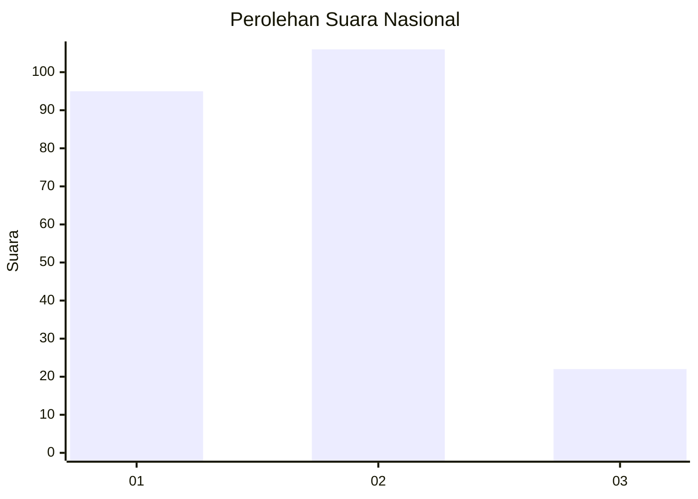
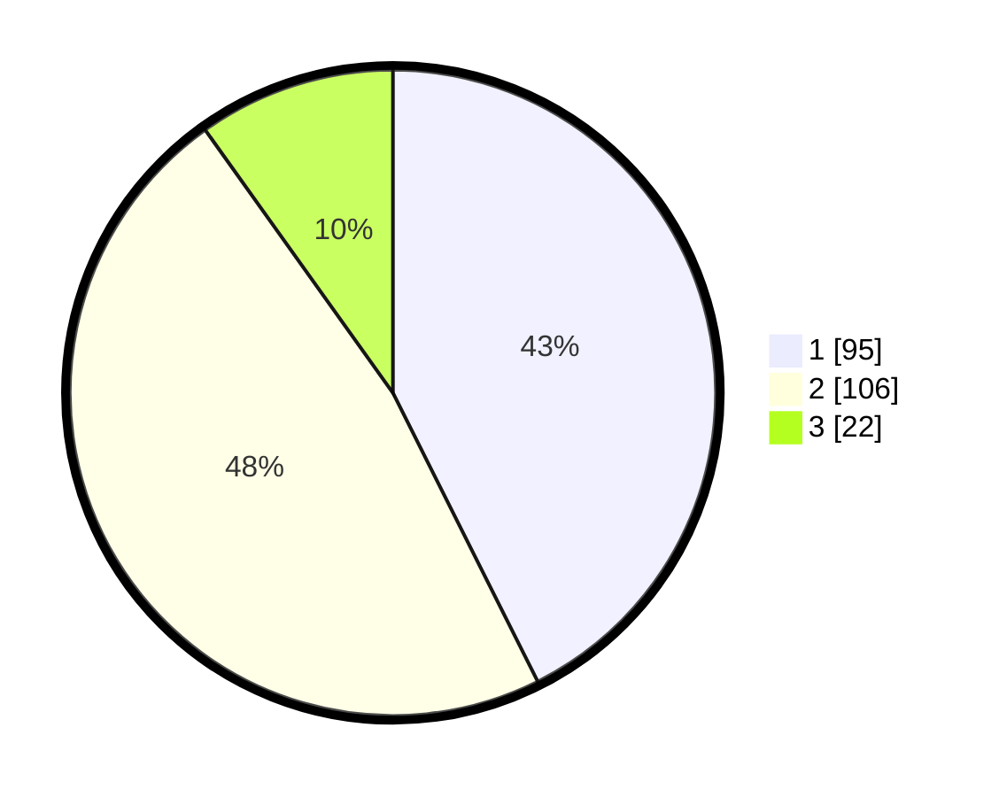

# Hasil

## Grafik

## Tabel

| No.    | Nama Paslon    | Suara | Suara (raw) | Persentase |
|:------ |:-------------- | -----:| -----------:| ----------:|
| 100025 | ANIES MUHAIMIN | 95    | [95][p-1]   | 42,60      |
| 100026 | PRABOWO GIBRAN | 106   | [106][p-2]  | 47,53      |
| 100027 | GANJAR MAHFUD  | 22    | [22][p-3]   | 9,87       |

[p-1]: https://github.com/gigit-pemilu/pemilu-2024/blob/main/pilpres/hitung-suara/sub/31-dki-jakarta/sub/75-jakarta-timur/sub/09-ciracas/sub/1005-rambutan/sub/094-tps/sub/paslon-1.txt
[p-2]: https://github.com/gigit-pemilu/pemilu-2024/blob/main/pilpres/hitung-suara/sub/31-dki-jakarta/sub/75-jakarta-timur/sub/09-ciracas/sub/1005-rambutan/sub/094-tps/sub/paslon-2.txt
[p-3]: https://github.com/gigit-pemilu/pemilu-2024/blob/main/pilpres/hitung-suara/sub/31-dki-jakarta/sub/75-jakarta-timur/sub/09-ciracas/sub/1005-rambutan/sub/094-tps/sub/paslon-3.txt

## Foto C Plano

https://sirekap-obj-formc.kpu.go.id/099f/pemilu/ppwp/31/75/09/10/05/3175091005094-20240214-212857--1c305480-13d4-4c37-8e8e-e669f82f916e.jpg

https://sirekap-obj-formc.kpu.go.id/099f/pemilu/ppwp/31/75/09/10/05/3175091005094-20240214-214052--acc32bf3-1e06-4285-8272-da35c10a0058.jpg

https://sirekap-obj-formc.kpu.go.id/099f/pemilu/ppwp/31/75/09/10/05/3175091005094-20240214-214159--0767ab36-4d75-4708-b04c-1d85ecde700e.jpg

## Metadata

| Key        | Value               |
| ---------- | ------------------- |
| Time Stamp | 2024-02-15 12:00:28 |

