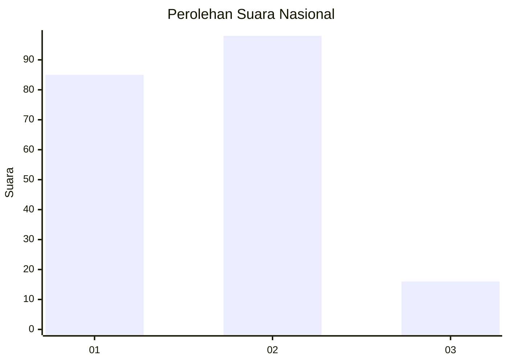
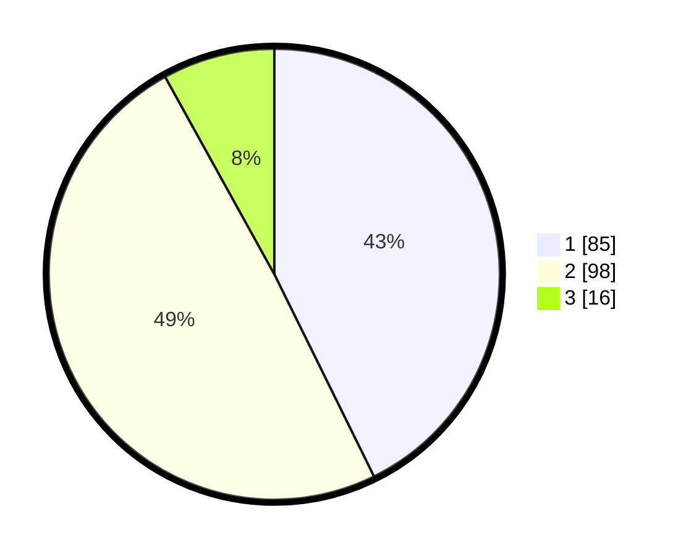

# Hasil

## Grafik

## Tabel

| No.    | Nama Paslon    | Suara | Suara (raw) | Persentase |
|:------ |:-------------- | -----:| -----------:| ----------:|
| 100025 | ANIES MUHAIMIN | 85    | [85][p-1]   | 42,71      |
| 100026 | PRABOWO GIBRAN | 98    | [98][p-2]   | 49,25      |
| 100027 | GANJAR MAHFUD  | 16    | [16][p-3]   | 8,04       |

[p-1]: https://github.com/gigit-pemilu/pemilu-2024/blob/main/pilpres/hitung-suara/sub/31-dki-jakarta/sub/75-jakarta-timur/sub/09-ciracas/sub/1005-rambutan/sub/104-tps/sub/paslon-1.txt
[p-2]: https://github.com/gigit-pemilu/pemilu-2024/blob/main/pilpres/hitung-suara/sub/31-dki-jakarta/sub/75-jakarta-timur/sub/09-ciracas/sub/1005-rambutan/sub/104-tps/sub/paslon-2.txt
[p-3]: https://github.com/gigit-pemilu/pemilu-2024/blob/main/pilpres/hitung-suara/sub/31-dki-jakarta/sub/75-jakarta-timur/sub/09-ciracas/sub/1005-rambutan/sub/104-tps/sub/paslon-3.txt

## Foto C Plano

https://sirekap-obj-formc.kpu.go.id/4af3/pemilu/ppwp/31/75/09/10/05/3175091005104-20240214-205552--62b2912f-242b-4d4b-a3cb-058bd2b3349e.jpg

https://sirekap-obj-formc.kpu.go.id/4af3/pemilu/ppwp/31/75/09/10/05/3175091005104-20240214-205946--2e7d5e0d-6fe8-4774-b19d-f99904afc785.jpg

https://sirekap-obj-formc.kpu.go.id/4af3/pemilu/ppwp/31/75/09/10/05/3175091005104-20240214-210157--9b255081-2963-41b2-ae0c-375e5623bec0.jpg

## Metadata

| Key        | Value               |
| ---------- | ------------------- |
| Time Stamp | 2024-02-25 18:00:00 |

