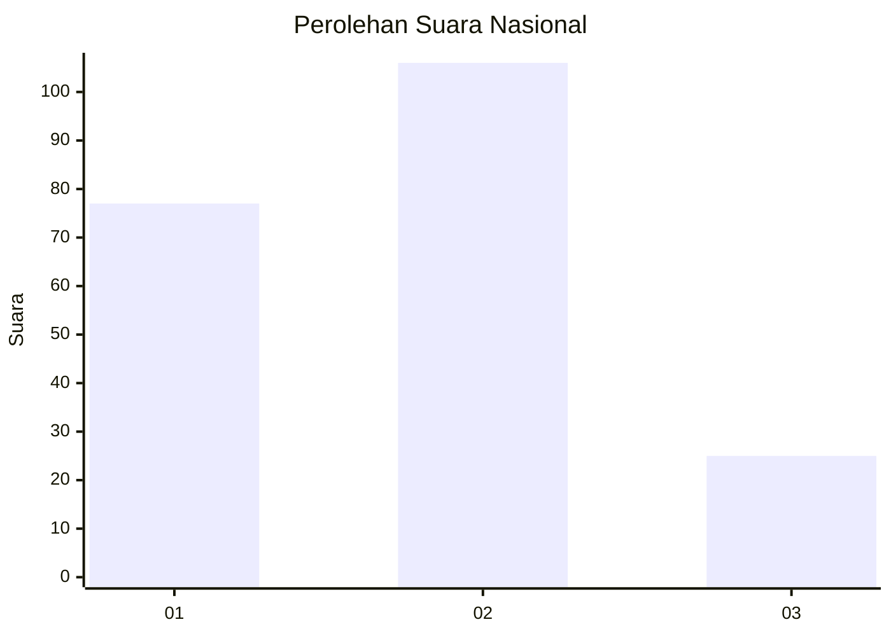
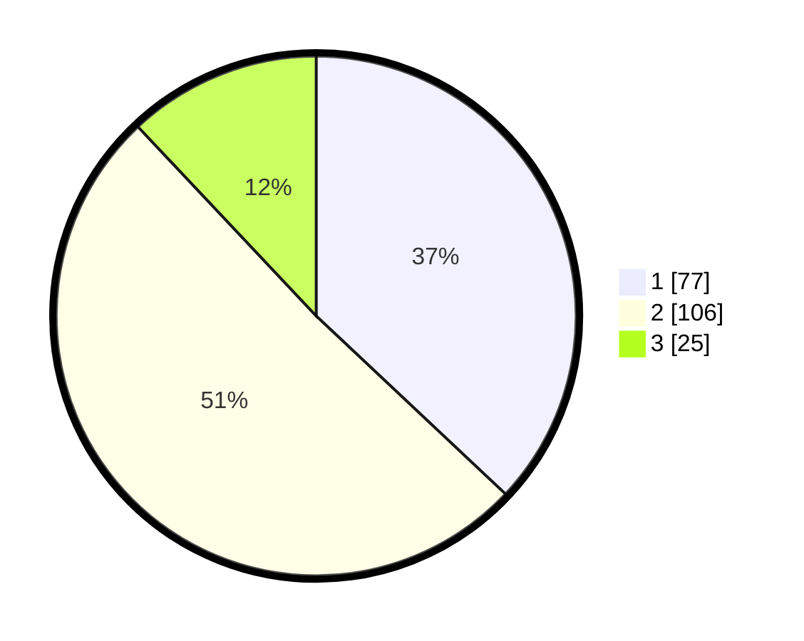

# Hasil

## Grafik

## Tabel

| No.    | Nama Paslon    | Suara | Suara (raw) | Persentase |
|:------ |:-------------- | -----:| -----------:| ----------:|
| 100025 | ANIES MUHAIMIN | 77    | [77][p-1]   | 37,02      |
| 100026 | PRABOWO GIBRAN | 106   | [106][p-2]  | 50,96      |
| 100027 | GANJAR MAHFUD  | 25    | [25][p-3]   | 12,02      |

[p-1]: https://github.com/gigit-pemilu/pemilu-2024/blob/main/pilpres/hitung-suara/sub/31-dki-jakarta/sub/75-jakarta-timur/sub/09-ciracas/sub/1005-rambutan/sub/111-tps/sub/paslon-1.txt
[p-2]: https://github.com/gigit-pemilu/pemilu-2024/blob/main/pilpres/hitung-suara/sub/31-dki-jakarta/sub/75-jakarta-timur/sub/09-ciracas/sub/1005-rambutan/sub/111-tps/sub/paslon-2.txt
[p-3]: https://github.com/gigit-pemilu/pemilu-2024/blob/main/pilpres/hitung-suara/sub/31-dki-jakarta/sub/75-jakarta-timur/sub/09-ciracas/sub/1005-rambutan/sub/111-tps/sub/paslon-3.txt

## Foto C Plano

https://sirekap-obj-formc.kpu.go.id/7a41/pemilu/ppwp/31/75/09/10/05/3175091005111-20240214-204216--305acb1f-09b2-4994-b25d-d82251fbc7db.jpg

https://sirekap-obj-formc.kpu.go.id/7a41/pemilu/ppwp/31/75/09/10/05/3175091005111-20240214-204459--5cd0bd26-5807-4ffb-b509-61180a3992d5.jpg

https://sirekap-obj-formc.kpu.go.id/7a41/pemilu/ppwp/31/75/09/10/05/3175091005111-20240214-204707--689f10b9-0bff-426a-b087-c3ab2ffe630e.jpg

## Metadata

| Key        | Value               |
| ---------- | ------------------- |
| Time Stamp | 2024-02-24 22:31:28 |

