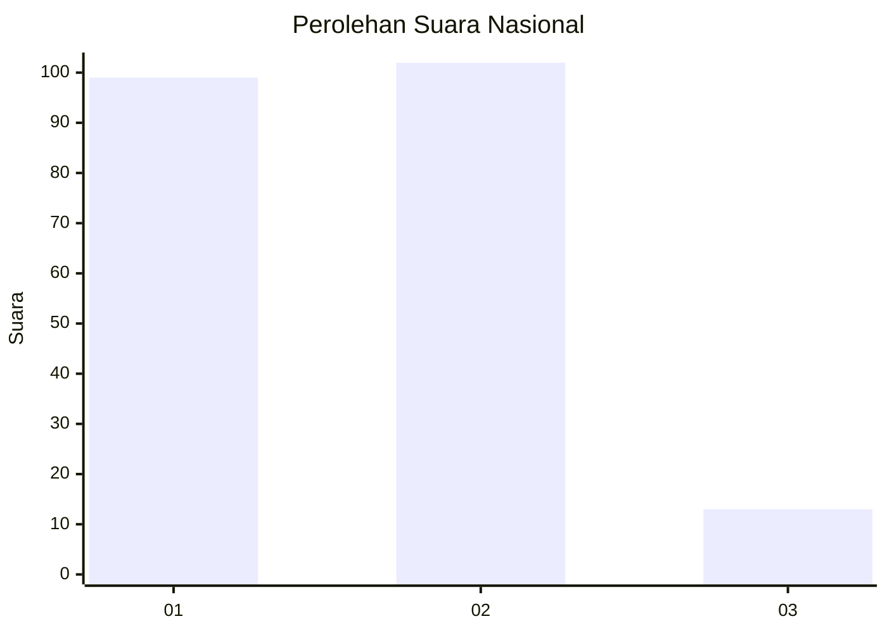
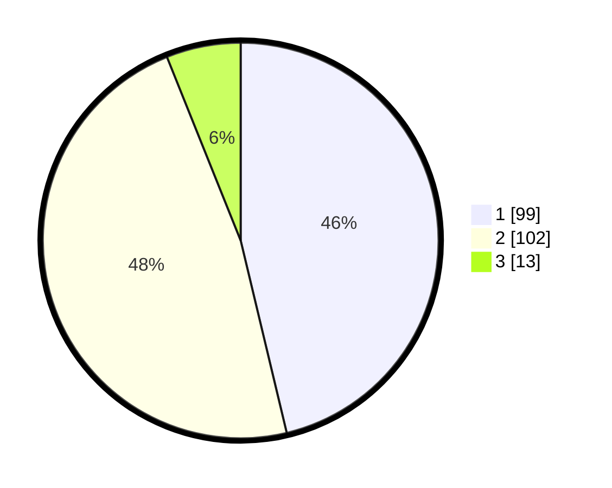

# Hasil

## Grafik

## Tabel

| No.    | Nama Paslon    | Suara | Suara (raw) | Persentase |
|:------ |:-------------- | -----:| -----------:| ----------:|
| 100025 | ANIES MUHAIMIN | 99    | [99][p-1]   | 46,26      |
| 100026 | PRABOWO GIBRAN | 102   | [102][p-2]  | 47,66      |
| 100027 | GANJAR MAHFUD  | 13    | [13][p-3]   | 6,07       |

[p-1]: https://github.com/gigit-pemilu/pemilu-2024/blob/main/pilpres/hitung-suara/sub/31-dki-jakarta/sub/75-jakarta-timur/sub/09-ciracas/sub/1005-rambutan/sub/119-tps/sub/paslon-1.txt
[p-2]: https://github.com/gigit-pemilu/pemilu-2024/blob/main/pilpres/hitung-suara/sub/31-dki-jakarta/sub/75-jakarta-timur/sub/09-ciracas/sub/1005-rambutan/sub/119-tps/sub/paslon-2.txt
[p-3]: https://github.com/gigit-pemilu/pemilu-2024/blob/main/pilpres/hitung-suara/sub/31-dki-jakarta/sub/75-jakarta-timur/sub/09-ciracas/sub/1005-rambutan/sub/119-tps/sub/paslon-3.txt

## Foto C Plano

https://sirekap-obj-formc.kpu.go.id/2d8f/pemilu/ppwp/31/75/09/10/05/3175091005119-20240215-223339--7a019612-31b4-4a3e-bf3e-a90f1170e7e7.jpg

https://sirekap-obj-formc.kpu.go.id/2d8f/pemilu/ppwp/31/75/09/10/05/3175091005119-20240215-223357--88ff2ff1-e707-4817-8bcd-e54a8c7a4c7d.jpg

https://sirekap-obj-formc.kpu.go.id/2d8f/pemilu/ppwp/31/75/09/10/05/3175091005119-20240215-223413--3d94db81-24a6-44a0-865b-6af808b9cec7.jpg

## Metadata

| Key        | Value               |
| ---------- | ------------------- |
| Time Stamp | 2024-02-24 22:31:28 |

