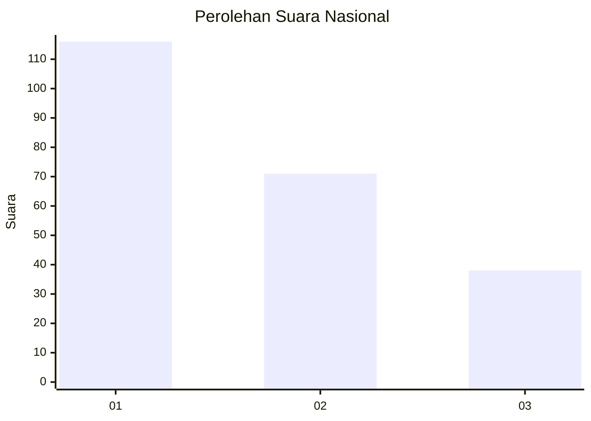
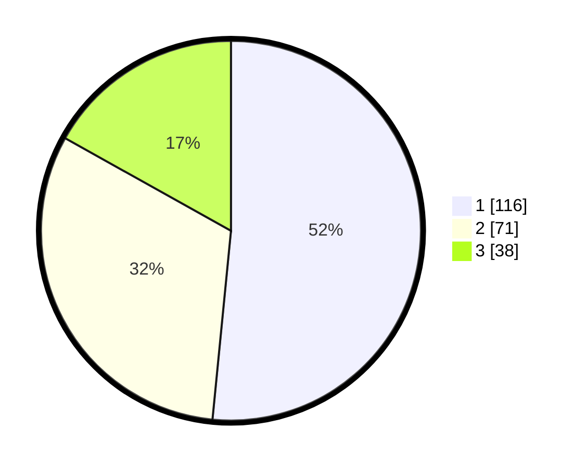

# Hasil

## Grafik

## Tabel

| No.    | Nama Paslon    | Suara | Suara (raw) | Persentase |
|:------ |:-------------- | -----:| -----------:| ----------:|
| 100025 | ANIES MUHAIMIN | 116   | [116][p-1]  | 51,56      |
| 100026 | PRABOWO GIBRAN | 71    | [71][p-2]   | 31,56      |
| 100027 | GANJAR MAHFUD  | 38    | [38][p-3]   | 16,89      |

[p-1]: https://github.com/gigit-pemilu/pemilu-2024/blob/main/pilpres/hitung-suara/sub/31-dki-jakarta/sub/75-jakarta-timur/sub/10-cipayung/sub/1001-cipayung/sub/015-tps/sub/paslon-1.txt
[p-2]: https://github.com/gigit-pemilu/pemilu-2024/blob/main/pilpres/hitung-suara/sub/31-dki-jakarta/sub/75-jakarta-timur/sub/10-cipayung/sub/1001-cipayung/sub/015-tps/sub/paslon-2.txt
[p-3]: https://github.com/gigit-pemilu/pemilu-2024/blob/main/pilpres/hitung-suara/sub/31-dki-jakarta/sub/75-jakarta-timur/sub/10-cipayung/sub/1001-cipayung/sub/015-tps/sub/paslon-3.txt

## Foto C Plano

https://sirekap-obj-formc.kpu.go.id/55e5/pemilu/ppwp/31/75/10/10/01/3175101001015-20240215-011614--cb21ad47-c3fc-42a5-a21f-b36b5da78ede.jpg

https://sirekap-obj-formc.kpu.go.id/55e5/pemilu/ppwp/31/75/10/10/01/3175101001015-20240215-011806--987a2c74-a2e9-408a-90b3-f07a47fba327.jpg

https://sirekap-obj-formc.kpu.go.id/55e5/pemilu/ppwp/31/75/10/10/01/3175101001015-20240215-011926--a79f9598-57d2-4976-95a7-858313763309.jpg

## Metadata

| Key        | Value               |
| ---------- | ------------------- |
| Time Stamp | 2024-02-15 15:30:25 |

