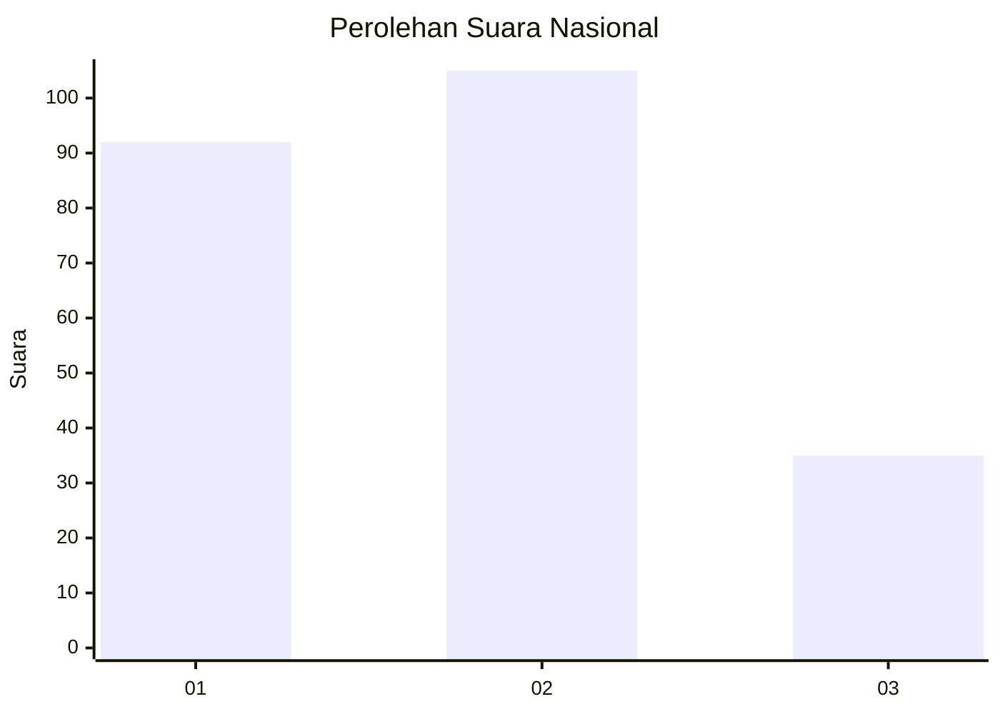
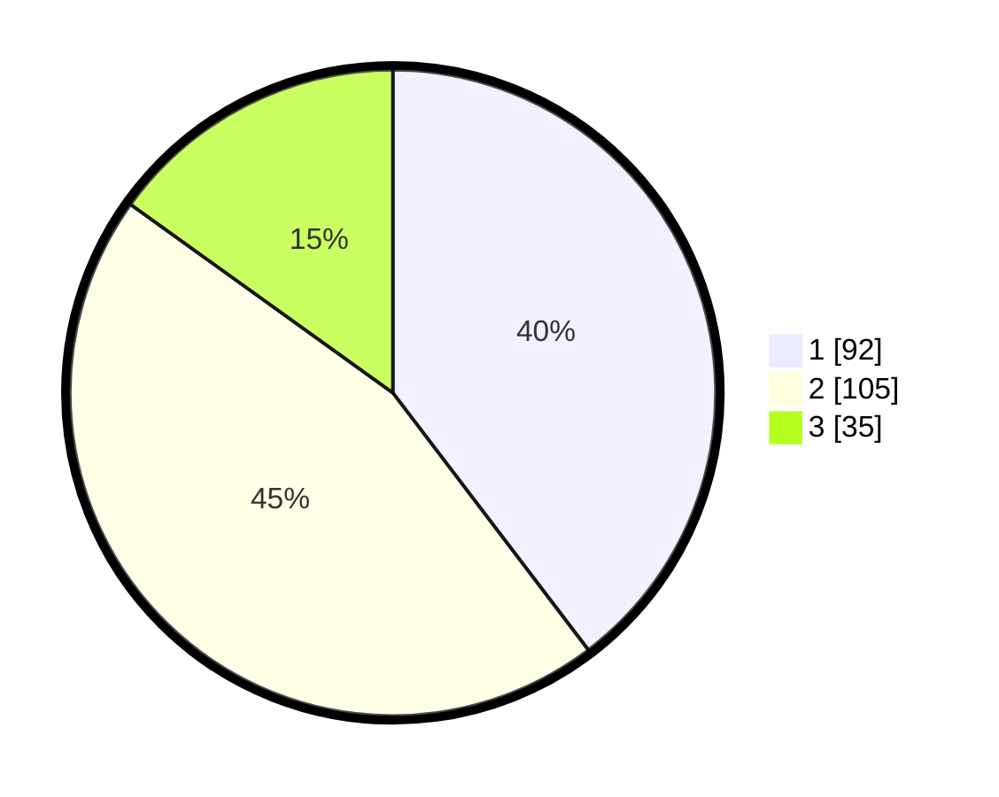

# Hasil

## Grafik

## Tabel

| No.    | Nama Paslon    | Suara | Suara (raw) | Persentase |
|:------ |:-------------- | -----:| -----------:| ----------:|
| 100025 | ANIES MUHAIMIN | 92    | [92][p-1]   | 39,66      |
| 100026 | PRABOWO GIBRAN | 105   | [105][p-2]  | 45,26      |
| 100027 | GANJAR MAHFUD  | 35    | [35][p-3]   | 15,09      |

[p-1]: https://github.com/gigit-pemilu/pemilu-2024/blob/main/pilpres/hitung-suara/sub/31-dki-jakarta/sub/75-jakarta-timur/sub/10-cipayung/sub/1001-cipayung/sub/028-tps/sub/paslon-1.txt
[p-2]: https://github.com/gigit-pemilu/pemilu-2024/blob/main/pilpres/hitung-suara/sub/31-dki-jakarta/sub/75-jakarta-timur/sub/10-cipayung/sub/1001-cipayung/sub/028-tps/sub/paslon-2.txt
[p-3]: https://github.com/gigit-pemilu/pemilu-2024/blob/main/pilpres/hitung-suara/sub/31-dki-jakarta/sub/75-jakarta-timur/sub/10-cipayung/sub/1001-cipayung/sub/028-tps/sub/paslon-3.txt

## Foto C Plano

https://sirekap-obj-formc.kpu.go.id/5ef9/pemilu/ppwp/31/75/10/10/01/3175101001028-20240214-162244--9f891307-2518-4a82-846a-91c94794dd0f.jpg

https://sirekap-obj-formc.kpu.go.id/5ef9/pemilu/ppwp/31/75/10/10/01/3175101001028-20240214-155854--b52265a3-3c6f-498a-bb2a-99ef23e1ddcc.jpg

https://sirekap-obj-formc.kpu.go.id/5ef9/pemilu/ppwp/31/75/10/10/01/3175101001028-20240214-155453--017fea53-6960-4bd3-bef4-5b681f0ae0e2.jpg

## Metadata

| Key        | Value               |
| ---------- | ------------------- |
| Time Stamp | 2024-02-24 22:31:28 |

