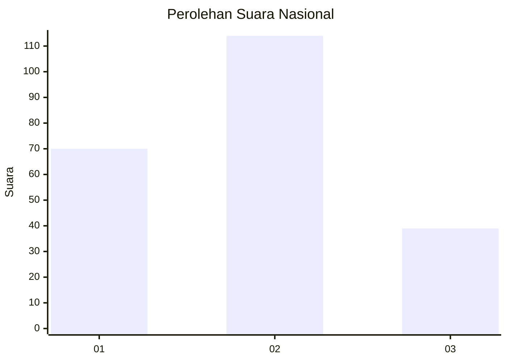
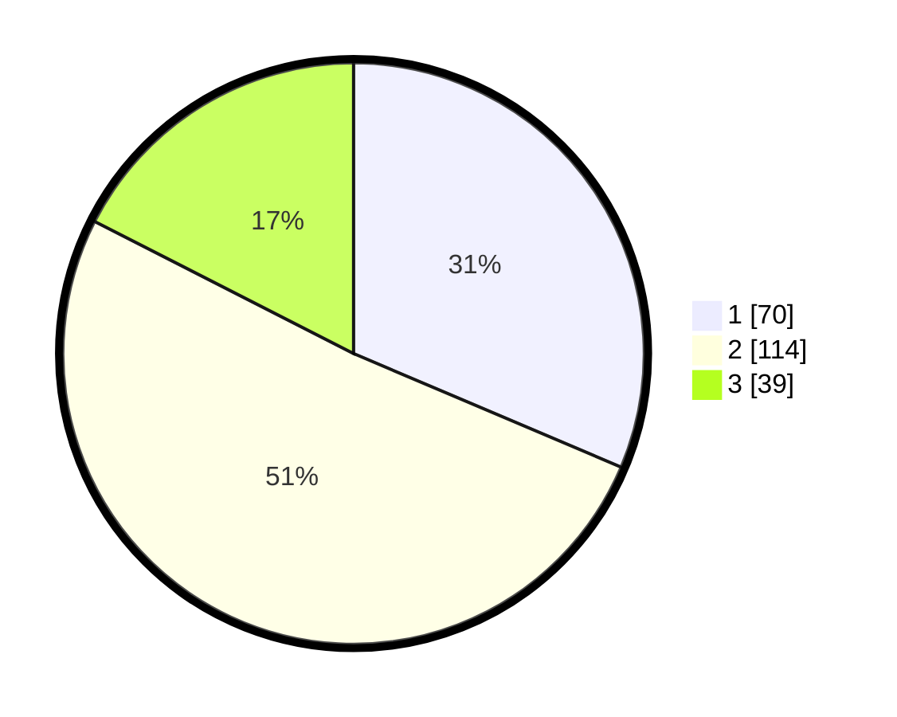

# Hasil

## Grafik

## Tabel

| No.    | Nama Paslon    | Suara | Suara (raw) | Persentase |
|:------ |:-------------- | -----:| -----------:| ----------:|
| 100025 | ANIES MUHAIMIN | 70    | [70][p-1]   | 31,39      |
| 100026 | PRABOWO GIBRAN | 114   | [114][p-2]  | 51,12      |
| 100027 | GANJAR MAHFUD  | 39    | [39][p-3]   | 17,49      |

[p-1]: https://github.com/gigit-pemilu/pemilu-2024/blob/main/pilpres/hitung-suara/sub/31-dki-jakarta/sub/75-jakarta-timur/sub/10-cipayung/sub/1001-cipayung/sub/037-tps/sub/paslon-1.txt
[p-2]: https://github.com/gigit-pemilu/pemilu-2024/blob/main/pilpres/hitung-suara/sub/31-dki-jakarta/sub/75-jakarta-timur/sub/10-cipayung/sub/1001-cipayung/sub/037-tps/sub/paslon-2.txt
[p-3]: https://github.com/gigit-pemilu/pemilu-2024/blob/main/pilpres/hitung-suara/sub/31-dki-jakarta/sub/75-jakarta-timur/sub/10-cipayung/sub/1001-cipayung/sub/037-tps/sub/paslon-3.txt

## Foto C Plano

https://sirekap-obj-formc.kpu.go.id/8979/pemilu/ppwp/31/75/10/10/01/3175101001037-20240215-004430--4dd7f4ff-4b7b-439b-9b2d-eb655000bbec.jpg

https://sirekap-obj-formc.kpu.go.id/8979/pemilu/ppwp/31/75/10/10/01/3175101001037-20240215-004610--3de88747-3998-44ad-ac14-3ab1c1aa900d.jpg

https://sirekap-obj-formc.kpu.go.id/8979/pemilu/ppwp/31/75/10/10/01/3175101001037-20240215-004702--6ce1b970-0aa2-4f53-beda-e0b0fa8cb12f.jpg

## Metadata

| Key        | Value               |
| ---------- | ------------------- |
| Time Stamp | 2024-02-24 22:31:28 |

