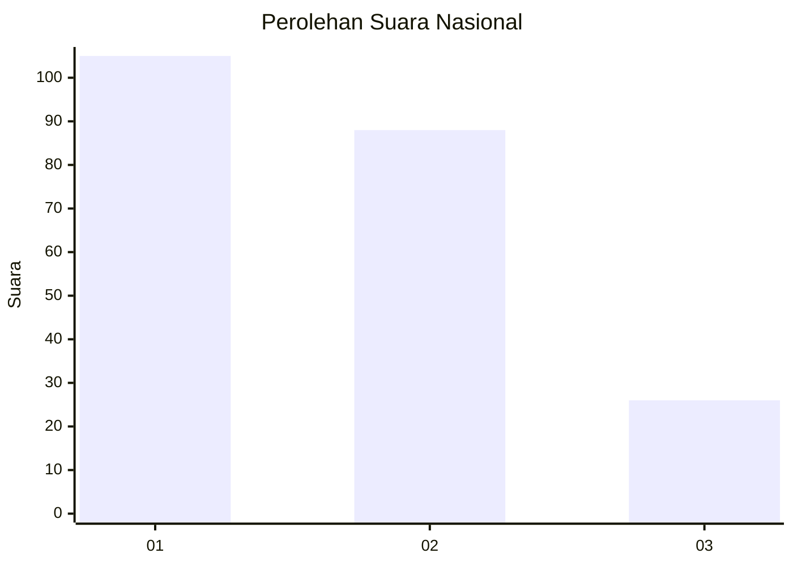
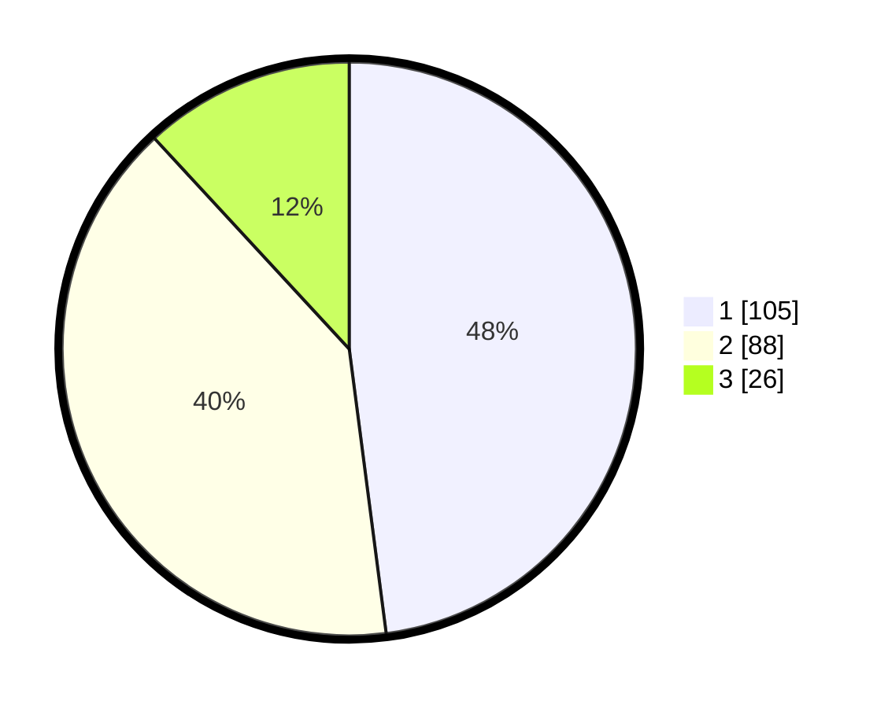

# Hasil

## Grafik

## Tabel

| No.    | Nama Paslon    | Suara | Suara (raw) | Persentase |
|:------ |:-------------- | -----:| -----------:| ----------:|
| 100025 | ANIES MUHAIMIN | 105   | [105][p-1]  | 47,95      |
| 100026 | PRABOWO GIBRAN | 88    | [88][p-2]   | 40,18      |
| 100027 | GANJAR MAHFUD  | 26    | [26][p-3]   | 11,87      |

[p-1]: https://github.com/gigit-pemilu/pemilu-2024/blob/main/pilpres/hitung-suara/sub/31-dki-jakarta/sub/75-jakarta-timur/sub/10-cipayung/sub/1001-cipayung/sub/048-tps/sub/paslon-1.txt
[p-2]: https://github.com/gigit-pemilu/pemilu-2024/blob/main/pilpres/hitung-suara/sub/31-dki-jakarta/sub/75-jakarta-timur/sub/10-cipayung/sub/1001-cipayung/sub/048-tps/sub/paslon-2.txt
[p-3]: https://github.com/gigit-pemilu/pemilu-2024/blob/main/pilpres/hitung-suara/sub/31-dki-jakarta/sub/75-jakarta-timur/sub/10-cipayung/sub/1001-cipayung/sub/048-tps/sub/paslon-3.txt

## Foto C Plano

https://sirekap-obj-formc.kpu.go.id/77f5/pemilu/ppwp/31/75/10/10/01/3175101001048-20240214-194910--0eb04ac1-3675-44e1-bb08-c224de6ccaf9.jpg

https://sirekap-obj-formc.kpu.go.id/77f5/pemilu/ppwp/31/75/10/10/01/3175101001048-20240214-194925--1ccd2e9f-5434-4b62-9bd9-979ebb8f626c.jpg

https://sirekap-obj-formc.kpu.go.id/77f5/pemilu/ppwp/31/75/10/10/01/3175101001048-20240214-194938--b8d39d00-34f2-4f94-ba4e-e0be65eef107.jpg

## Metadata

| Key        | Value               |
| ---------- | ------------------- |
| Time Stamp | 2024-02-15 12:00:28 |

