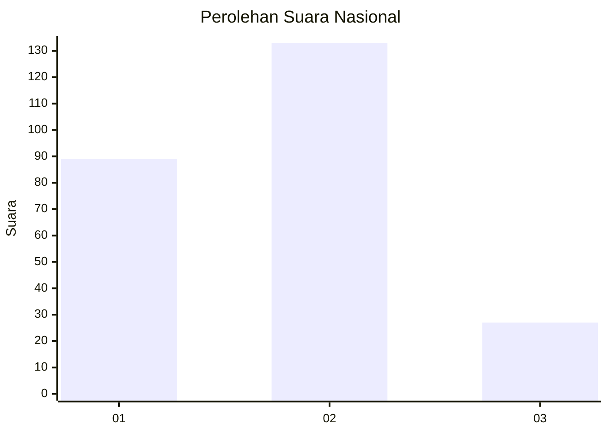
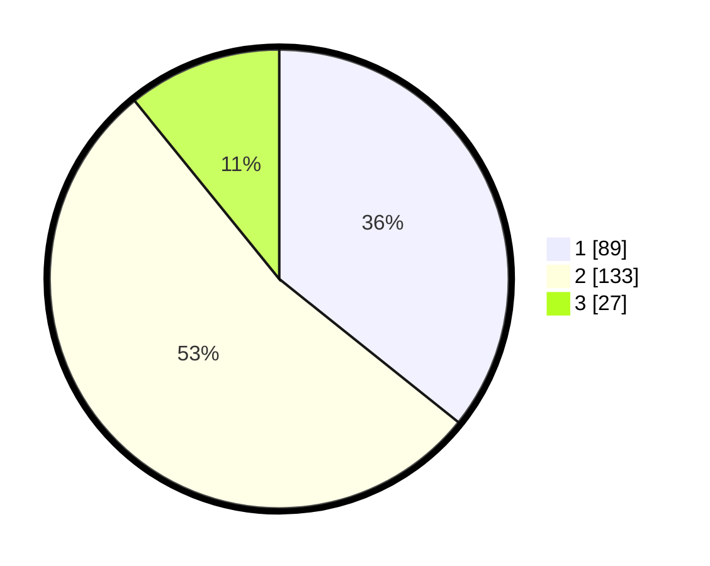

# Hasil

## Grafik

## Tabel

| No.    | Nama Paslon    | Suara | Suara (raw) | Persentase |
|:------ |:-------------- | -----:| -----------:| ----------:|
| 100025 | ANIES MUHAIMIN | 89    | [89][p-1]   | 35,74      |
| 100026 | PRABOWO GIBRAN | 133   | [133][p-2]  | 53,41      |
| 100027 | GANJAR MAHFUD  | 27    | [27][p-3]   | 10,84      |

[p-1]: https://github.com/gigit-pemilu/pemilu-2024/blob/main/pilpres/hitung-suara/sub/31-dki-jakarta/sub/75-jakarta-timur/sub/10-cipayung/sub/1001-cipayung/sub/052-tps/sub/paslon-1.txt
[p-2]: https://github.com/gigit-pemilu/pemilu-2024/blob/main/pilpres/hitung-suara/sub/31-dki-jakarta/sub/75-jakarta-timur/sub/10-cipayung/sub/1001-cipayung/sub/052-tps/sub/paslon-2.txt
[p-3]: https://github.com/gigit-pemilu/pemilu-2024/blob/main/pilpres/hitung-suara/sub/31-dki-jakarta/sub/75-jakarta-timur/sub/10-cipayung/sub/1001-cipayung/sub/052-tps/sub/paslon-3.txt

## Foto C Plano

https://sirekap-obj-formc.kpu.go.id/c2c6/pemilu/ppwp/31/75/10/10/01/3175101001052-20240214-223418--6068a791-2edb-4355-8e50-f7917920d1b1.jpg

https://sirekap-obj-formc.kpu.go.id/c2c6/pemilu/ppwp/31/75/10/10/01/3175101001052-20240214-223320--12790e68-a1d5-4fc5-a111-ae31263ec2dc.jpg

https://sirekap-obj-formc.kpu.go.id/c2c6/pemilu/ppwp/31/75/10/10/01/3175101001052-20240214-223753--cf51b6a0-ddfd-469a-932a-cd051675f6fd.jpg

## Metadata

| Key        | Value               |
| ---------- | ------------------- |
| Time Stamp | 2024-02-15 15:00:29 |

