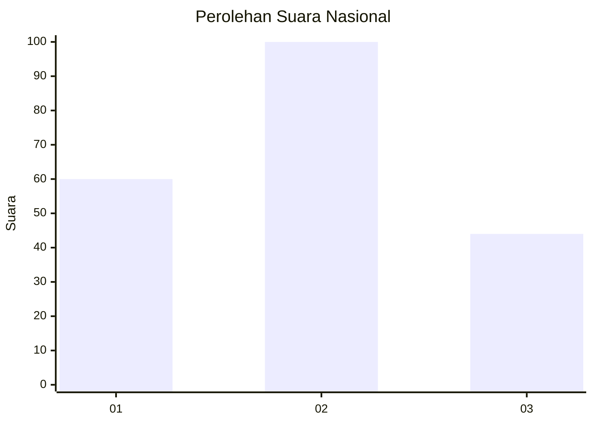
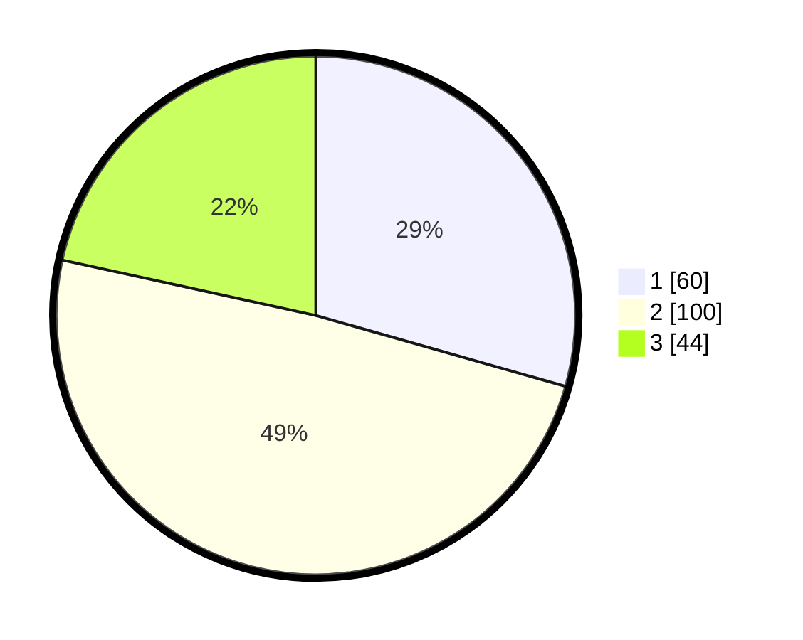

# Hasil

## Grafik

## Tabel

| No.    | Nama Paslon    | Suara | Suara (raw) | Persentase |
|:------ |:-------------- | -----:| -----------:| ----------:|
| 100025 | ANIES MUHAIMIN | 60    | [60][p-1]   | 29,41      |
| 100026 | PRABOWO GIBRAN | 100   | [100][p-2]  | 49,02      |
| 100027 | GANJAR MAHFUD  | 44    | [44][p-3]   | 21,57      |

[p-1]: https://github.com/gigit-pemilu/pemilu-2024/blob/main/pilpres/hitung-suara/sub/31-dki-jakarta/sub/75-jakarta-timur/sub/10-cipayung/sub/1001-cipayung/sub/060-tps/sub/paslon-1.txt
[p-2]: https://github.com/gigit-pemilu/pemilu-2024/blob/main/pilpres/hitung-suara/sub/31-dki-jakarta/sub/75-jakarta-timur/sub/10-cipayung/sub/1001-cipayung/sub/060-tps/sub/paslon-2.txt
[p-3]: https://github.com/gigit-pemilu/pemilu-2024/blob/main/pilpres/hitung-suara/sub/31-dki-jakarta/sub/75-jakarta-timur/sub/10-cipayung/sub/1001-cipayung/sub/060-tps/sub/paslon-3.txt

## Foto C Plano

https://sirekap-obj-formc.kpu.go.id/3f07/pemilu/ppwp/31/75/10/10/01/3175101001060-20240214-215740--000003ff-8585-4646-975f-ea90ea5eda00.jpg

https://sirekap-obj-formc.kpu.go.id/3f07/pemilu/ppwp/31/75/10/10/01/3175101001060-20240214-215927--0107a4c6-d14f-4f55-8d02-04df6ee5f1b4.jpg

https://sirekap-obj-formc.kpu.go.id/3f07/pemilu/ppwp/31/75/10/10/01/3175101001060-20240214-220137--fb0c60f1-5d4f-42c3-9814-a4b5119a97a8.jpg

## Metadata

| Key        | Value               |
| ---------- | ------------------- |
| Time Stamp | 2024-02-24 22:31:28 |

