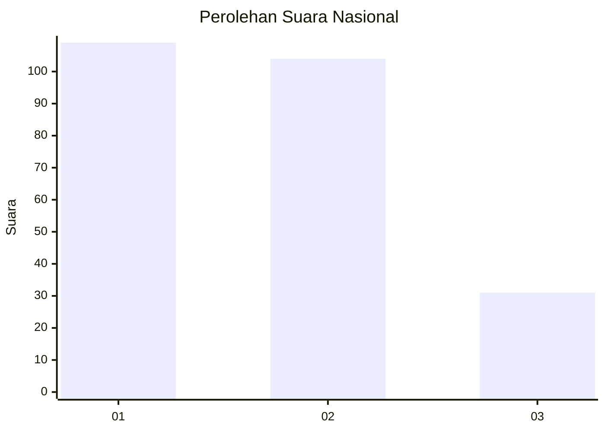
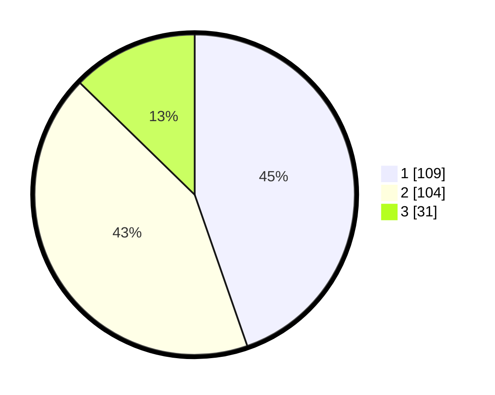

# Hasil

## Grafik

## Tabel

| No.    | Nama Paslon    | Suara | Suara (raw) | Persentase |
|:------ |:-------------- | -----:| -----------:| ----------:|
| 100025 | ANIES MUHAIMIN | 109   | [109][p-1]  | 44,67      |
| 100026 | PRABOWO GIBRAN | 104   | [104][p-2]  | 42,62      |
| 100027 | GANJAR MAHFUD  | 31    | [31][p-3]   | 12,70      |

[p-1]: https://github.com/gigit-pemilu/pemilu-2024/blob/main/pilpres/hitung-suara/sub/31-dki-jakarta/sub/75-jakarta-timur/sub/10-cipayung/sub/1001-cipayung/sub/064-tps/sub/paslon-1.txt
[p-2]: https://github.com/gigit-pemilu/pemilu-2024/blob/main/pilpres/hitung-suara/sub/31-dki-jakarta/sub/75-jakarta-timur/sub/10-cipayung/sub/1001-cipayung/sub/064-tps/sub/paslon-2.txt
[p-3]: https://github.com/gigit-pemilu/pemilu-2024/blob/main/pilpres/hitung-suara/sub/31-dki-jakarta/sub/75-jakarta-timur/sub/10-cipayung/sub/1001-cipayung/sub/064-tps/sub/paslon-3.txt

## Foto C Plano

https://sirekap-obj-formc.kpu.go.id/a1bd/pemilu/ppwp/31/75/10/10/01/3175101001064-20240214-155053--6361a368-fe1d-4d39-a2e4-a4f327e1c051.jpg

https://sirekap-obj-formc.kpu.go.id/a1bd/pemilu/ppwp/31/75/10/10/01/3175101001064-20240214-202910--fd685a7b-7158-4121-abb3-f8d0e39678ff.jpg

https://sirekap-obj-formc.kpu.go.id/a1bd/pemilu/ppwp/31/75/10/10/01/3175101001064-20240214-203143--c68b67fc-073e-4d88-aef1-e1e79f7457e7.jpg

## Metadata

| Key        | Value               |
| ---------- | ------------------- |
| Time Stamp | 2024-02-24 22:31:28 |

