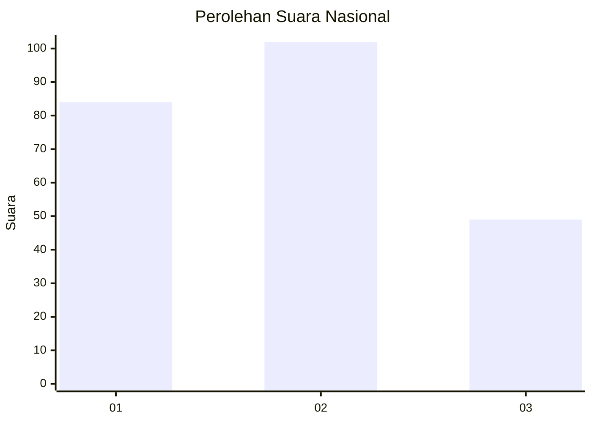
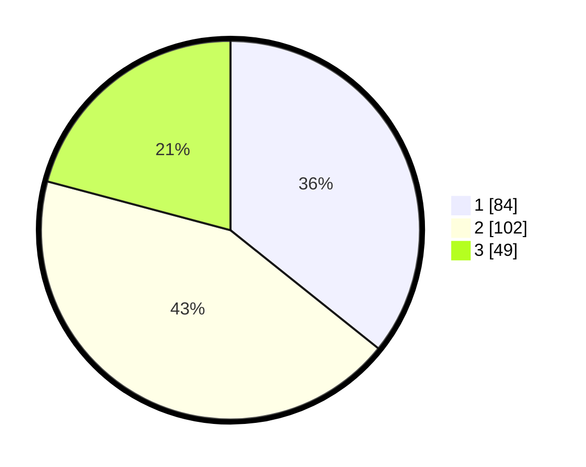

# Hasil

## Grafik

## Tabel

| No.    | Nama Paslon    | Suara | Suara (raw) | Persentase |
|:------ |:-------------- | -----:| -----------:| ----------:|
| 100025 | ANIES MUHAIMIN | 84    | [84][p-1]   | 35,74      |
| 100026 | PRABOWO GIBRAN | 102   | [102][p-2]  | 43,40      |
| 100027 | GANJAR MAHFUD  | 49    | [49][p-3]   | 20,85      |

[p-1]: https://github.com/gigit-pemilu/pemilu-2024/blob/main/pilpres/hitung-suara/sub/31-dki-jakarta/sub/75-jakarta-timur/sub/10-cipayung/sub/1001-cipayung/sub/086-tps/sub/paslon-1.txt
[p-2]: https://github.com/gigit-pemilu/pemilu-2024/blob/main/pilpres/hitung-suara/sub/31-dki-jakarta/sub/75-jakarta-timur/sub/10-cipayung/sub/1001-cipayung/sub/086-tps/sub/paslon-2.txt
[p-3]: https://github.com/gigit-pemilu/pemilu-2024/blob/main/pilpres/hitung-suara/sub/31-dki-jakarta/sub/75-jakarta-timur/sub/10-cipayung/sub/1001-cipayung/sub/086-tps/sub/paslon-3.txt

## Foto C Plano

https://sirekap-obj-formc.kpu.go.id/8ad9/pemilu/ppwp/31/75/10/10/01/3175101001086-20240214-221225--c3c72f8f-6b72-4680-a5c1-7c31c0a0042c.jpg

https://sirekap-obj-formc.kpu.go.id/8ad9/pemilu/ppwp/31/75/10/10/01/3175101001086-20240214-221238--76e948c8-a309-49bb-a63d-a94af171cc93.jpg

https://sirekap-obj-formc.kpu.go.id/8ad9/pemilu/ppwp/31/75/10/10/01/3175101001086-20240214-221243--981cae87-86d6-47f6-807f-bef95916e1d5.jpg

## Metadata

| Key        | Value               |
| ---------- | ------------------- |
| Time Stamp | 2024-02-24 22:31:28 |

