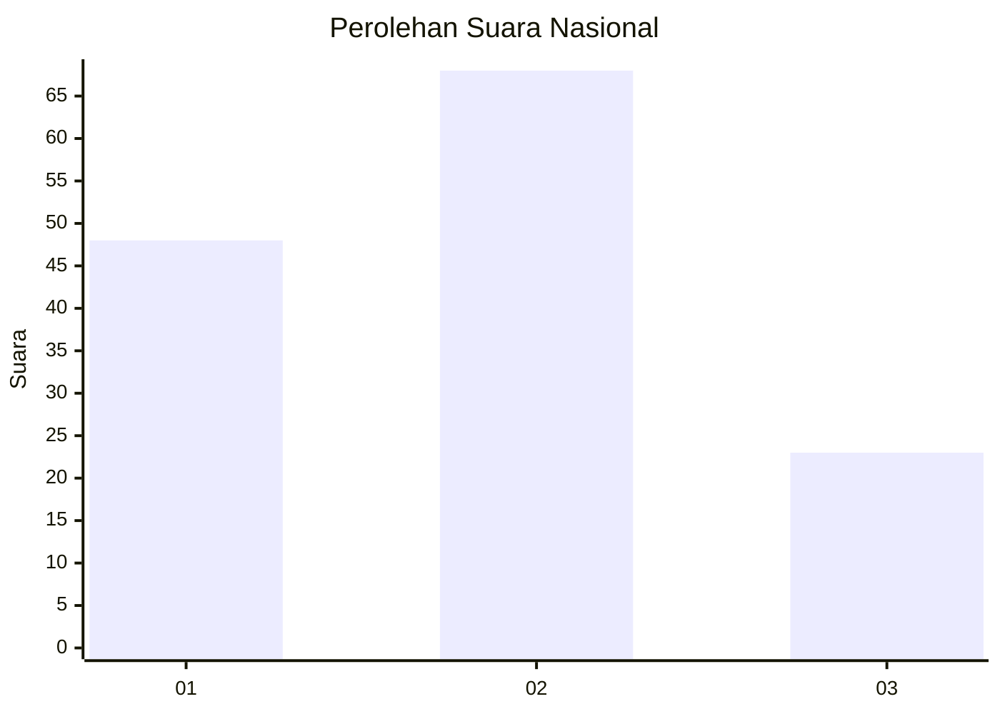
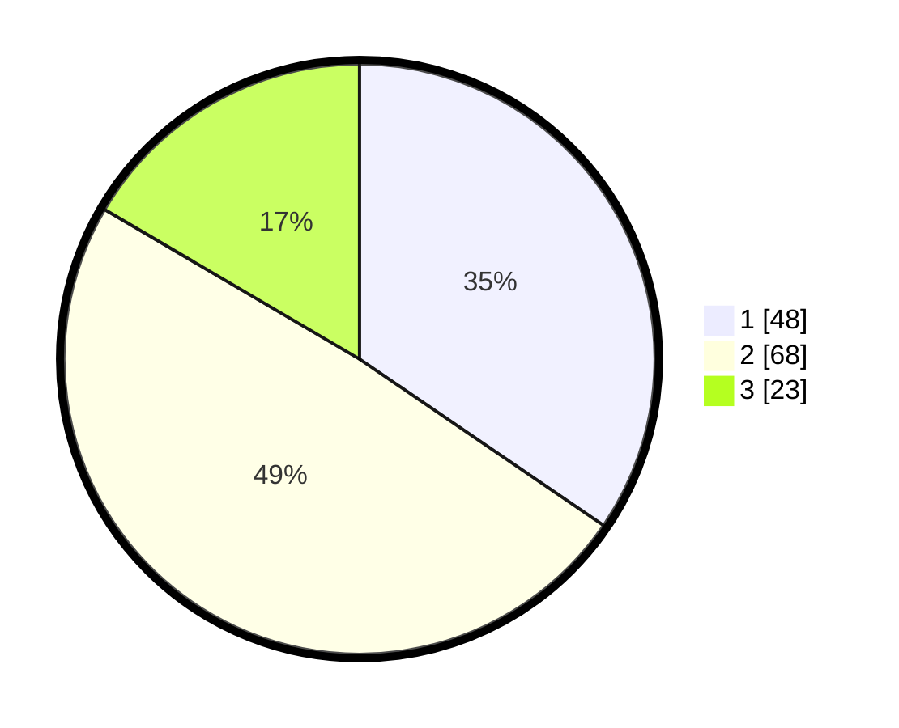

# Hasil

## Grafik

## Tabel

| No.    | Nama Paslon    | Suara | Suara (raw) | Persentase |
|:------ |:-------------- | -----:| -----------:| ----------:|
| 100025 | ANIES MUHAIMIN | 48    | [48][p-1]   | 34,53      |
| 100026 | PRABOWO GIBRAN | 68    | [68][p-2]   | 48,92      |
| 100027 | GANJAR MAHFUD  | 23    | [23][p-3]   | 16,55      |

[p-1]: https://github.com/gigit-pemilu/pemilu-2024/blob/main/pilpres/hitung-suara/sub/31-dki-jakarta/sub/75-jakarta-timur/sub/10-cipayung/sub/1001-cipayung/sub/090-tps/sub/paslon-1.txt
[p-2]: https://github.com/gigit-pemilu/pemilu-2024/blob/main/pilpres/hitung-suara/sub/31-dki-jakarta/sub/75-jakarta-timur/sub/10-cipayung/sub/1001-cipayung/sub/090-tps/sub/paslon-2.txt
[p-3]: https://github.com/gigit-pemilu/pemilu-2024/blob/main/pilpres/hitung-suara/sub/31-dki-jakarta/sub/75-jakarta-timur/sub/10-cipayung/sub/1001-cipayung/sub/090-tps/sub/paslon-3.txt

## Foto C Plano

https://sirekap-obj-formc.kpu.go.id/e2b8/pemilu/ppwp/31/75/10/10/01/3175101001090-20240214-223303--9de939cf-cf23-4926-82b8-ebdedc660b70.jpg

https://sirekap-obj-formc.kpu.go.id/e2b8/pemilu/ppwp/31/75/10/10/01/3175101001090-20240214-202348--79e862ad-bfb1-4d87-aa94-e35fca226606.jpg

https://sirekap-obj-formc.kpu.go.id/e2b8/pemilu/ppwp/31/75/10/10/01/3175101001090-20240214-202437--6b8d86e9-0727-4ab8-a358-6c5a8a6fa5d4.jpg

## Metadata

| Key        | Value               |
| ---------- | ------------------- |
| Time Stamp | 2024-02-15 20:00:44 |

