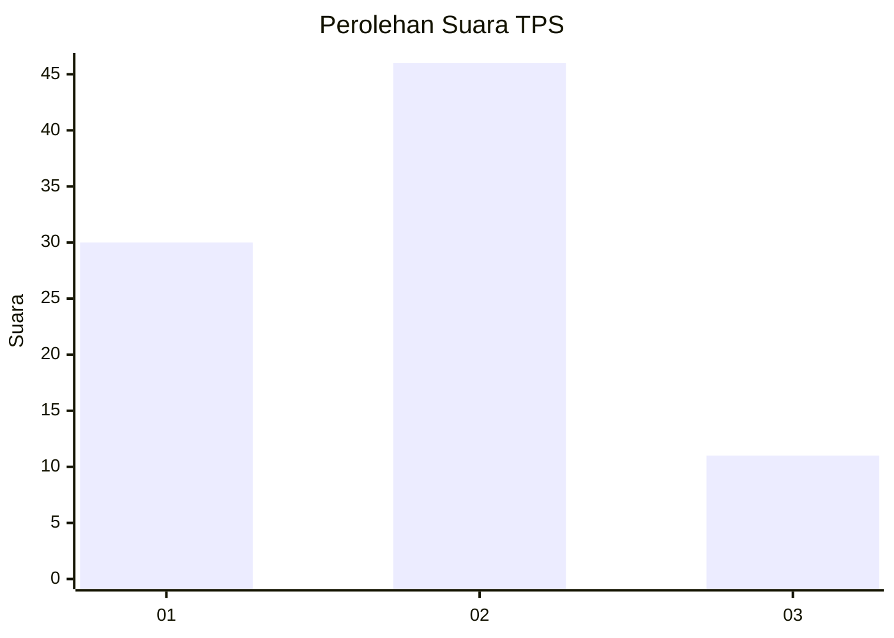
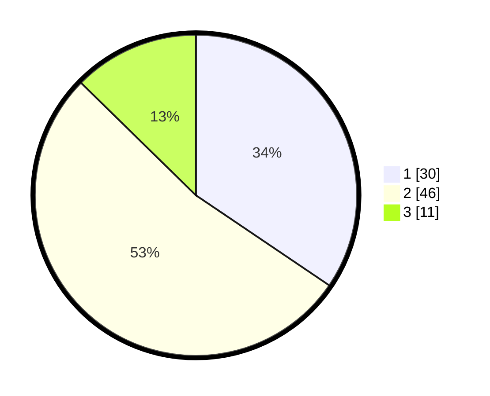

# Hasil

## Grafik

## Tabel

| No. | Nama Paslon    | Suara | Suara (raw) | Persentase |
|:--- |:-------------- | -----:| -----------:| ----------:|
| 1   | ANIES MUHAIMIN | 30    | [30][p-1]   | 34,48      |
| 2   | PRABOWO GIBRAN | 46    | [46][p-2]   | 52,87      |
| 3   | GANJAR MAHFUD  | 11    | [11][p-3]   | 12,64      |

[p-1]: https://github.com/gigit-pemilu/pemilu-2024-31-dki-jakarta/blob/main/pilpres/hitung-suara/sub/31-dki-jakarta/sub/75-jakarta-timur/sub/10-cipayung/sub/1001-cipayung/sub/092-tps/sub/paslon-1.txt
[p-2]: https://github.com/gigit-pemilu/pemilu-2024-31-dki-jakarta/blob/main/pilpres/hitung-suara/sub/31-dki-jakarta/sub/75-jakarta-timur/sub/10-cipayung/sub/1001-cipayung/sub/092-tps/sub/paslon-2.txt
[p-3]: https://github.com/gigit-pemilu/pemilu-2024-31-dki-jakarta/blob/main/pilpres/hitung-suara/sub/31-dki-jakarta/sub/75-jakarta-timur/sub/10-cipayung/sub/1001-cipayung/sub/092-tps/sub/paslon-3.txt

## Foto C Plano

https://sirekap-obj-formc.kpu.go.id/3bb9/pemilu/ppwp/31/75/10/10/01/3175101001092-20240214-223509--3414b5bd-6bab-4f54-89ea-11cabb3beec3.jpg

https://sirekap-obj-formc.kpu.go.id/3bb9/pemilu/ppwp/31/75/10/10/01/3175101001092-20240214-202408--e6cfebdc-79ae-4e04-90b6-63324296835d.jpg

https://sirekap-obj-formc.kpu.go.id/3bb9/pemilu/ppwp/31/75/10/10/01/3175101001092-20240214-202631--2186e7ab-6110-4d07-9b95-ddd1ed4ea43e.jpg

## Metadata

| Key        | Value               |
| ---------- | ------------------- |
| Time Stamp | 2024-02-15 12:00:28 |

