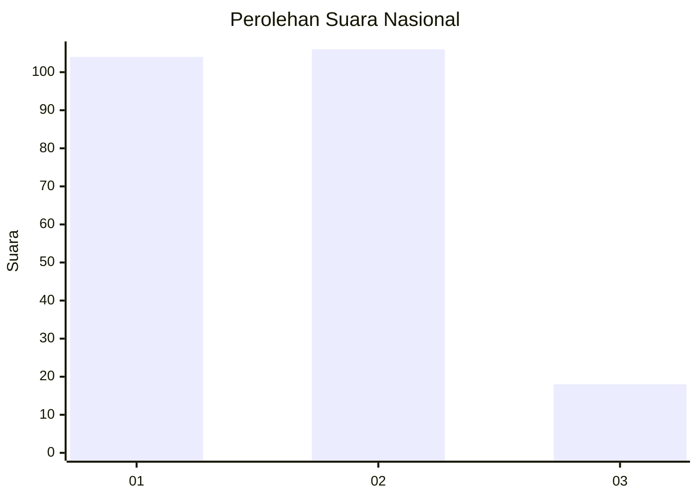
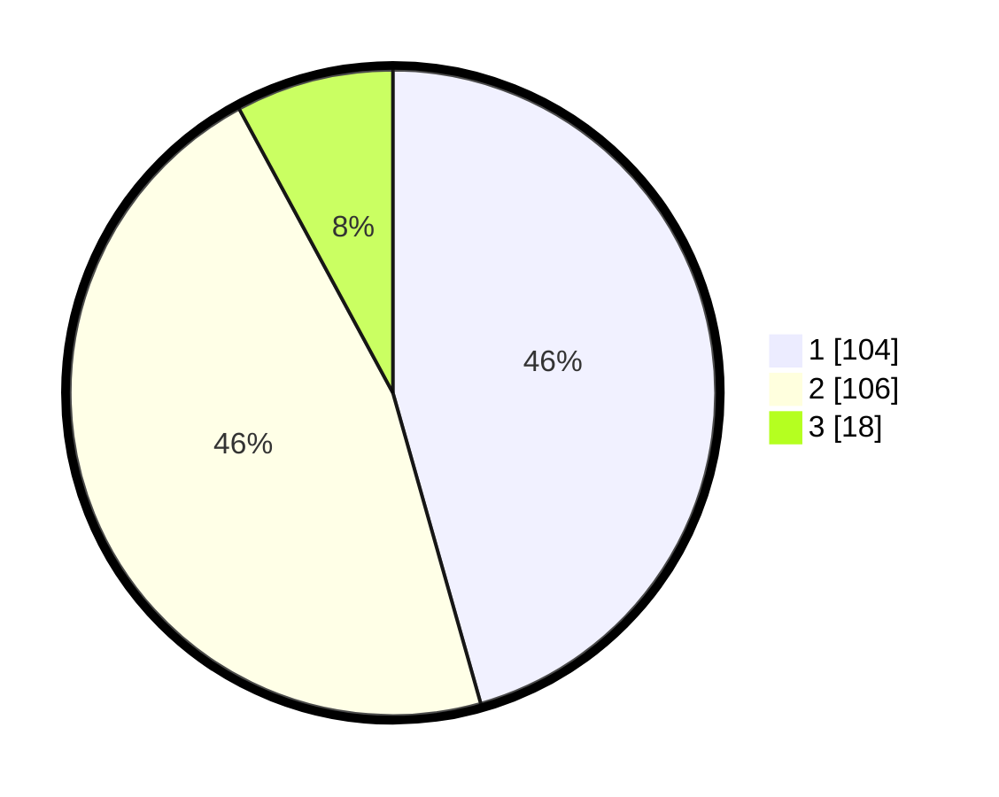

# Hasil

## Grafik

## Tabel

| No.    | Nama Paslon    | Suara | Suara (raw) | Persentase |
|:------ |:-------------- | -----:| -----------:| ----------:|
| 100025 | ANIES MUHAIMIN | 104   | [104][p-1]  | 45,61      |
| 100026 | PRABOWO GIBRAN | 106   | [106][p-2]  | 46,49      |
| 100027 | GANJAR MAHFUD  | 18    | [18][p-3]   | 7,89       |

[p-1]: https://github.com/gigit-pemilu/pemilu-2024/blob/main/pilpres/hitung-suara/sub/31-dki-jakarta/sub/75-jakarta-timur/sub/10-cipayung/sub/1002-cilangkap/sub/009-tps/sub/paslon-1.txt
[p-2]: https://github.com/gigit-pemilu/pemilu-2024/blob/main/pilpres/hitung-suara/sub/31-dki-jakarta/sub/75-jakarta-timur/sub/10-cipayung/sub/1002-cilangkap/sub/009-tps/sub/paslon-2.txt
[p-3]: https://github.com/gigit-pemilu/pemilu-2024/blob/main/pilpres/hitung-suara/sub/31-dki-jakarta/sub/75-jakarta-timur/sub/10-cipayung/sub/1002-cilangkap/sub/009-tps/sub/paslon-3.txt

## Foto C Plano

https://sirekap-obj-formc.kpu.go.id/2e30/pemilu/ppwp/31/75/10/10/02/3175101002009-20240214-222248--ef6394b3-30fd-498e-894e-9a8de267cf10.jpg

https://sirekap-obj-formc.kpu.go.id/2e30/pemilu/ppwp/31/75/10/10/02/3175101002009-20240214-222254--507d6755-3b60-4ce2-a625-f3d366da8855.jpg

https://sirekap-obj-formc.kpu.go.id/2e30/pemilu/ppwp/31/75/10/10/02/3175101002009-20240214-222301--b16da15e-3786-4d85-b79b-f98cfd1e128b.jpg

## Metadata

| Key        | Value               |
| ---------- | ------------------- |
| Time Stamp | 2024-02-16 16:25:10 |

