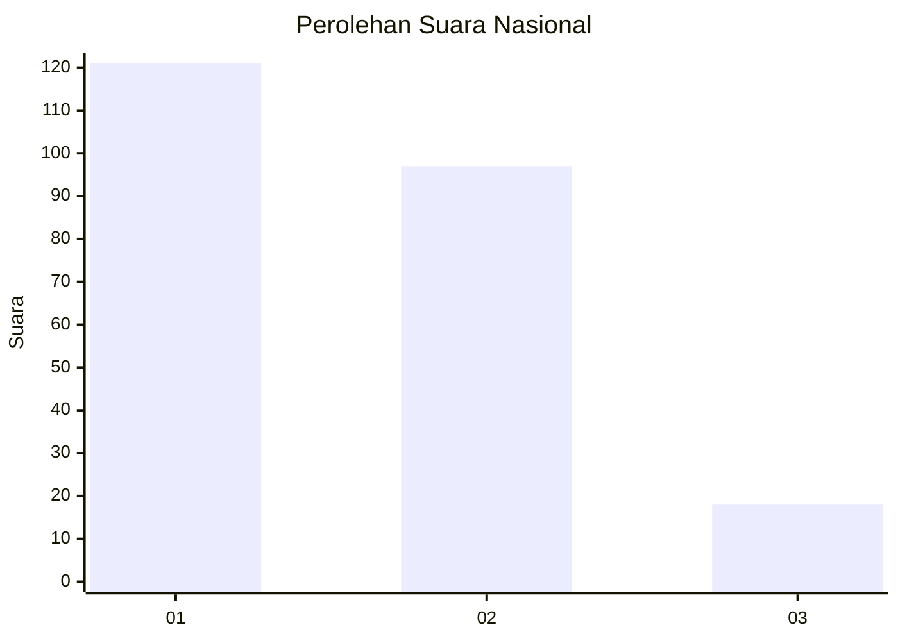
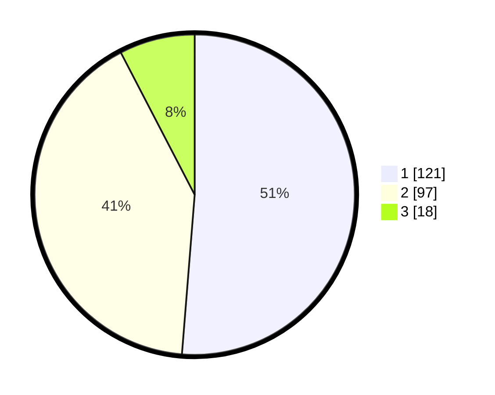

# Hasil

## Grafik

## Tabel

| No.    | Nama Paslon    | Suara | Suara (raw) | Persentase |
|:------ |:-------------- | -----:| -----------:| ----------:|
| 100025 | ANIES MUHAIMIN | 121   | [121][p-1]  | 51,27      |
| 100026 | PRABOWO GIBRAN | 97    | [97][p-2]   | 41,10      |
| 100027 | GANJAR MAHFUD  | 18    | [18][p-3]   | 7,63       |

[p-1]: https://github.com/gigit-pemilu/pemilu-2024/blob/main/pilpres/hitung-suara/sub/31-dki-jakarta/sub/75-jakarta-timur/sub/10-cipayung/sub/1002-cilangkap/sub/010-tps/sub/paslon-1.txt
[p-2]: https://github.com/gigit-pemilu/pemilu-2024/blob/main/pilpres/hitung-suara/sub/31-dki-jakarta/sub/75-jakarta-timur/sub/10-cipayung/sub/1002-cilangkap/sub/010-tps/sub/paslon-2.txt
[p-3]: https://github.com/gigit-pemilu/pemilu-2024/blob/main/pilpres/hitung-suara/sub/31-dki-jakarta/sub/75-jakarta-timur/sub/10-cipayung/sub/1002-cilangkap/sub/010-tps/sub/paslon-3.txt

## Foto C Plano

https://sirekap-obj-formc.kpu.go.id/4a54/pemilu/ppwp/31/75/10/10/02/3175101002010-20240214-224459--9ff91498-3c87-4ec4-a7be-640a305eea9d.jpg

https://sirekap-obj-formc.kpu.go.id/4a54/pemilu/ppwp/31/75/10/10/02/3175101002010-20240214-224558--2ad4e8c3-e0c2-4812-9e87-e0c489f77835.jpg

https://sirekap-obj-formc.kpu.go.id/4a54/pemilu/ppwp/31/75/10/10/02/3175101002010-20240214-225139--e6cf8fb6-0cc2-4489-9f25-87ee879c6cb9.jpg

## Metadata

| Key        | Value               |
| ---------- | ------------------- |
| Time Stamp | 2024-02-24 22:31:28 |

