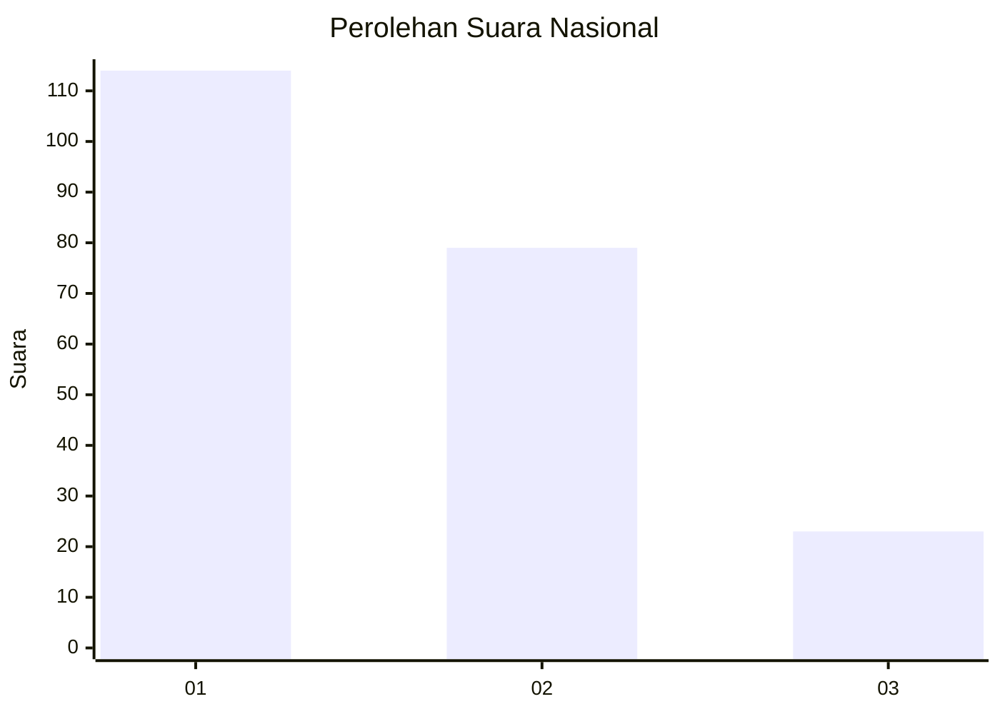
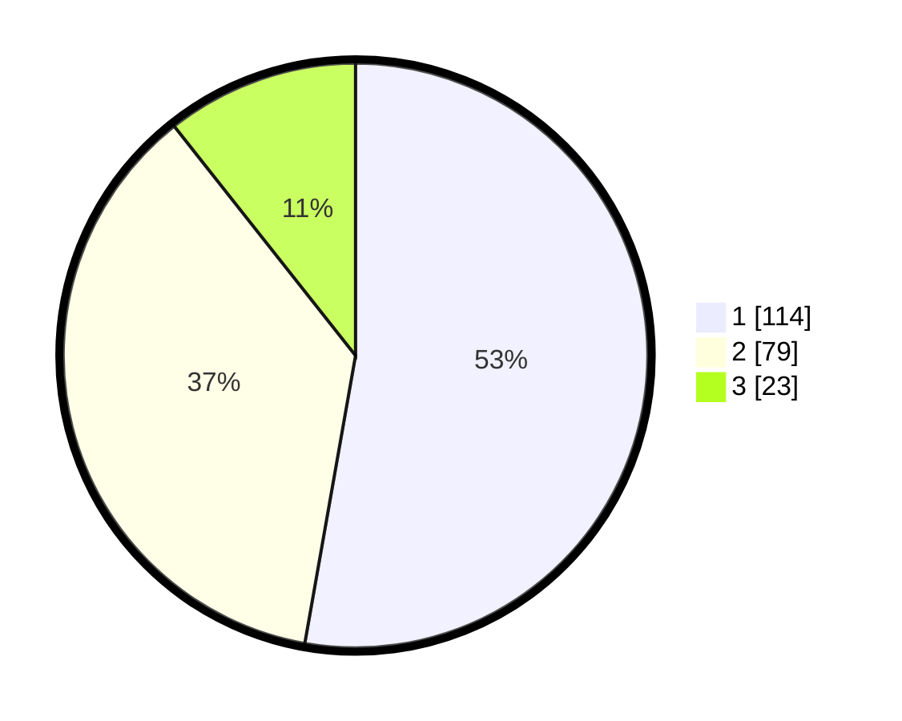

# Hasil

## Grafik

## Tabel

| No.    | Nama Paslon    | Suara | Suara (raw) | Persentase |
|:------ |:-------------- | -----:| -----------:| ----------:|
| 100025 | ANIES MUHAIMIN | 114   | [114][p-1]  | 52,78      |
| 100026 | PRABOWO GIBRAN | 79    | [79][p-2]   | 36,57      |
| 100027 | GANJAR MAHFUD  | 23    | [23][p-3]   | 10,65      |

[p-1]: https://github.com/gigit-pemilu/pemilu-2024/blob/main/pilpres/hitung-suara/sub/31-dki-jakarta/sub/75-jakarta-timur/sub/10-cipayung/sub/1002-cilangkap/sub/032-tps/sub/paslon-1.txt
[p-2]: https://github.com/gigit-pemilu/pemilu-2024/blob/main/pilpres/hitung-suara/sub/31-dki-jakarta/sub/75-jakarta-timur/sub/10-cipayung/sub/1002-cilangkap/sub/032-tps/sub/paslon-2.txt
[p-3]: https://github.com/gigit-pemilu/pemilu-2024/blob/main/pilpres/hitung-suara/sub/31-dki-jakarta/sub/75-jakarta-timur/sub/10-cipayung/sub/1002-cilangkap/sub/032-tps/sub/paslon-3.txt

## Foto C Plano

https://sirekap-obj-formc.kpu.go.id/6fcf/pemilu/ppwp/31/75/10/10/02/3175101002032-20240214-213034--44bba18c-7869-4d5b-818e-ea68a113205a.jpg

https://sirekap-obj-formc.kpu.go.id/6fcf/pemilu/ppwp/31/75/10/10/02/3175101002032-20240214-213050--33d41088-ad32-4dc5-95e2-f1b5a4010f6d.jpg

https://sirekap-obj-formc.kpu.go.id/6fcf/pemilu/ppwp/31/75/10/10/02/3175101002032-20240214-213105--63ed5370-4b84-4253-a113-29b3e459cefe.jpg

## Metadata

| Key        | Value               |
| ---------- | ------------------- |
| Time Stamp | 2024-02-24 22:31:28 |

