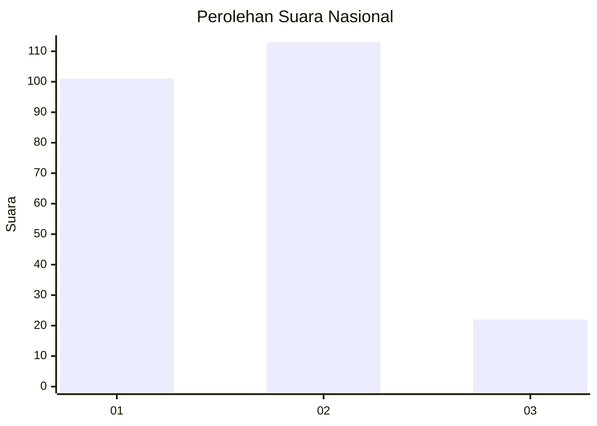
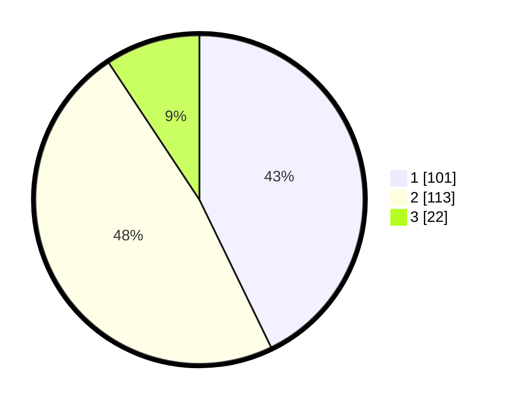

# Hasil

## Grafik

## Tabel

| No.    | Nama Paslon    | Suara | Suara (raw) | Persentase |
|:------ |:-------------- | -----:| -----------:| ----------:|
| 100025 | ANIES MUHAIMIN | 101   | [101][p-1]  | 42,80      |
| 100026 | PRABOWO GIBRAN | 113   | [113][p-2]  | 47,88      |
| 100027 | GANJAR MAHFUD  | 22    | [22][p-3]   | 9,32       |

[p-1]: https://github.com/gigit-pemilu/pemilu-2024/blob/main/pilpres/hitung-suara/sub/31-dki-jakarta/sub/75-jakarta-timur/sub/10-cipayung/sub/1002-cilangkap/sub/034-tps/sub/paslon-1.txt
[p-2]: https://github.com/gigit-pemilu/pemilu-2024/blob/main/pilpres/hitung-suara/sub/31-dki-jakarta/sub/75-jakarta-timur/sub/10-cipayung/sub/1002-cilangkap/sub/034-tps/sub/paslon-2.txt
[p-3]: https://github.com/gigit-pemilu/pemilu-2024/blob/main/pilpres/hitung-suara/sub/31-dki-jakarta/sub/75-jakarta-timur/sub/10-cipayung/sub/1002-cilangkap/sub/034-tps/sub/paslon-3.txt

## Foto C Plano

https://sirekap-obj-formc.kpu.go.id/12c6/pemilu/ppwp/31/75/10/10/02/3175101002034-20240214-191500--a1105ec5-3039-4725-9aba-4a1676b02988.jpg

https://sirekap-obj-formc.kpu.go.id/12c6/pemilu/ppwp/31/75/10/10/02/3175101002034-20240214-194408--ab643718-69d5-41c8-a131-bb00eb23eb13.jpg

https://sirekap-obj-formc.kpu.go.id/12c6/pemilu/ppwp/31/75/10/10/02/3175101002034-20240214-194622--772cf57c-631e-46d8-aed3-4ab332fc1684.jpg

## Metadata

| Key        | Value               |
| ---------- | ------------------- |
| Time Stamp | 2024-02-15 15:00:29 |

