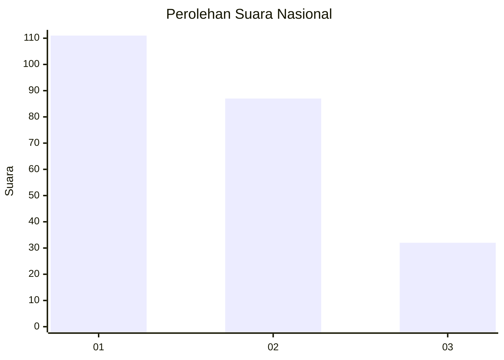
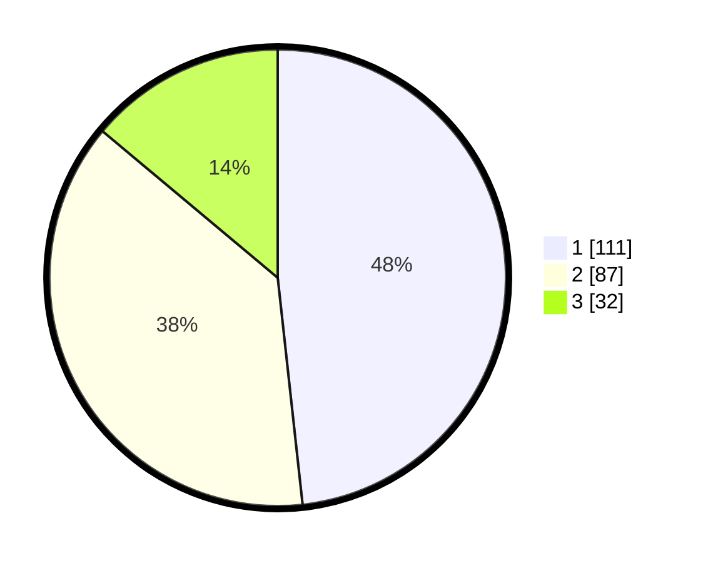

# Hasil

## Grafik

## Tabel

| No.    | Nama Paslon    | Suara | Suara (raw) | Persentase |
|:------ |:-------------- | -----:| -----------:| ----------:|
| 100025 | ANIES MUHAIMIN | 111   | [111][p-1]  | 48,26      |
| 100026 | PRABOWO GIBRAN | 87    | [87][p-2]   | 37,83      |
| 100027 | GANJAR MAHFUD  | 32    | [32][p-3]   | 13,91      |

[p-1]: https://github.com/gigit-pemilu/pemilu-2024/blob/main/pilpres/hitung-suara/sub/31-dki-jakarta/sub/75-jakarta-timur/sub/10-cipayung/sub/1002-cilangkap/sub/047-tps/sub/paslon-1.txt
[p-2]: https://github.com/gigit-pemilu/pemilu-2024/blob/main/pilpres/hitung-suara/sub/31-dki-jakarta/sub/75-jakarta-timur/sub/10-cipayung/sub/1002-cilangkap/sub/047-tps/sub/paslon-2.txt
[p-3]: https://github.com/gigit-pemilu/pemilu-2024/blob/main/pilpres/hitung-suara/sub/31-dki-jakarta/sub/75-jakarta-timur/sub/10-cipayung/sub/1002-cilangkap/sub/047-tps/sub/paslon-3.txt

## Foto C Plano

https://sirekap-obj-formc.kpu.go.id/3424/pemilu/ppwp/31/75/10/10/02/3175101002047-20240214-155718--24b56c6c-bfc4-403e-b5cc-0614c4561958.jpg

https://sirekap-obj-formc.kpu.go.id/3424/pemilu/ppwp/31/75/10/10/02/3175101002047-20240214-155309--38a8a481-1121-41c9-8330-552c4a5c7deb.jpg

https://sirekap-obj-formc.kpu.go.id/3424/pemilu/ppwp/31/75/10/10/02/3175101002047-20240214-160104--73acd309-addb-49fe-99d5-e8471051e744.jpg

## Metadata

| Key        | Value               |
| ---------- | ------------------- |
| Time Stamp | 2024-02-24 22:31:28 |

