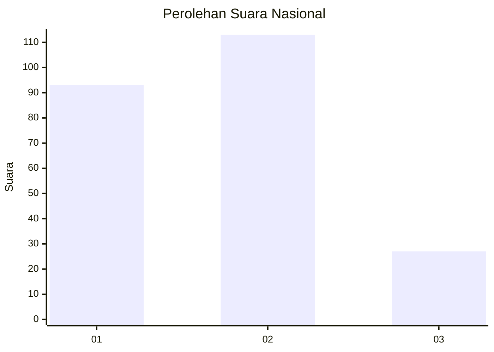
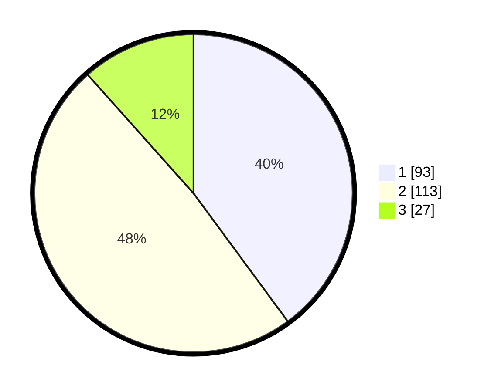

# Hasil

## Grafik

## Tabel

| No.    | Nama Paslon    | Suara | Suara (raw) | Persentase |
|:------ |:-------------- | -----:| -----------:| ----------:|
| 100025 | ANIES MUHAIMIN | 93    | [93][p-1]   | 39,91      |
| 100026 | PRABOWO GIBRAN | 113   | [113][p-2]  | 48,50      |
| 100027 | GANJAR MAHFUD  | 27    | [27][p-3]   | 11,59      |

[p-1]: https://github.com/gigit-pemilu/pemilu-2024/blob/main/pilpres/hitung-suara/sub/31-dki-jakarta/sub/75-jakarta-timur/sub/10-cipayung/sub/1002-cilangkap/sub/084-tps/sub/paslon-1.txt
[p-2]: https://github.com/gigit-pemilu/pemilu-2024/blob/main/pilpres/hitung-suara/sub/31-dki-jakarta/sub/75-jakarta-timur/sub/10-cipayung/sub/1002-cilangkap/sub/084-tps/sub/paslon-2.txt
[p-3]: https://github.com/gigit-pemilu/pemilu-2024/blob/main/pilpres/hitung-suara/sub/31-dki-jakarta/sub/75-jakarta-timur/sub/10-cipayung/sub/1002-cilangkap/sub/084-tps/sub/paslon-3.txt

## Foto C Plano

https://sirekap-obj-formc.kpu.go.id/a078/pemilu/ppwp/31/75/10/10/02/3175101002084-20240214-232445--0fad8911-7640-4982-829e-c730796de0b9.jpg

https://sirekap-obj-formc.kpu.go.id/a078/pemilu/ppwp/31/75/10/10/02/3175101002084-20240214-232427--de0e1145-4792-4645-8931-a815d06d5830.jpg

https://sirekap-obj-formc.kpu.go.id/a078/pemilu/ppwp/31/75/10/10/02/3175101002084-20240214-232536--95e0b0af-5511-469b-b241-64319800062a.jpg

## Metadata

| Key        | Value               |
| ---------- | ------------------- |
| Time Stamp | 2024-02-24 22:31:28 |

