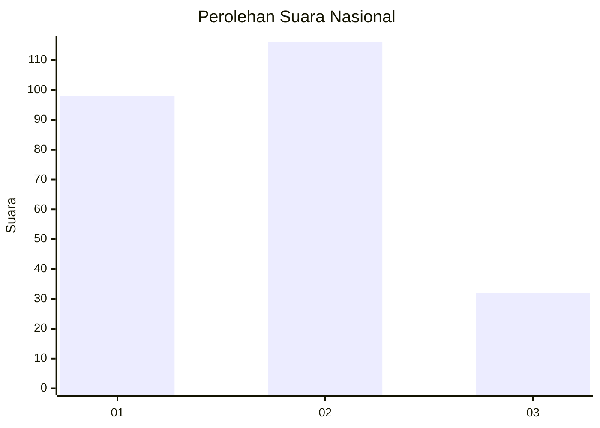
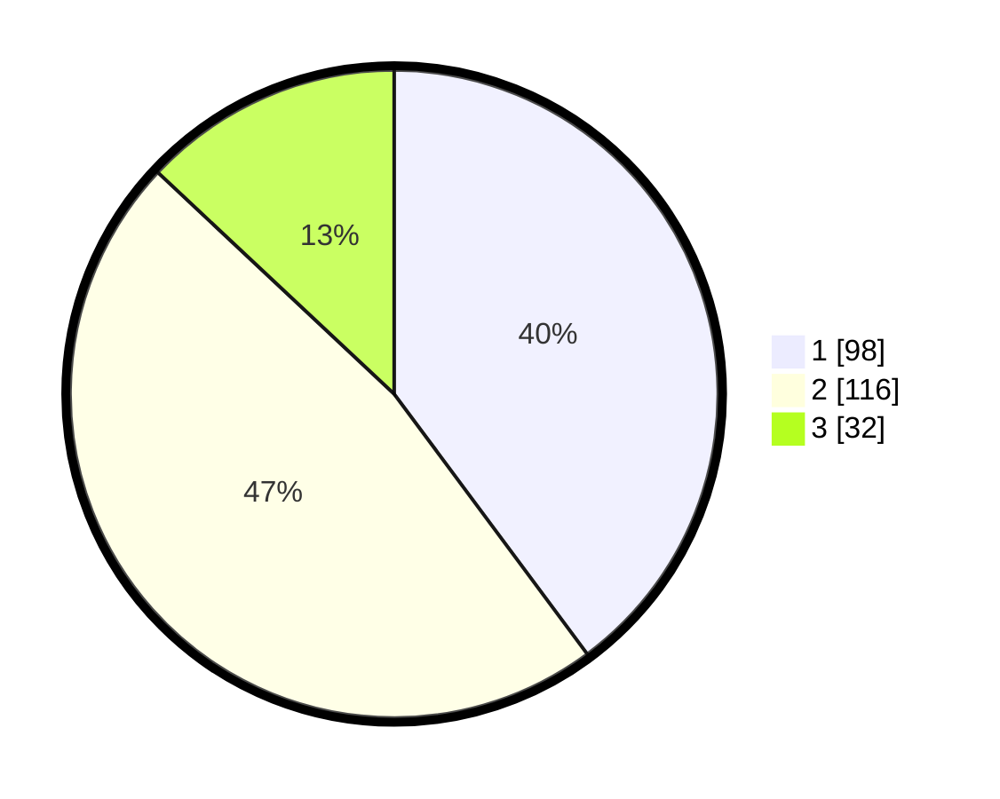

# Hasil

## Grafik

## Tabel

| No.    | Nama Paslon    | Suara | Suara (raw) | Persentase |
|:------ |:-------------- | -----:| -----------:| ----------:|
| 100025 | ANIES MUHAIMIN | 98    | [98][p-1]   | 39,84      |
| 100026 | PRABOWO GIBRAN | 116   | [116][p-2]  | 47,15      |
| 100027 | GANJAR MAHFUD  | 32    | [32][p-3]   | 13,01      |

[p-1]: https://github.com/gigit-pemilu/pemilu-2024/blob/main/pilpres/hitung-suara/sub/31-dki-jakarta/sub/75-jakarta-timur/sub/10-cipayung/sub/1002-cilangkap/sub/090-tps/sub/paslon-1.txt
[p-2]: https://github.com/gigit-pemilu/pemilu-2024/blob/main/pilpres/hitung-suara/sub/31-dki-jakarta/sub/75-jakarta-timur/sub/10-cipayung/sub/1002-cilangkap/sub/090-tps/sub/paslon-2.txt
[p-3]: https://github.com/gigit-pemilu/pemilu-2024/blob/main/pilpres/hitung-suara/sub/31-dki-jakarta/sub/75-jakarta-timur/sub/10-cipayung/sub/1002-cilangkap/sub/090-tps/sub/paslon-3.txt

## Foto C Plano

https://sirekap-obj-formc.kpu.go.id/fc1c/pemilu/ppwp/31/75/10/10/02/3175101002090-20240214-225054--c6865661-2a55-4785-90e1-38fb589fa630.jpg

https://sirekap-obj-formc.kpu.go.id/fc1c/pemilu/ppwp/31/75/10/10/02/3175101002090-20240214-225156--6359da2c-afe0-45a7-b84b-c93c3869e780.jpg

https://sirekap-obj-formc.kpu.go.id/fc1c/pemilu/ppwp/31/75/10/10/02/3175101002090-20240214-225255--c20d2c62-cc53-4d4b-a769-0e04e4307318.jpg

## Metadata

| Key        | Value               |
| ---------- | ------------------- |
| Time Stamp | 2024-02-16 02:00:27 |

