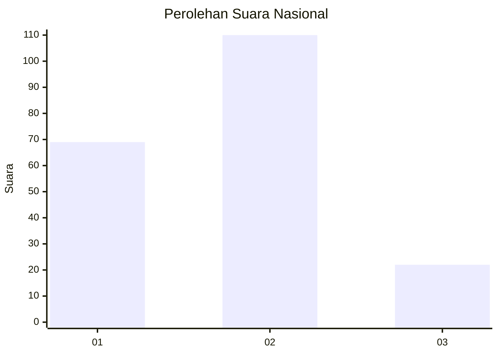
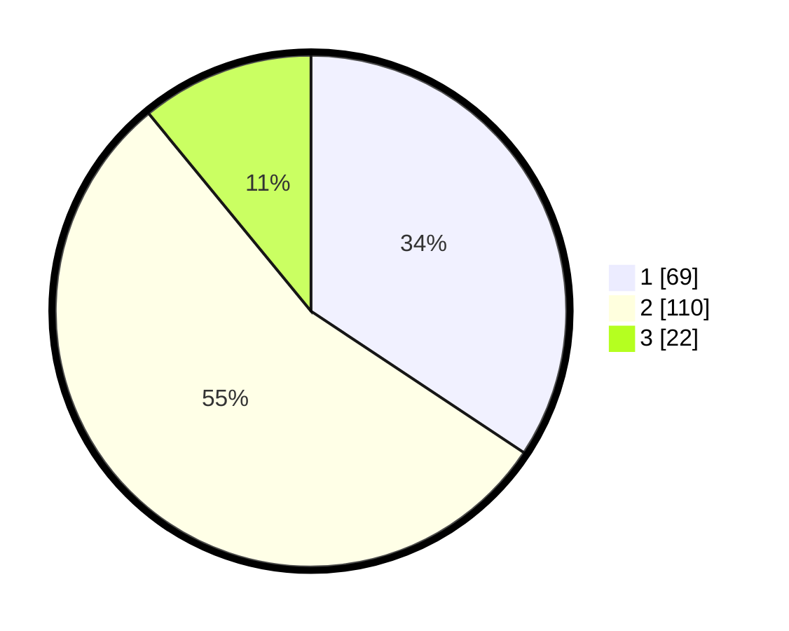

# Hasil

## Grafik

## Tabel

| No.    | Nama Paslon    | Suara | Suara (raw) | Persentase |
|:------ |:-------------- | -----:| -----------:| ----------:|
| 100025 | ANIES MUHAIMIN | 69    | [69][p-1]   | 34,33      |
| 100026 | PRABOWO GIBRAN | 110   | [110][p-2]  | 54,73      |
| 100027 | GANJAR MAHFUD  | 22    | [22][p-3]   | 10,95      |

[p-1]: https://github.com/gigit-pemilu/pemilu-2024/blob/main/pilpres/hitung-suara/sub/31-dki-jakarta/sub/75-jakarta-timur/sub/10-cipayung/sub/1002-cilangkap/sub/091-tps/sub/paslon-1.txt
[p-2]: https://github.com/gigit-pemilu/pemilu-2024/blob/main/pilpres/hitung-suara/sub/31-dki-jakarta/sub/75-jakarta-timur/sub/10-cipayung/sub/1002-cilangkap/sub/091-tps/sub/paslon-2.txt
[p-3]: https://github.com/gigit-pemilu/pemilu-2024/blob/main/pilpres/hitung-suara/sub/31-dki-jakarta/sub/75-jakarta-timur/sub/10-cipayung/sub/1002-cilangkap/sub/091-tps/sub/paslon-3.txt

## Foto C Plano

https://sirekap-obj-formc.kpu.go.id/034f/pemilu/ppwp/31/75/10/10/02/3175101002091-20240215-004844--0ecff92d-50af-40db-b8d9-775cff042a84.jpg

https://sirekap-obj-formc.kpu.go.id/034f/pemilu/ppwp/31/75/10/10/02/3175101002091-20240214-212001--ff69be13-ebe8-4c0c-947f-56010d25a050.jpg

https://sirekap-obj-formc.kpu.go.id/034f/pemilu/ppwp/31/75/10/10/02/3175101002091-20240215-004156--badecf38-fff2-4ea0-8df5-3199942e9d10.jpg

## Metadata

| Key        | Value               |
| ---------- | ------------------- |
| Time Stamp | 2024-02-25 15:00:00 |

