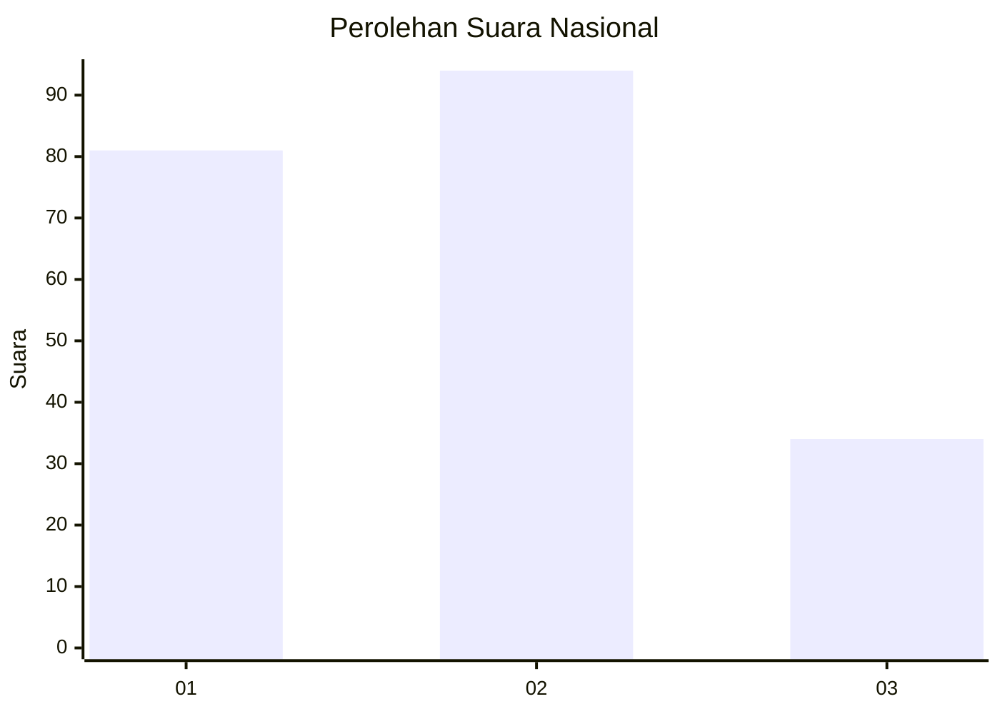
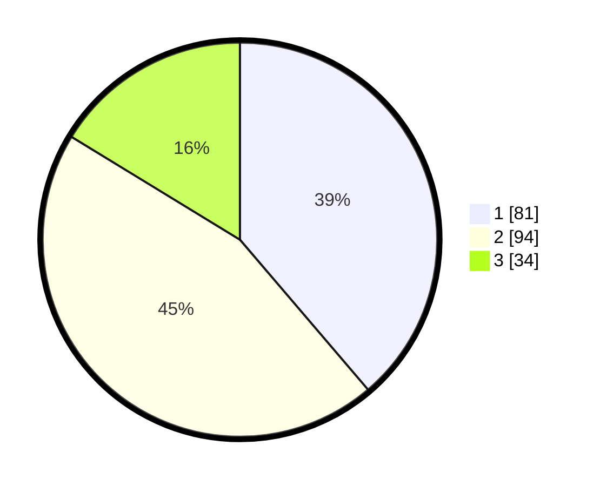

# Hasil

## Grafik

## Tabel

| No.    | Nama Paslon    | Suara | Suara (raw) | Persentase |
|:------ |:-------------- | -----:| -----------:| ----------:|
| 100025 | ANIES MUHAIMIN | 81    | [81][p-1]   | 38,76      |
| 100026 | PRABOWO GIBRAN | 94    | [94][p-2]   | 44,98      |
| 100027 | GANJAR MAHFUD  | 34    | [34][p-3]   | 16,27      |

[p-1]: https://github.com/gigit-pemilu/pemilu-2024/blob/main/pilpres/hitung-suara/sub/31-dki-jakarta/sub/75-jakarta-timur/sub/10-cipayung/sub/1003-pondok-ranggon/sub/067-tps/sub/paslon-1.txt
[p-2]: https://github.com/gigit-pemilu/pemilu-2024/blob/main/pilpres/hitung-suara/sub/31-dki-jakarta/sub/75-jakarta-timur/sub/10-cipayung/sub/1003-pondok-ranggon/sub/067-tps/sub/paslon-2.txt
[p-3]: https://github.com/gigit-pemilu/pemilu-2024/blob/main/pilpres/hitung-suara/sub/31-dki-jakarta/sub/75-jakarta-timur/sub/10-cipayung/sub/1003-pondok-ranggon/sub/067-tps/sub/paslon-3.txt

## Foto C Plano

https://sirekap-obj-formc.kpu.go.id/a391/pemilu/ppwp/31/75/10/10/03/3175101003067-20240215-134359--3cacf611-4699-45df-8104-a8c76d420283.jpg

https://sirekap-obj-formc.kpu.go.id/a391/pemilu/ppwp/31/75/10/10/03/3175101003067-20240215-134353--6bab069b-d7ac-434c-b749-8a2218b371ba.jpg

https://sirekap-obj-formc.kpu.go.id/a391/pemilu/ppwp/31/75/10/10/03/3175101003067-20240215-134404--e0c055cf-d4e9-41e6-a33f-53cf199122a8.jpg

## Metadata

| Key        | Value               |
| ---------- | ------------------- |
| Time Stamp | 2024-02-24 22:31:28 |

