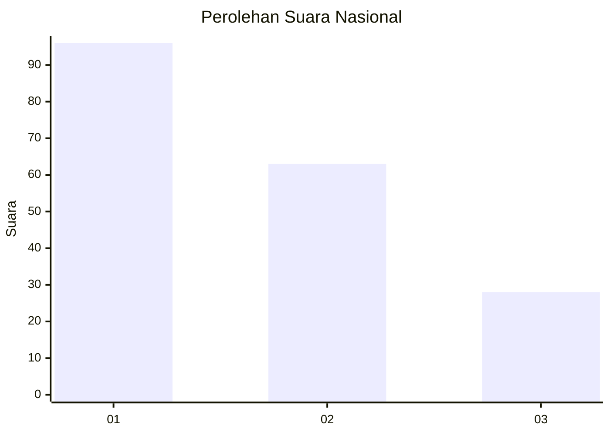
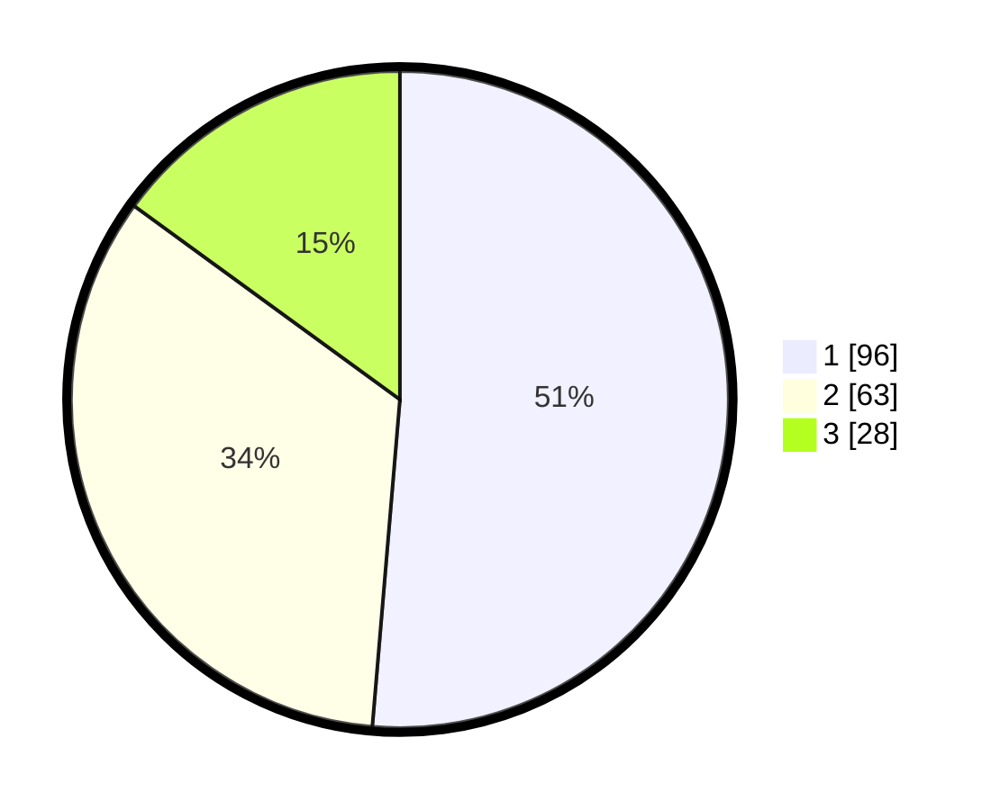

# Hasil

## Grafik

## Tabel

| No.    | Nama Paslon    | Suara | Suara (raw) | Persentase |
|:------ |:-------------- | -----:| -----------:| ----------:|
| 100025 | ANIES MUHAIMIN | 96    | [96][p-1]   | 51,34      |
| 100026 | PRABOWO GIBRAN | 63    | [63][p-2]   | 33,69      |
| 100027 | GANJAR MAHFUD  | 28    | [28][p-3]   | 14,97      |

[p-1]: https://github.com/gigit-pemilu/pemilu-2024/blob/main/pilpres/hitung-suara/sub/31-dki-jakarta/sub/75-jakarta-timur/sub/10-cipayung/sub/1003-pondok-ranggon/sub/071-tps/sub/paslon-1.txt
[p-2]: https://github.com/gigit-pemilu/pemilu-2024/blob/main/pilpres/hitung-suara/sub/31-dki-jakarta/sub/75-jakarta-timur/sub/10-cipayung/sub/1003-pondok-ranggon/sub/071-tps/sub/paslon-2.txt
[p-3]: https://github.com/gigit-pemilu/pemilu-2024/blob/main/pilpres/hitung-suara/sub/31-dki-jakarta/sub/75-jakarta-timur/sub/10-cipayung/sub/1003-pondok-ranggon/sub/071-tps/sub/paslon-3.txt

## Foto C Plano

https://sirekap-obj-formc.kpu.go.id/4ac7/pemilu/ppwp/31/75/10/10/03/3175101003071-20240214-231648--780c5e2c-7c62-423a-ae6d-ebf4a837eaf1.jpg

https://sirekap-obj-formc.kpu.go.id/4ac7/pemilu/ppwp/31/75/10/10/03/3175101003071-20240214-231800--1de9ff3e-bcc1-4b2f-9001-df716937504a.jpg

https://sirekap-obj-formc.kpu.go.id/4ac7/pemilu/ppwp/31/75/10/10/03/3175101003071-20240214-231917--768d05c3-00c3-4b73-b32d-c1c49f325780.jpg

## Metadata

| Key        | Value               |
| ---------- | ------------------- |
| Time Stamp | 2024-02-15 15:00:29 |

