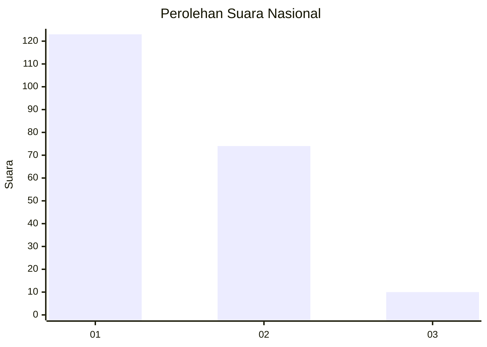
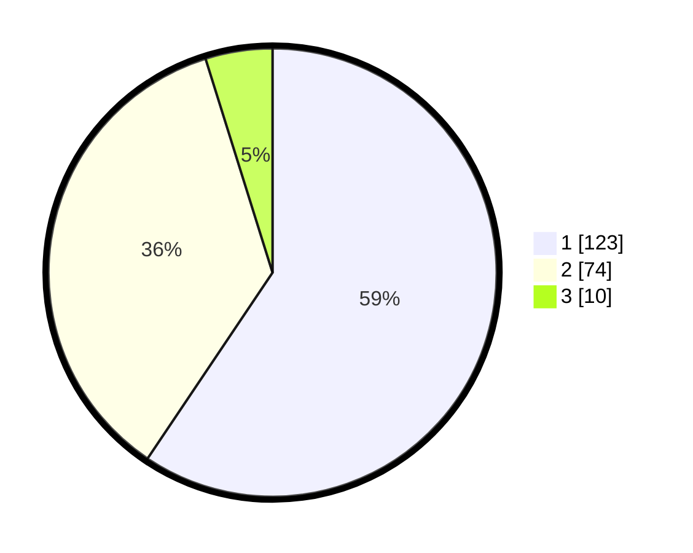

# Hasil

## Grafik

## Tabel

| No.    | Nama Paslon    | Suara | Suara (raw) | Persentase |
|:------ |:-------------- | -----:| -----------:| ----------:|
| 100025 | ANIES MUHAIMIN | 123   | [123][p-1]  | 59,42      |
| 100026 | PRABOWO GIBRAN | 74    | [74][p-2]   | 35,75      |
| 100027 | GANJAR MAHFUD  | 10    | [10][p-3]   | 4,83       |

[p-1]: https://github.com/gigit-pemilu/pemilu-2024/blob/main/pilpres/hitung-suara/sub/31-dki-jakarta/sub/75-jakarta-timur/sub/10-cipayung/sub/1003-pondok-ranggon/sub/073-tps/sub/paslon-1.txt
[p-2]: https://github.com/gigit-pemilu/pemilu-2024/blob/main/pilpres/hitung-suara/sub/31-dki-jakarta/sub/75-jakarta-timur/sub/10-cipayung/sub/1003-pondok-ranggon/sub/073-tps/sub/paslon-2.txt
[p-3]: https://github.com/gigit-pemilu/pemilu-2024/blob/main/pilpres/hitung-suara/sub/31-dki-jakarta/sub/75-jakarta-timur/sub/10-cipayung/sub/1003-pondok-ranggon/sub/073-tps/sub/paslon-3.txt

## Foto C Plano

https://sirekap-obj-formc.kpu.go.id/286f/pemilu/ppwp/31/75/10/10/03/3175101003073-20240214-213606--dcb5a009-67ff-430e-bb73-d65b4b124d13.jpg

https://sirekap-obj-formc.kpu.go.id/286f/pemilu/ppwp/31/75/10/10/03/3175101003073-20240214-213838--db12538b-f8c9-41ae-820d-ad8144069bc6.jpg

https://sirekap-obj-formc.kpu.go.id/286f/pemilu/ppwp/31/75/10/10/03/3175101003073-20240214-223947--3e4b9265-90c6-4d07-afcf-54375e9c66b9.jpg

## Metadata

| Key        | Value               |
| ---------- | ------------------- |
| Time Stamp | 2024-02-15 15:00:29 |

