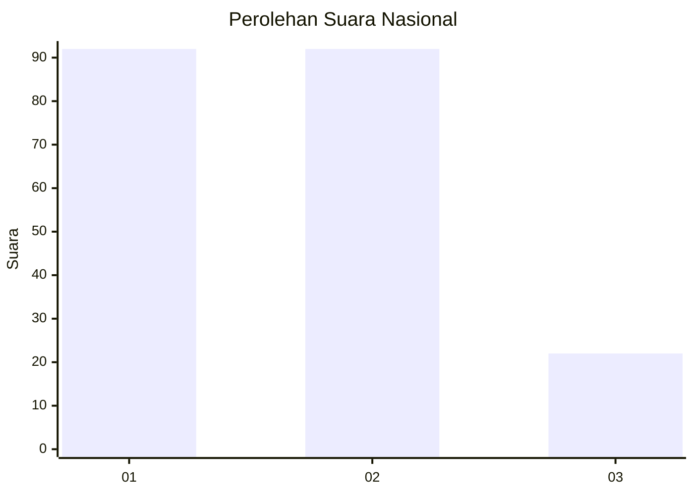
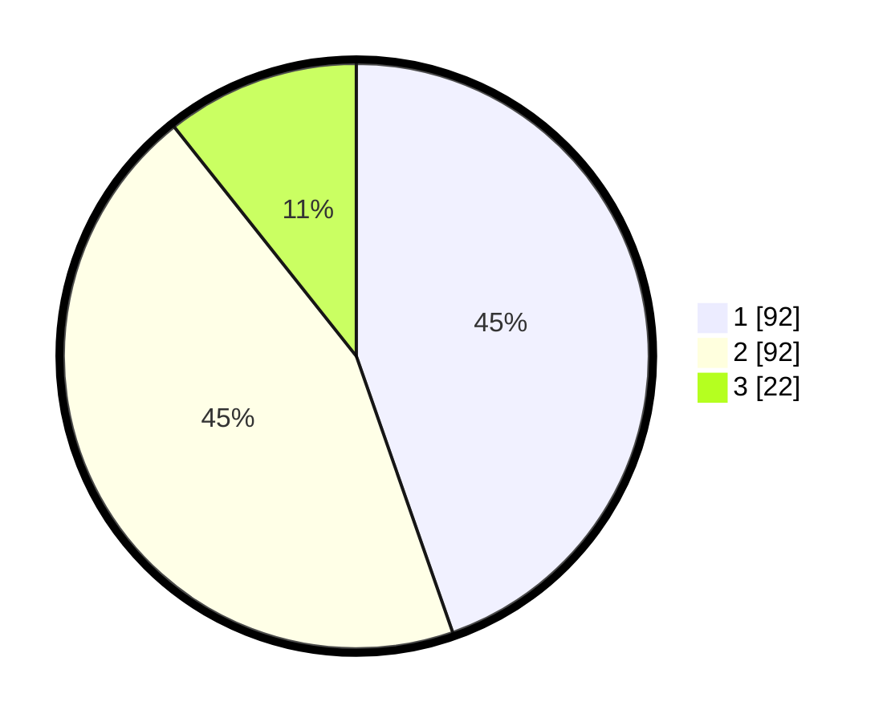

# Hasil

## Grafik

## Tabel

| No.    | Nama Paslon    | Suara | Suara (raw) | Persentase |
|:------ |:-------------- | -----:| -----------:| ----------:|
| 100025 | ANIES MUHAIMIN | 92    | [92][p-1]   | 44,66      |
| 100026 | PRABOWO GIBRAN | 92    | [92][p-2]   | 44,66      |
| 100027 | GANJAR MAHFUD  | 22    | [22][p-3]   | 10,68      |

[p-1]: https://github.com/gigit-pemilu/pemilu-2024/blob/main/pilpres/hitung-suara/sub/31-dki-jakarta/sub/75-jakarta-timur/sub/10-cipayung/sub/1003-pondok-ranggon/sub/082-tps/sub/paslon-1.txt
[p-2]: https://github.com/gigit-pemilu/pemilu-2024/blob/main/pilpres/hitung-suara/sub/31-dki-jakarta/sub/75-jakarta-timur/sub/10-cipayung/sub/1003-pondok-ranggon/sub/082-tps/sub/paslon-2.txt
[p-3]: https://github.com/gigit-pemilu/pemilu-2024/blob/main/pilpres/hitung-suara/sub/31-dki-jakarta/sub/75-jakarta-timur/sub/10-cipayung/sub/1003-pondok-ranggon/sub/082-tps/sub/paslon-3.txt

## Foto C Plano

https://sirekap-obj-formc.kpu.go.id/18be/pemilu/ppwp/31/75/10/10/03/3175101003082-20240214-220444--48f10960-97c8-4b9a-9f7d-a7552542fbc7.jpg

https://sirekap-obj-formc.kpu.go.id/18be/pemilu/ppwp/31/75/10/10/03/3175101003082-20240214-211947--ebd23b02-61fb-4e58-9f22-e7fd135b363a.jpg

https://sirekap-obj-formc.kpu.go.id/18be/pemilu/ppwp/31/75/10/10/03/3175101003082-20240214-212547--070b8e81-02be-4097-8f0c-3ed4bca707a9.jpg

## Metadata

| Key        | Value               |
| ---------- | ------------------- |
| Time Stamp | 2024-02-25 11:00:00 |

