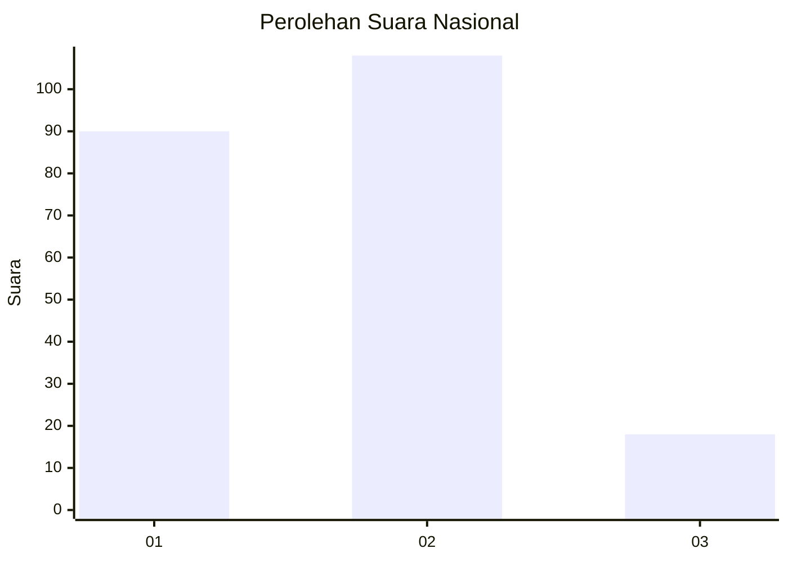
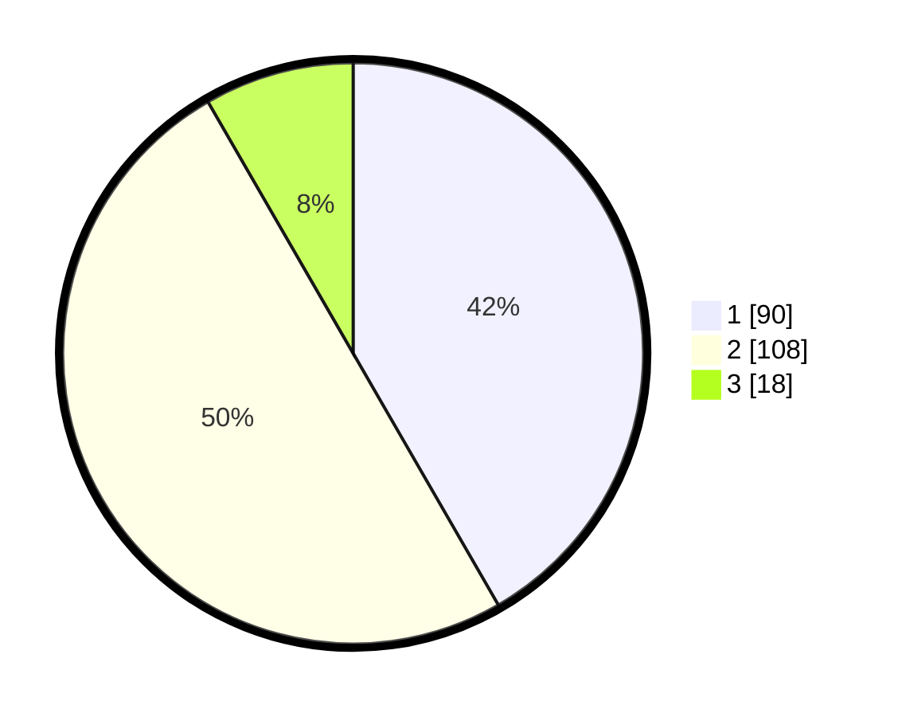

# Hasil

## Grafik

## Tabel

| No.    | Nama Paslon    | Suara | Suara (raw) | Persentase |
|:------ |:-------------- | -----:| -----------:| ----------:|
| 100025 | ANIES MUHAIMIN | 90    | [90][p-1]   | 41,67      |
| 100026 | PRABOWO GIBRAN | 108   | [108][p-2]  | 50,00      |
| 100027 | GANJAR MAHFUD  | 18    | [18][p-3]   | 8,33       |

[p-1]: https://github.com/gigit-pemilu/pemilu-2024/blob/main/pilpres/hitung-suara/sub/31-dki-jakarta/sub/75-jakarta-timur/sub/10-cipayung/sub/1003-pondok-ranggon/sub/087-tps/sub/paslon-1.txt
[p-2]: https://github.com/gigit-pemilu/pemilu-2024/blob/main/pilpres/hitung-suara/sub/31-dki-jakarta/sub/75-jakarta-timur/sub/10-cipayung/sub/1003-pondok-ranggon/sub/087-tps/sub/paslon-2.txt
[p-3]: https://github.com/gigit-pemilu/pemilu-2024/blob/main/pilpres/hitung-suara/sub/31-dki-jakarta/sub/75-jakarta-timur/sub/10-cipayung/sub/1003-pondok-ranggon/sub/087-tps/sub/paslon-3.txt

## Foto C Plano

https://sirekap-obj-formc.kpu.go.id/185a/pemilu/ppwp/31/75/10/10/03/3175101003087-20240214-225030--4a125cf1-65ad-4182-9c89-81a0ffb151e1.jpg

https://sirekap-obj-formc.kpu.go.id/185a/pemilu/ppwp/31/75/10/10/03/3175101003087-20240214-225144--80f6c8cb-40fb-463a-a751-05e17f2a8146.jpg

https://sirekap-obj-formc.kpu.go.id/185a/pemilu/ppwp/31/75/10/10/03/3175101003087-20240214-225305--91a4aedf-f186-460b-97bc-3195d0b9d64a.jpg

## Metadata

| Key        | Value               |
| ---------- | ------------------- |
| Time Stamp | 2024-02-24 22:31:28 |

