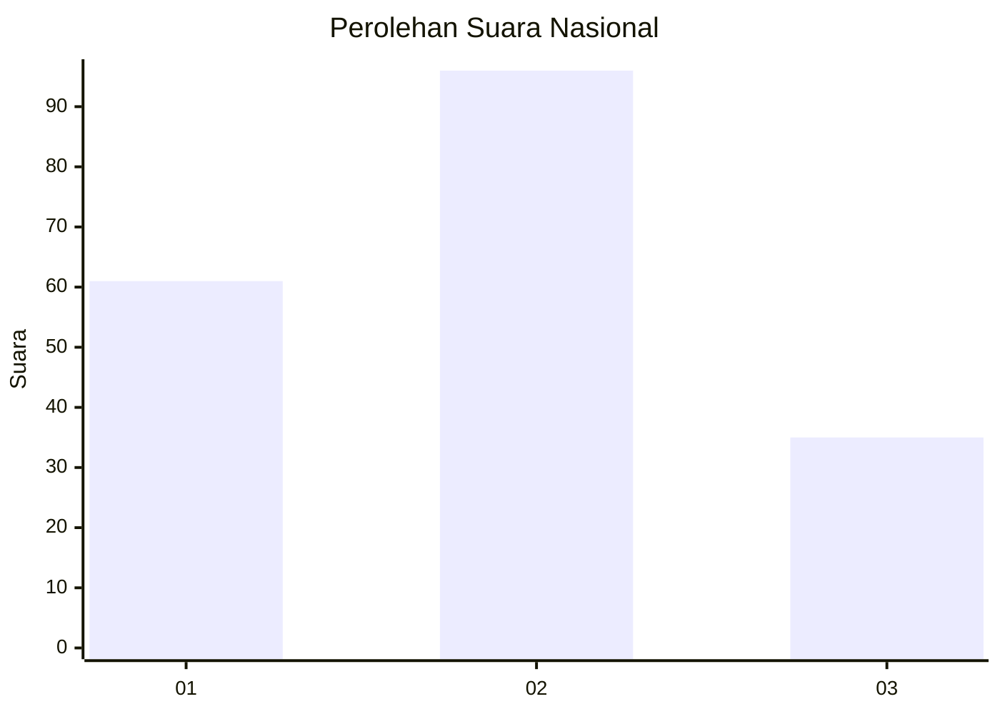
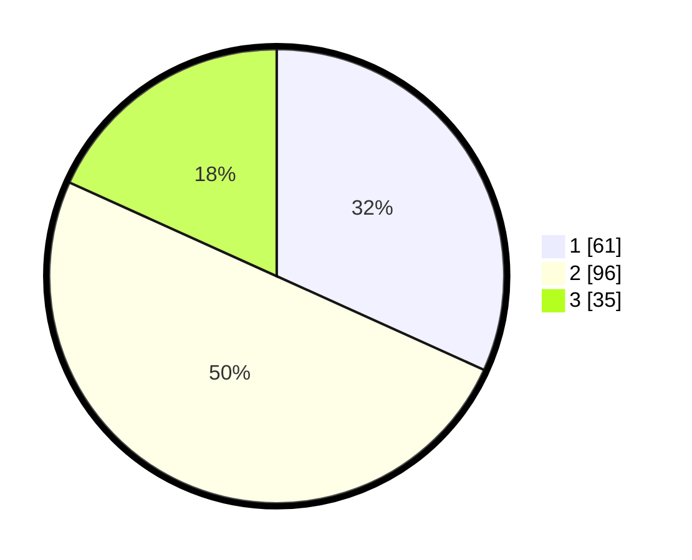

# Hasil

## Grafik

## Tabel

| No.    | Nama Paslon    | Suara | Suara (raw) | Persentase |
|:------ |:-------------- | -----:| -----------:| ----------:|
| 100025 | ANIES MUHAIMIN | 61    | [61][p-1]   | 31,77      |
| 100026 | PRABOWO GIBRAN | 96    | [96][p-2]   | 50,00      |
| 100027 | GANJAR MAHFUD  | 35    | [35][p-3]   | 18,23      |

[p-1]: https://github.com/gigit-pemilu/pemilu-2024/blob/main/pilpres/hitung-suara/sub/31-dki-jakarta/sub/75-jakarta-timur/sub/10-cipayung/sub/1003-pondok-ranggon/sub/089-tps/sub/paslon-1.txt
[p-2]: https://github.com/gigit-pemilu/pemilu-2024/blob/main/pilpres/hitung-suara/sub/31-dki-jakarta/sub/75-jakarta-timur/sub/10-cipayung/sub/1003-pondok-ranggon/sub/089-tps/sub/paslon-2.txt
[p-3]: https://github.com/gigit-pemilu/pemilu-2024/blob/main/pilpres/hitung-suara/sub/31-dki-jakarta/sub/75-jakarta-timur/sub/10-cipayung/sub/1003-pondok-ranggon/sub/089-tps/sub/paslon-3.txt

## Foto C Plano

https://sirekap-obj-formc.kpu.go.id/e1f4/pemilu/ppwp/31/75/10/10/03/3175101003089-20240214-212102--170ae2cb-5d9f-4a19-85fc-20bc01a11a81.jpg

https://sirekap-obj-formc.kpu.go.id/e1f4/pemilu/ppwp/31/75/10/10/03/3175101003089-20240214-212237--7d45b2e0-9af1-4e16-9311-f1bc83124a58.jpg

https://sirekap-obj-formc.kpu.go.id/e1f4/pemilu/ppwp/31/75/10/10/03/3175101003089-20240214-212426--24c5b236-c396-45e2-8c2c-13513b6d4ba0.jpg

## Metadata

| Key        | Value               |
| ---------- | ------------------- |
| Time Stamp | 2024-02-15 15:00:29 |

