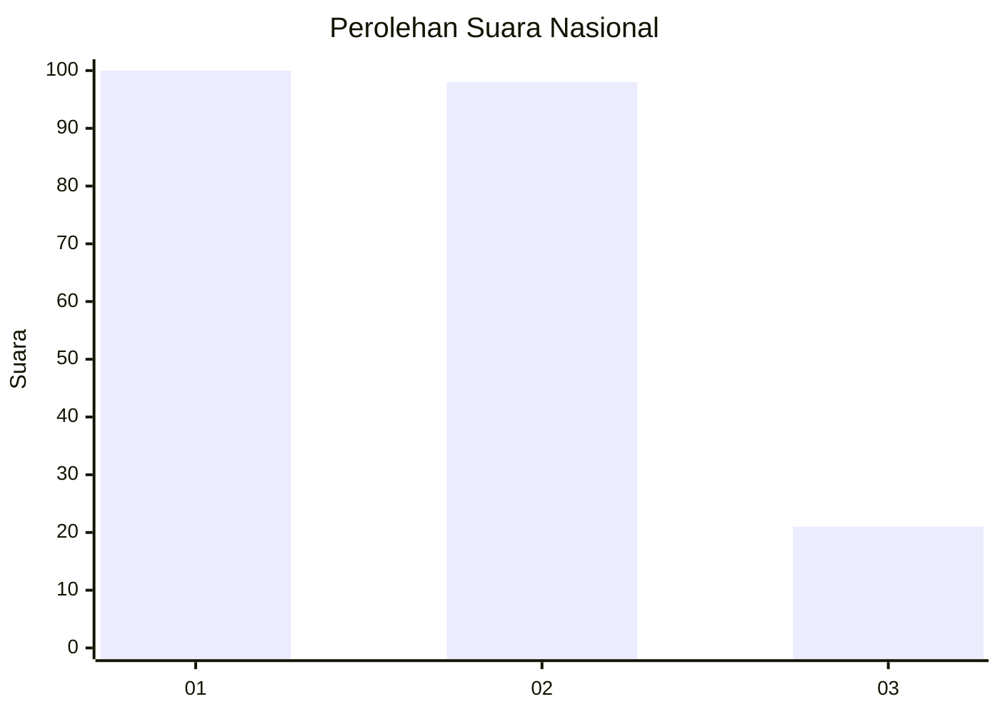
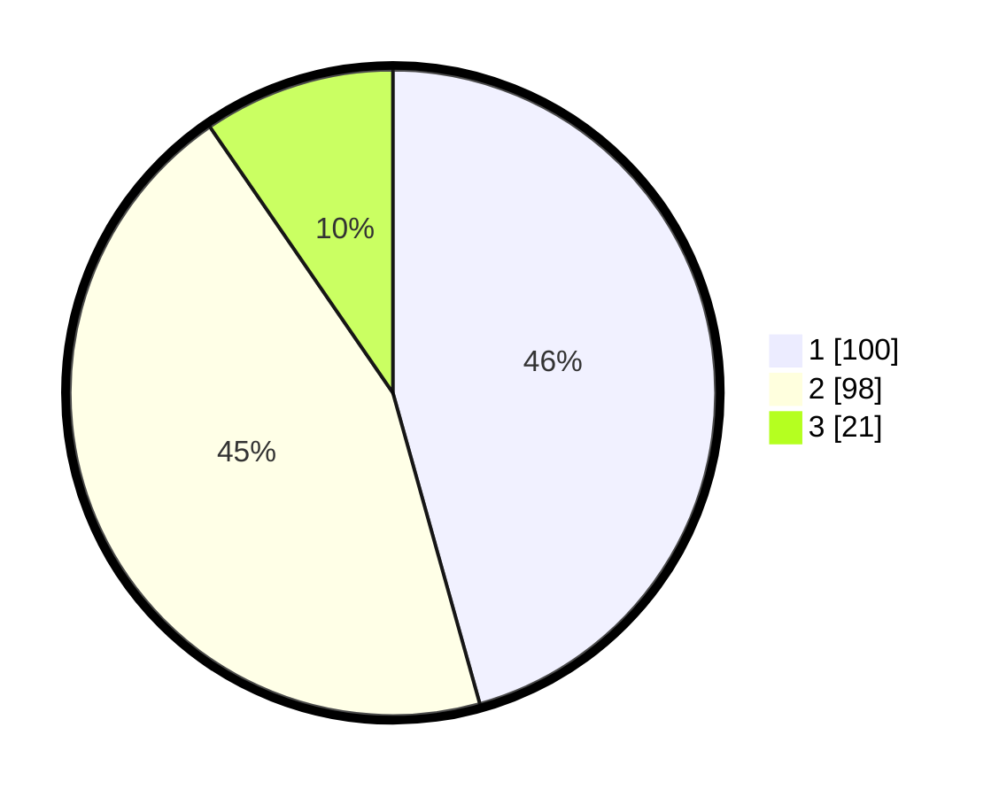

# Hasil

## Grafik

## Tabel

| No.    | Nama Paslon    | Suara | Suara (raw) | Persentase |
|:------ |:-------------- | -----:| -----------:| ----------:|
| 100025 | ANIES MUHAIMIN | 100   | [100][p-1]  | 45,66      |
| 100026 | PRABOWO GIBRAN | 98    | [98][p-2]   | 44,75      |
| 100027 | GANJAR MAHFUD  | 21    | [21][p-3]   | 9,59       |

[p-1]: https://github.com/gigit-pemilu/pemilu-2024/blob/main/pilpres/hitung-suara/sub/31-dki-jakarta/sub/75-jakarta-timur/sub/10-cipayung/sub/1004-munjul/sub/053-tps/sub/paslon-1.txt
[p-2]: https://github.com/gigit-pemilu/pemilu-2024/blob/main/pilpres/hitung-suara/sub/31-dki-jakarta/sub/75-jakarta-timur/sub/10-cipayung/sub/1004-munjul/sub/053-tps/sub/paslon-2.txt
[p-3]: https://github.com/gigit-pemilu/pemilu-2024/blob/main/pilpres/hitung-suara/sub/31-dki-jakarta/sub/75-jakarta-timur/sub/10-cipayung/sub/1004-munjul/sub/053-tps/sub/paslon-3.txt

## Foto C Plano

https://sirekap-obj-formc.kpu.go.id/3e3a/pemilu/ppwp/31/75/10/10/04/3175101004053-20240215-173838--bbf8e330-6a09-4652-9bd4-3d018bd2803d.jpg

https://sirekap-obj-formc.kpu.go.id/3e3a/pemilu/ppwp/31/75/10/10/04/3175101004053-20240215-173955--6f9c7944-dbd3-4920-b895-f06cafd6ea9b.jpg

https://sirekap-obj-formc.kpu.go.id/3e3a/pemilu/ppwp/31/75/10/10/04/3175101004053-20240215-173959--2fc13968-0cc7-43d2-a06a-3c377a0fb9ec.jpg

## Metadata

| Key        | Value               |
| ---------- | ------------------- |
| Time Stamp | 2024-02-24 22:31:28 |

