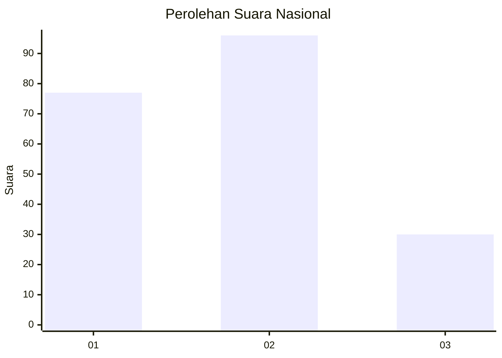
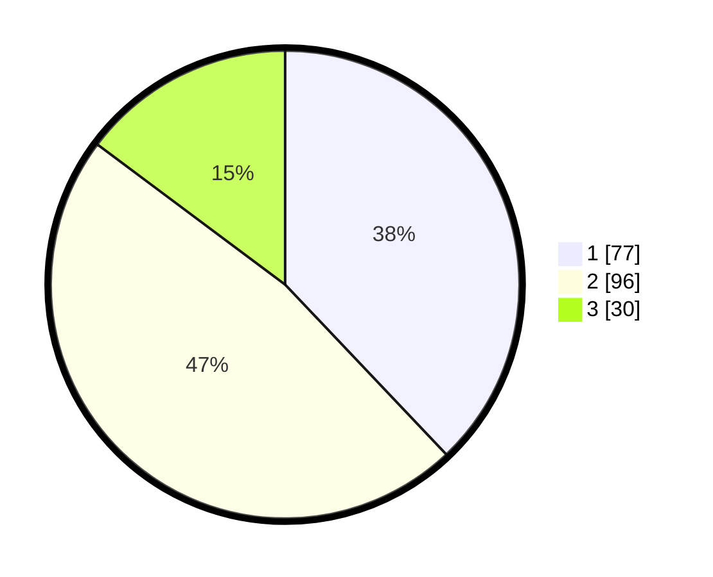

# Hasil

## Grafik

## Tabel

| No.    | Nama Paslon    | Suara | Suara (raw) | Persentase |
|:------ |:-------------- | -----:| -----------:| ----------:|
| 100025 | ANIES MUHAIMIN | 77    | [77][p-1]   | 37,93      |
| 100026 | PRABOWO GIBRAN | 96    | [96][p-2]   | 47,29      |
| 100027 | GANJAR MAHFUD  | 30    | [30][p-3]   | 14,78      |

[p-1]: https://github.com/gigit-pemilu/pemilu-2024/blob/main/pilpres/hitung-suara/sub/31-dki-jakarta/sub/75-jakarta-timur/sub/10-cipayung/sub/1004-munjul/sub/062-tps/sub/paslon-1.txt
[p-2]: https://github.com/gigit-pemilu/pemilu-2024/blob/main/pilpres/hitung-suara/sub/31-dki-jakarta/sub/75-jakarta-timur/sub/10-cipayung/sub/1004-munjul/sub/062-tps/sub/paslon-2.txt
[p-3]: https://github.com/gigit-pemilu/pemilu-2024/blob/main/pilpres/hitung-suara/sub/31-dki-jakarta/sub/75-jakarta-timur/sub/10-cipayung/sub/1004-munjul/sub/062-tps/sub/paslon-3.txt

## Foto C Plano

https://sirekap-obj-formc.kpu.go.id/640f/pemilu/ppwp/31/75/10/10/04/3175101004062-20240214-220842--f499ec51-6988-4a04-88d7-7c3538068f3e.jpg

https://sirekap-obj-formc.kpu.go.id/640f/pemilu/ppwp/31/75/10/10/04/3175101004062-20240214-221018--d77085e0-8656-4207-adc5-3933683a6d42.jpg

https://sirekap-obj-formc.kpu.go.id/640f/pemilu/ppwp/31/75/10/10/04/3175101004062-20240214-221204--f2bbcd6a-a602-4683-a174-b2ca2f928b5f.jpg

## Metadata

| Key        | Value               |
| ---------- | ------------------- |
| Time Stamp | 2024-02-15 15:00:29 |

