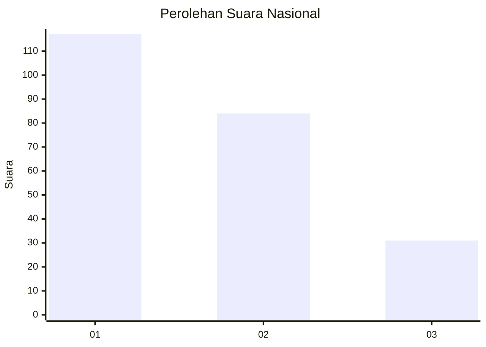
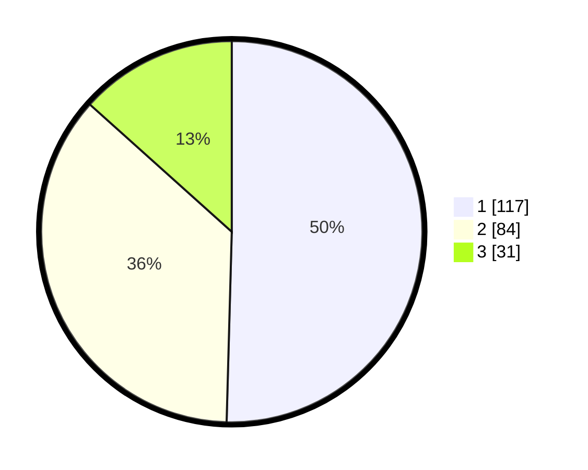

# Hasil

## Grafik

## Tabel

| No.    | Nama Paslon    | Suara | Suara (raw) | Persentase |
|:------ |:-------------- | -----:| -----------:| ----------:|
| 100025 | ANIES MUHAIMIN | 117   | [117][p-1]  | 50,43      |
| 100026 | PRABOWO GIBRAN | 84    | [84][p-2]   | 36,21      |
| 100027 | GANJAR MAHFUD  | 31    | [31][p-3]   | 13,36      |

[p-1]: https://github.com/gigit-pemilu/pemilu-2024/blob/main/pilpres/hitung-suara/sub/31-dki-jakarta/sub/75-jakarta-timur/sub/10-cipayung/sub/1005-setu/sub/034-tps/sub/paslon-1.txt
[p-2]: https://github.com/gigit-pemilu/pemilu-2024/blob/main/pilpres/hitung-suara/sub/31-dki-jakarta/sub/75-jakarta-timur/sub/10-cipayung/sub/1005-setu/sub/034-tps/sub/paslon-2.txt
[p-3]: https://github.com/gigit-pemilu/pemilu-2024/blob/main/pilpres/hitung-suara/sub/31-dki-jakarta/sub/75-jakarta-timur/sub/10-cipayung/sub/1005-setu/sub/034-tps/sub/paslon-3.txt

## Foto C Plano

https://sirekap-obj-formc.kpu.go.id/8d1a/pemilu/ppwp/31/75/10/10/05/3175101005034-20240214-231205--c458ddd8-87c2-4204-9c76-646dc321fa1f.jpg

https://sirekap-obj-formc.kpu.go.id/8d1a/pemilu/ppwp/31/75/10/10/05/3175101005034-20240214-231324--e77f715d-b5e6-45e2-86eb-128be0b90661.jpg

https://sirekap-obj-formc.kpu.go.id/8d1a/pemilu/ppwp/31/75/10/10/05/3175101005034-20240214-231419--f307c13a-c58e-4c51-9451-5913a1dd3766.jpg

## Metadata

| Key        | Value               |
| ---------- | ------------------- |
| Time Stamp | 2024-02-25 18:00:00 |

