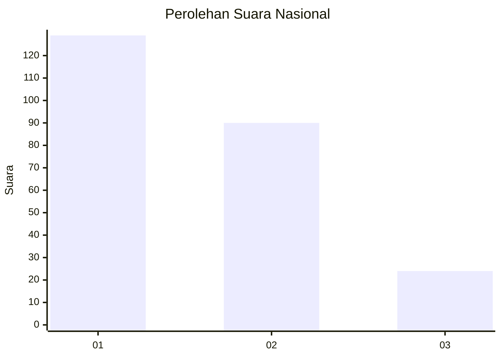
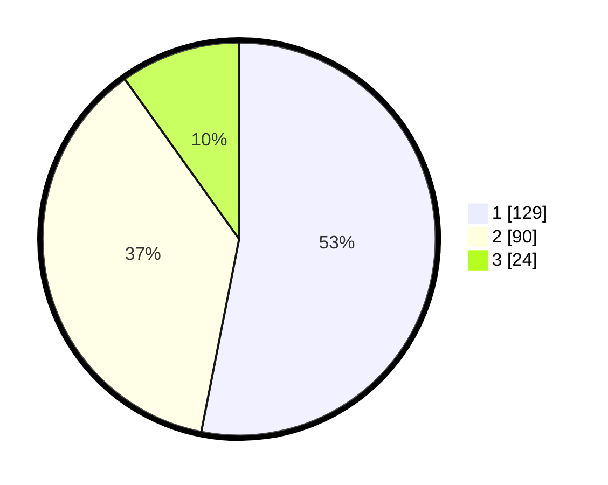

# Hasil

## Grafik

## Tabel

| No.    | Nama Paslon    | Suara | Suara (raw) | Persentase |
|:------ |:-------------- | -----:| -----------:| ----------:|
| 100025 | ANIES MUHAIMIN | 129   | [129][p-1]  | 53,09      |
| 100026 | PRABOWO GIBRAN | 90    | [90][p-2]   | 37,04      |
| 100027 | GANJAR MAHFUD  | 24    | [24][p-3]   | 9,88       |

[p-1]: https://github.com/gigit-pemilu/pemilu-2024/blob/main/pilpres/hitung-suara/sub/31-dki-jakarta/sub/75-jakarta-timur/sub/10-cipayung/sub/1005-setu/sub/056-tps/sub/paslon-1.txt
[p-2]: https://github.com/gigit-pemilu/pemilu-2024/blob/main/pilpres/hitung-suara/sub/31-dki-jakarta/sub/75-jakarta-timur/sub/10-cipayung/sub/1005-setu/sub/056-tps/sub/paslon-2.txt
[p-3]: https://github.com/gigit-pemilu/pemilu-2024/blob/main/pilpres/hitung-suara/sub/31-dki-jakarta/sub/75-jakarta-timur/sub/10-cipayung/sub/1005-setu/sub/056-tps/sub/paslon-3.txt

## Foto C Plano

https://sirekap-obj-formc.kpu.go.id/f332/pemilu/ppwp/31/75/10/10/05/3175101005056-20240214-201715--b3bec973-c6dd-4f2c-b30c-eb3a12b1e9db.jpg

https://sirekap-obj-formc.kpu.go.id/f332/pemilu/ppwp/31/75/10/10/05/3175101005056-20240214-201744--db97f052-5868-4a9c-9702-de462549fc26.jpg

https://sirekap-obj-formc.kpu.go.id/f332/pemilu/ppwp/31/75/10/10/05/3175101005056-20240214-201807--2ce492d6-d50e-4b7d-a7cd-c297f978d33a.jpg

## Metadata

| Key        | Value               |
| ---------- | ------------------- |
| Time Stamp | 2024-02-24 22:31:28 |

