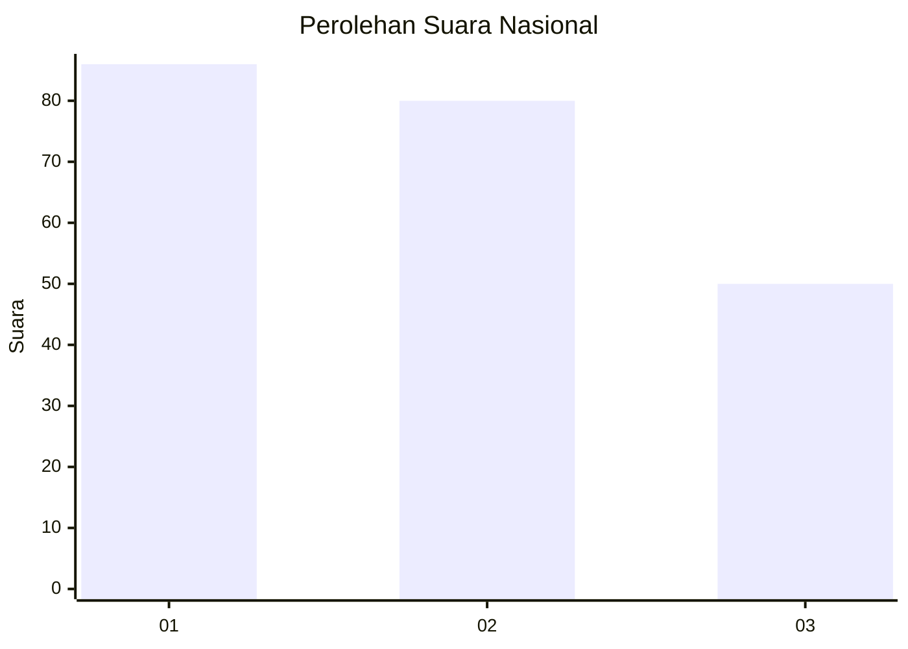
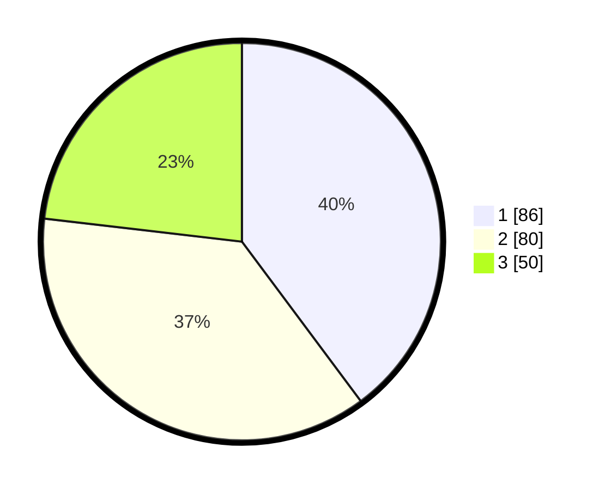

# Hasil

## Grafik

## Tabel

| No.    | Nama Paslon    | Suara | Suara (raw) | Persentase |
|:------ |:-------------- | -----:| -----------:| ----------:|
| 100025 | ANIES MUHAIMIN | 86    | [86][p-1]   | 39,81      |
| 100026 | PRABOWO GIBRAN | 80    | [80][p-2]   | 37,04      |
| 100027 | GANJAR MAHFUD  | 50    | [50][p-3]   | 23,15      |

[p-1]: https://github.com/gigit-pemilu/pemilu-2024/blob/main/pilpres/hitung-suara/sub/31-dki-jakarta/sub/75-jakarta-timur/sub/10-cipayung/sub/1006-bambu-apus/sub/050-tps/sub/paslon-1.txt
[p-2]: https://github.com/gigit-pemilu/pemilu-2024/blob/main/pilpres/hitung-suara/sub/31-dki-jakarta/sub/75-jakarta-timur/sub/10-cipayung/sub/1006-bambu-apus/sub/050-tps/sub/paslon-2.txt
[p-3]: https://github.com/gigit-pemilu/pemilu-2024/blob/main/pilpres/hitung-suara/sub/31-dki-jakarta/sub/75-jakarta-timur/sub/10-cipayung/sub/1006-bambu-apus/sub/050-tps/sub/paslon-3.txt

## Foto C Plano

https://sirekap-obj-formc.kpu.go.id/ba77/pemilu/ppwp/31/75/10/10/06/3175101006050-20240214-205507--cf007587-5571-4075-ab50-485fcf71a970.jpg

https://sirekap-obj-formc.kpu.go.id/ba77/pemilu/ppwp/31/75/10/10/06/3175101006050-20240214-205800--8485e295-7603-4238-8793-b8d99deca471.jpg

https://sirekap-obj-formc.kpu.go.id/ba77/pemilu/ppwp/31/75/10/10/06/3175101006050-20240214-225717--fa9064ee-165c-462b-ba23-da784e2502bb.jpg

## Metadata

| Key        | Value               |
| ---------- | ------------------- |
| Time Stamp | 2024-02-15 09:00:24 |

