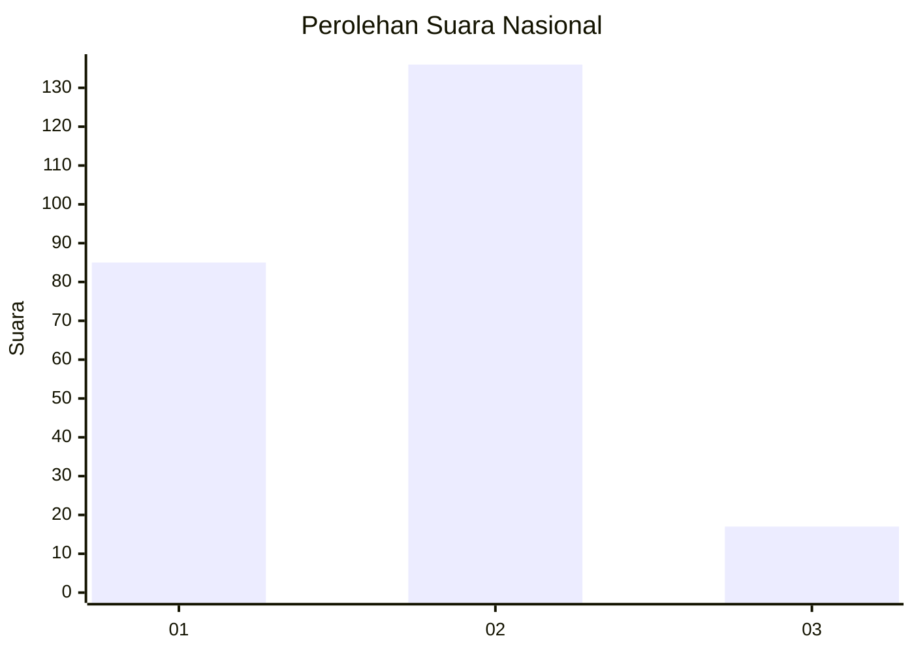
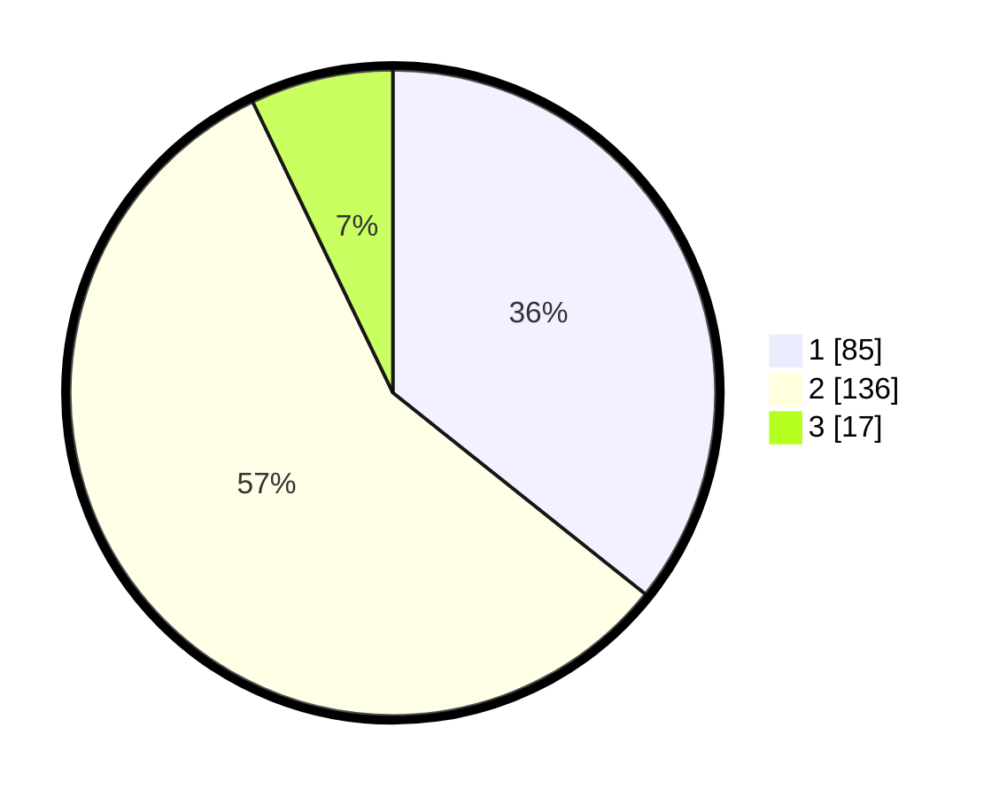

# Hasil

## Grafik

## Tabel

| No.    | Nama Paslon    | Suara | Suara (raw) | Persentase |
|:------ |:-------------- | -----:| -----------:| ----------:|
| 100025 | ANIES MUHAIMIN | 85    | [85][p-1]   | 35,71      |
| 100026 | PRABOWO GIBRAN | 136   | [136][p-2]  | 57,14      |
| 100027 | GANJAR MAHFUD  | 17    | [17][p-3]   | 7,14       |

[p-1]: https://github.com/gigit-pemilu/pemilu-2024/blob/main/pilpres/hitung-suara/sub/31-dki-jakarta/sub/75-jakarta-timur/sub/10-cipayung/sub/1006-bambu-apus/sub/080-tps/sub/paslon-1.txt
[p-2]: https://github.com/gigit-pemilu/pemilu-2024/blob/main/pilpres/hitung-suara/sub/31-dki-jakarta/sub/75-jakarta-timur/sub/10-cipayung/sub/1006-bambu-apus/sub/080-tps/sub/paslon-2.txt
[p-3]: https://github.com/gigit-pemilu/pemilu-2024/blob/main/pilpres/hitung-suara/sub/31-dki-jakarta/sub/75-jakarta-timur/sub/10-cipayung/sub/1006-bambu-apus/sub/080-tps/sub/paslon-3.txt

## Foto C Plano

https://sirekap-obj-formc.kpu.go.id/6138/pemilu/ppwp/31/75/10/10/06/3175101006080-20240214-160137--15023cb3-7a48-4889-8c3e-3939e2ba1982.jpg

https://sirekap-obj-formc.kpu.go.id/6138/pemilu/ppwp/31/75/10/10/06/3175101006080-20240214-155542--e1dd36d0-b028-4574-9d20-48027314df38.jpg

https://sirekap-obj-formc.kpu.go.id/6138/pemilu/ppwp/31/75/10/10/06/3175101006080-20240214-155518--8e4febe8-872a-4f01-bc90-da8408505b9e.jpg

## Metadata

| Key        | Value               |
| ---------- | ------------------- |
| Time Stamp | 2024-02-14 21:46:01 |

