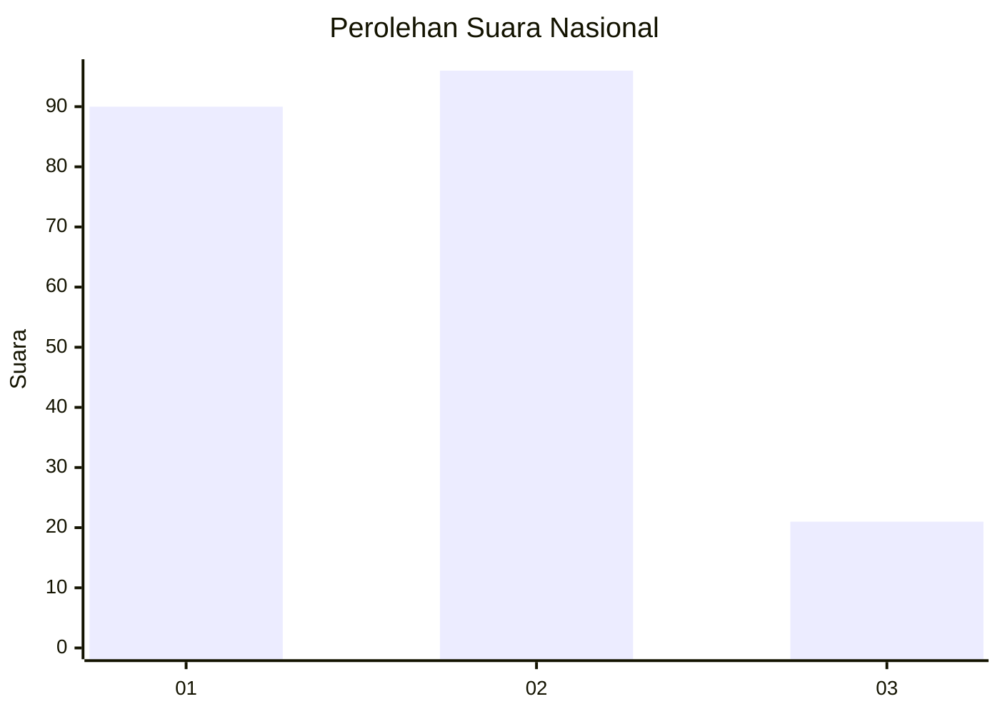
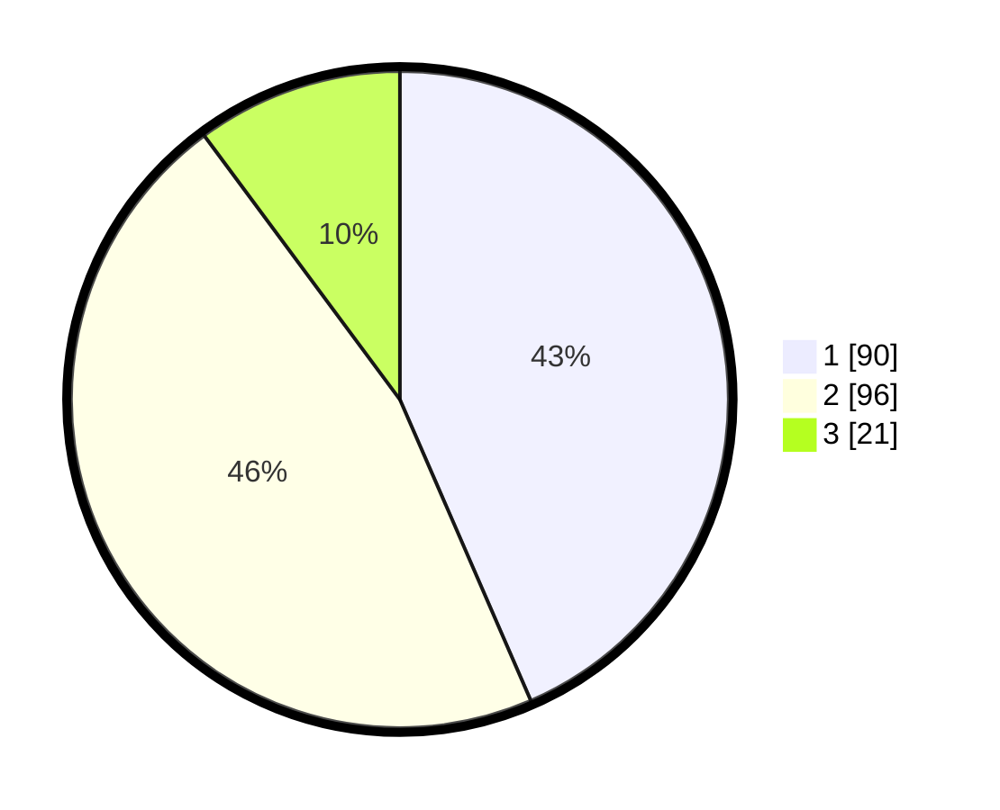

# Hasil

## Grafik

## Tabel

| No.    | Nama Paslon    | Suara | Suara (raw) | Persentase |
|:------ |:-------------- | -----:| -----------:| ----------:|
| 100025 | ANIES MUHAIMIN | 90    | [90][p-1]   | 43,48      |
| 100026 | PRABOWO GIBRAN | 96    | [96][p-2]   | 46,38      |
| 100027 | GANJAR MAHFUD  | 21    | [21][p-3]   | 10,14      |

[p-1]: https://github.com/gigit-pemilu/pemilu-2024/blob/main/pilpres/hitung-suara/sub/31-dki-jakarta/sub/75-jakarta-timur/sub/10-cipayung/sub/1006-bambu-apus/sub/094-tps/sub/paslon-1.txt
[p-2]: https://github.com/gigit-pemilu/pemilu-2024/blob/main/pilpres/hitung-suara/sub/31-dki-jakarta/sub/75-jakarta-timur/sub/10-cipayung/sub/1006-bambu-apus/sub/094-tps/sub/paslon-2.txt
[p-3]: https://github.com/gigit-pemilu/pemilu-2024/blob/main/pilpres/hitung-suara/sub/31-dki-jakarta/sub/75-jakarta-timur/sub/10-cipayung/sub/1006-bambu-apus/sub/094-tps/sub/paslon-3.txt

## Foto C Plano

https://sirekap-obj-formc.kpu.go.id/0940/pemilu/ppwp/31/75/10/10/06/3175101006094-20240214-211310--40b596c5-b76c-4f6e-be91-2839af997bd6.jpg

https://sirekap-obj-formc.kpu.go.id/0940/pemilu/ppwp/31/75/10/10/06/3175101006094-20240214-211334--6a61a9f3-d5a7-48a9-85f1-c04594705721.jpg

https://sirekap-obj-formc.kpu.go.id/0940/pemilu/ppwp/31/75/10/10/06/3175101006094-20240214-211359--d9d52b1c-b7f3-4115-a008-be2550aa808c.jpg

## Metadata

| Key        | Value               |
| ---------- | ------------------- |
| Time Stamp | 2024-02-15 15:00:29 |

