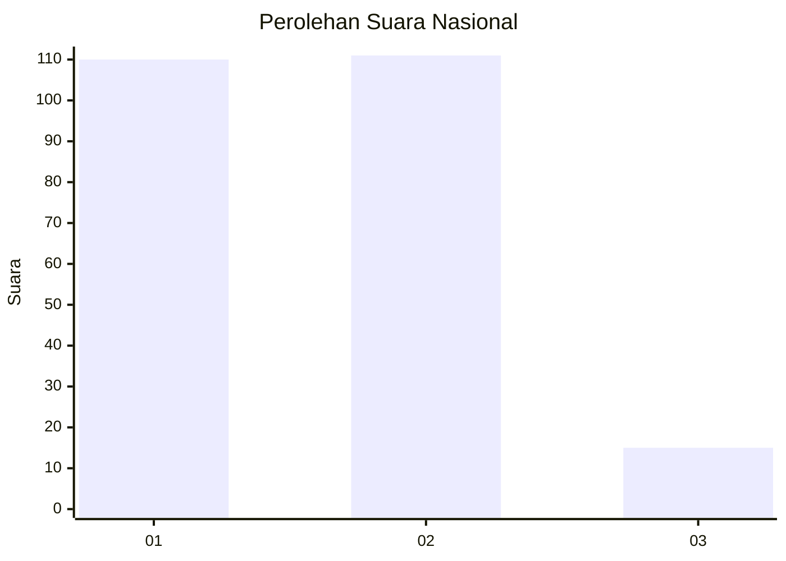
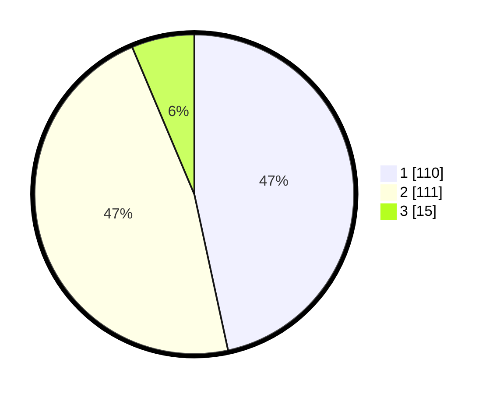

# Hasil

## Grafik

## Tabel

| No.    | Nama Paslon    | Suara | Suara (raw) | Persentase |
|:------ |:-------------- | -----:| -----------:| ----------:|
| 100025 | ANIES MUHAIMIN | 110   | [110][p-1]  | 46,61      |
| 100026 | PRABOWO GIBRAN | 111   | [111][p-2]  | 47,03      |
| 100027 | GANJAR MAHFUD  | 15    | [15][p-3]   | 6,36       |

[p-1]: https://github.com/gigit-pemilu/pemilu-2024/blob/main/pilpres/hitung-suara/sub/31-dki-jakarta/sub/75-jakarta-timur/sub/10-cipayung/sub/1007-lubang-buaya/sub/006-tps/sub/paslon-1.txt
[p-2]: https://github.com/gigit-pemilu/pemilu-2024/blob/main/pilpres/hitung-suara/sub/31-dki-jakarta/sub/75-jakarta-timur/sub/10-cipayung/sub/1007-lubang-buaya/sub/006-tps/sub/paslon-2.txt
[p-3]: https://github.com/gigit-pemilu/pemilu-2024/blob/main/pilpres/hitung-suara/sub/31-dki-jakarta/sub/75-jakarta-timur/sub/10-cipayung/sub/1007-lubang-buaya/sub/006-tps/sub/paslon-3.txt

## Foto C Plano

https://sirekap-obj-formc.kpu.go.id/5779/pemilu/ppwp/31/75/10/10/07/3175101007006-20240214-213140--40d2c03e-69b8-4f75-ad4c-4cd52c315cb7.jpg

https://sirekap-obj-formc.kpu.go.id/5779/pemilu/ppwp/31/75/10/10/07/3175101007006-20240214-200658--8cc7d5c7-e440-43c9-b971-a7002e1a2904.jpg

https://sirekap-obj-formc.kpu.go.id/5779/pemilu/ppwp/31/75/10/10/07/3175101007006-20240214-213211--b2d95c3a-f68e-4ff9-985d-a379d491a76a.jpg

## Metadata

| Key        | Value               |
| ---------- | ------------------- |
| Time Stamp | 2024-02-15 12:00:28 |

