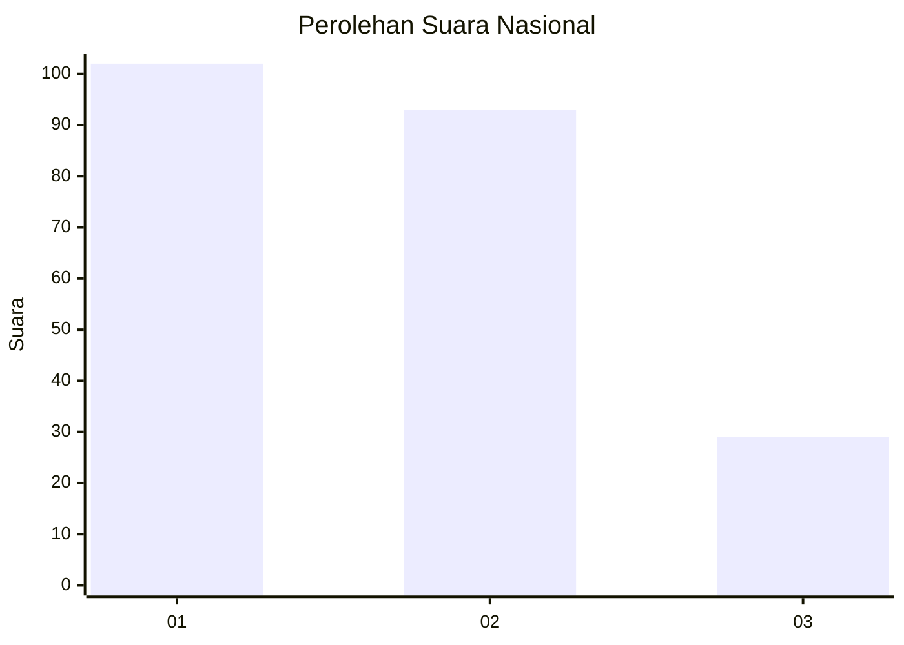
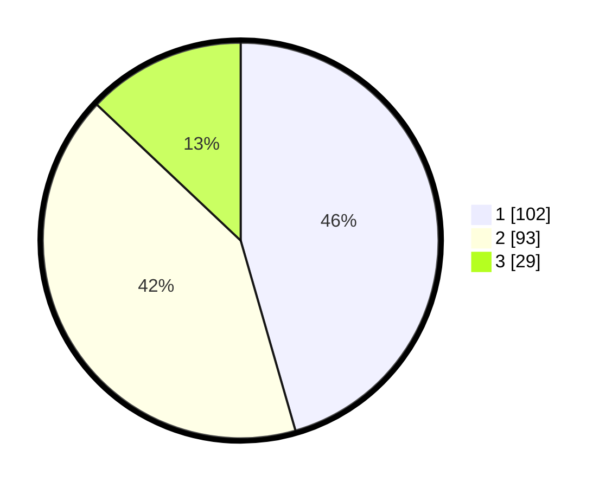

# Hasil

## Grafik

## Tabel

| No.    | Nama Paslon    | Suara | Suara (raw) | Persentase |
|:------ |:-------------- | -----:| -----------:| ----------:|
| 100025 | ANIES MUHAIMIN | 102   | [102][p-1]  | 45,54      |
| 100026 | PRABOWO GIBRAN | 93    | [93][p-2]   | 41,52      |
| 100027 | GANJAR MAHFUD  | 29    | [29][p-3]   | 12,95      |

[p-1]: https://github.com/gigit-pemilu/pemilu-2024/blob/main/pilpres/hitung-suara/sub/31-dki-jakarta/sub/75-jakarta-timur/sub/10-cipayung/sub/1007-lubang-buaya/sub/008-tps/sub/paslon-1.txt
[p-2]: https://github.com/gigit-pemilu/pemilu-2024/blob/main/pilpres/hitung-suara/sub/31-dki-jakarta/sub/75-jakarta-timur/sub/10-cipayung/sub/1007-lubang-buaya/sub/008-tps/sub/paslon-2.txt
[p-3]: https://github.com/gigit-pemilu/pemilu-2024/blob/main/pilpres/hitung-suara/sub/31-dki-jakarta/sub/75-jakarta-timur/sub/10-cipayung/sub/1007-lubang-buaya/sub/008-tps/sub/paslon-3.txt

## Foto C Plano

https://sirekap-obj-formc.kpu.go.id/aad4/pemilu/ppwp/31/75/10/10/07/3175101007008-20240215-154305--63010f91-c8f0-4a1d-b97d-7bf905690960.jpg

https://sirekap-obj-formc.kpu.go.id/aad4/pemilu/ppwp/31/75/10/10/07/3175101007008-20240215-154458--7770f0cc-c32d-460d-a34f-cc26c94348c7.jpg

https://sirekap-obj-formc.kpu.go.id/aad4/pemilu/ppwp/31/75/10/10/07/3175101007008-20240215-154916--445452a0-8fe1-4556-9e47-468ca9061635.jpg

## Metadata

| Key        | Value               |
| ---------- | ------------------- |
| Time Stamp | 2024-02-15 17:00:25 |

