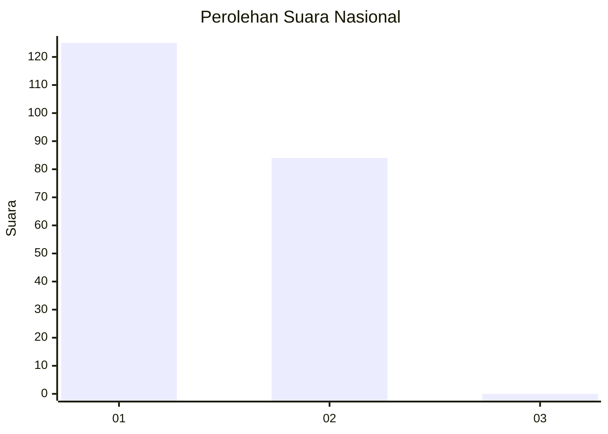
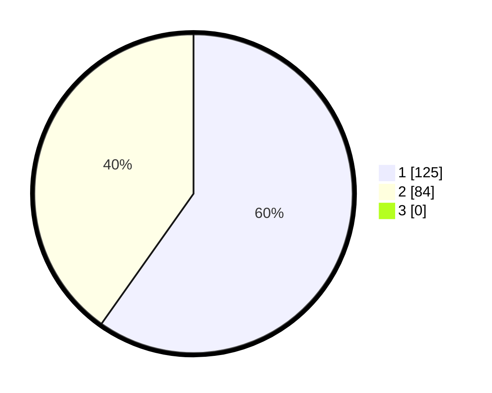

# Hasil

## Grafik

## Tabel

| No.    | Nama Paslon    | Suara | Suara (raw) | Persentase |
|:------ |:-------------- | -----:| -----------:| ----------:|
| 100025 | ANIES MUHAIMIN | 125   | [125][p-1]  | 59,81      |
| 100026 | PRABOWO GIBRAN | 84    | [84][p-2]   | 40,19      |
| 100027 | GANJAR MAHFUD  | 0     | [0][p-3]    | 0,00       |

[p-1]: https://github.com/gigit-pemilu/pemilu-2024/blob/main/pilpres/hitung-suara/sub/31-dki-jakarta/sub/75-jakarta-timur/sub/10-cipayung/sub/1007-lubang-buaya/sub/021-tps/sub/paslon-1.txt
[p-2]: https://github.com/gigit-pemilu/pemilu-2024/blob/main/pilpres/hitung-suara/sub/31-dki-jakarta/sub/75-jakarta-timur/sub/10-cipayung/sub/1007-lubang-buaya/sub/021-tps/sub/paslon-2.txt
[p-3]: https://github.com/gigit-pemilu/pemilu-2024/blob/main/pilpres/hitung-suara/sub/31-dki-jakarta/sub/75-jakarta-timur/sub/10-cipayung/sub/1007-lubang-buaya/sub/021-tps/sub/paslon-3.txt

## Foto C Plano

https://sirekap-obj-formc.kpu.go.id/57ea/pemilu/ppwp/31/75/10/10/07/3175101007021-20240215-010207--151dee43-e254-457b-97dd-8468a83b0fb4.jpg

https://sirekap-obj-formc.kpu.go.id/57ea/pemilu/ppwp/31/75/10/10/07/3175101007021-20240215-010254--29e6ed87-6d04-4fae-9e41-9aef0419b7ac.jpg

https://sirekap-obj-formc.kpu.go.id/57ea/pemilu/ppwp/31/75/10/10/07/3175101007021-20240215-010324--9ed2d870-54dd-4882-bcd9-e19cc95f6a66.jpg

## Metadata

| Key        | Value               |
| ---------- | ------------------- |
| Time Stamp | 2024-02-15 12:00:28 |

