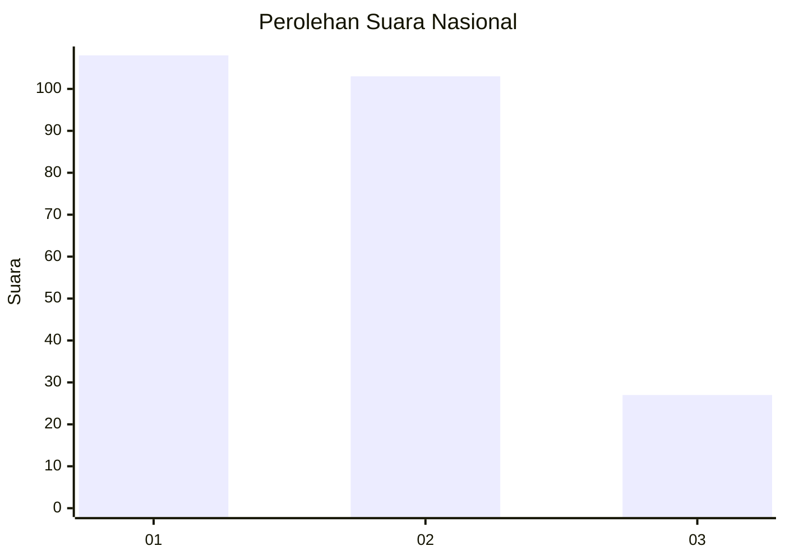
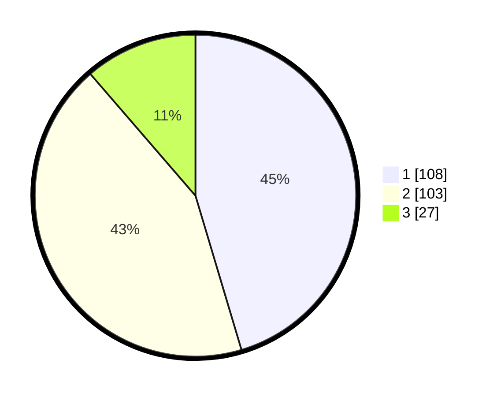

# Hasil

## Grafik

## Tabel

| No.    | Nama Paslon    | Suara | Suara (raw) | Persentase |
|:------ |:-------------- | -----:| -----------:| ----------:|
| 100025 | ANIES MUHAIMIN | 108   | [108][p-1]  | 45,38      |
| 100026 | PRABOWO GIBRAN | 103   | [103][p-2]  | 43,28      |
| 100027 | GANJAR MAHFUD  | 27    | [27][p-3]   | 11,34      |

[p-1]: https://github.com/gigit-pemilu/pemilu-2024/blob/main/pilpres/hitung-suara/sub/31-dki-jakarta/sub/75-jakarta-timur/sub/10-cipayung/sub/1007-lubang-buaya/sub/034-tps/sub/paslon-1.txt
[p-2]: https://github.com/gigit-pemilu/pemilu-2024/blob/main/pilpres/hitung-suara/sub/31-dki-jakarta/sub/75-jakarta-timur/sub/10-cipayung/sub/1007-lubang-buaya/sub/034-tps/sub/paslon-2.txt
[p-3]: https://github.com/gigit-pemilu/pemilu-2024/blob/main/pilpres/hitung-suara/sub/31-dki-jakarta/sub/75-jakarta-timur/sub/10-cipayung/sub/1007-lubang-buaya/sub/034-tps/sub/paslon-3.txt

## Foto C Plano

https://sirekap-obj-formc.kpu.go.id/8ec7/pemilu/ppwp/31/75/10/10/07/3175101007034-20240214-222326--85787a5c-3ee1-4e4c-b517-9af70c76c1c9.jpg

https://sirekap-obj-formc.kpu.go.id/8ec7/pemilu/ppwp/31/75/10/10/07/3175101007034-20240214-222913--c85b160e-390b-420f-bfb8-818fe89226c1.jpg

https://sirekap-obj-formc.kpu.go.id/8ec7/pemilu/ppwp/31/75/10/10/07/3175101007034-20240214-222509--3cc8149a-e409-4b39-a8e5-9de56b91dcc4.jpg

## Metadata

| Key        | Value               |
| ---------- | ------------------- |
| Time Stamp | 2024-02-15 12:00:28 |

