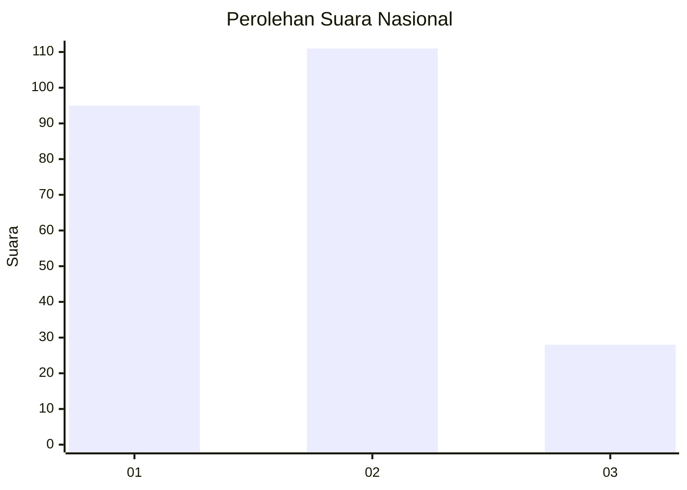
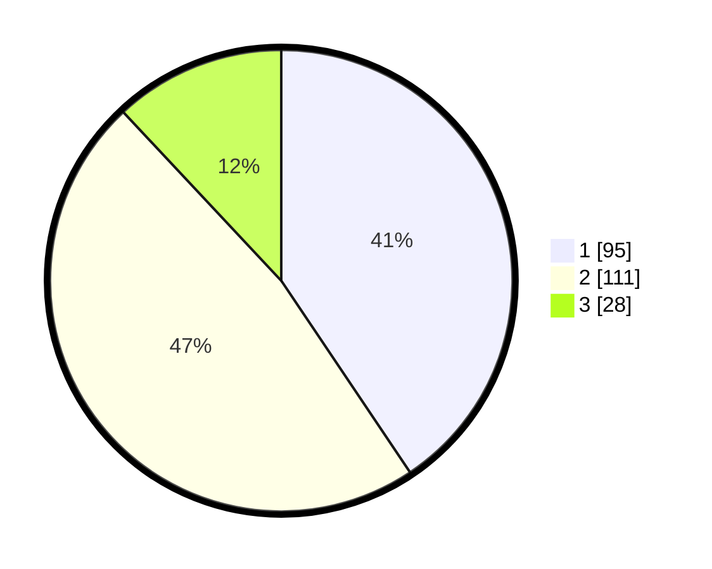

# Hasil

## Grafik

## Tabel

| No.    | Nama Paslon    | Suara | Suara (raw) | Persentase |
|:------ |:-------------- | -----:| -----------:| ----------:|
| 100025 | ANIES MUHAIMIN | 95    | [95][p-1]   | 40,60      |
| 100026 | PRABOWO GIBRAN | 111   | [111][p-2]  | 47,44      |
| 100027 | GANJAR MAHFUD  | 28    | [28][p-3]   | 11,97      |

[p-1]: https://github.com/gigit-pemilu/pemilu-2024/blob/main/pilpres/hitung-suara/sub/31-dki-jakarta/sub/75-jakarta-timur/sub/10-cipayung/sub/1007-lubang-buaya/sub/060-tps/sub/paslon-1.txt
[p-2]: https://github.com/gigit-pemilu/pemilu-2024/blob/main/pilpres/hitung-suara/sub/31-dki-jakarta/sub/75-jakarta-timur/sub/10-cipayung/sub/1007-lubang-buaya/sub/060-tps/sub/paslon-2.txt
[p-3]: https://github.com/gigit-pemilu/pemilu-2024/blob/main/pilpres/hitung-suara/sub/31-dki-jakarta/sub/75-jakarta-timur/sub/10-cipayung/sub/1007-lubang-buaya/sub/060-tps/sub/paslon-3.txt

## Foto C Plano

https://sirekap-obj-formc.kpu.go.id/55ab/pemilu/ppwp/31/75/10/10/07/3175101007060-20240214-215411--654eb9b3-e613-442c-9fb4-b6572022f7f0.jpg

https://sirekap-obj-formc.kpu.go.id/55ab/pemilu/ppwp/31/75/10/10/07/3175101007060-20240214-215440--577d47bf-a993-4246-a780-4a8addc47931.jpg

https://sirekap-obj-formc.kpu.go.id/55ab/pemilu/ppwp/31/75/10/10/07/3175101007060-20240214-215518--d123c0c9-779c-4399-8df0-47b35f7bb729.jpg

## Metadata

| Key        | Value               |
| ---------- | ------------------- |
| Time Stamp | 2024-02-15 15:00:29 |

