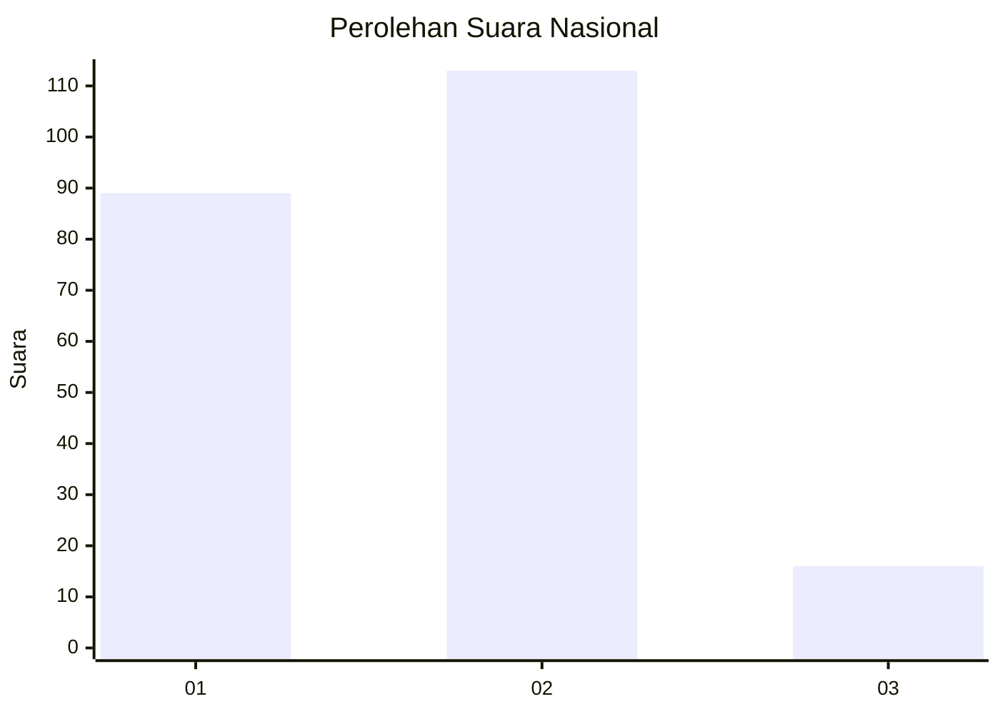

# Hasil

## Grafik

## Tabel

| No.    | Nama Paslon    | Suara | Suara (raw) | Persentase |
|:------ |:-------------- | -----:| -----------:| ----------:|
| 100025 | ANIES MUHAIMIN | 89    | [89][p-1]   | 40,83      |
| 100026 | PRABOWO GIBRAN | 113   | [113][p-2]  | 51,83      |
| 100027 | GANJAR MAHFUD  | 16    | [16][p-3]   | 7,34       |

[p-1]: https://github.com/gigit-pemilu/pemilu-2024/blob/main/pilpres/hitung-suara/sub/31-dki-jakarta/sub/75-jakarta-timur/sub/10-cipayung/sub/1007-lubang-buaya/sub/078-tps/sub/paslon-1.txt
[p-2]: https://github.com/gigit-pemilu/pemilu-2024/blob/main/pilpres/hitung-suara/sub/31-dki-jakarta/sub/75-jakarta-timur/sub/10-cipayung/sub/1007-lubang-buaya/sub/078-tps/sub/paslon-2.txt
[p-3]: https://github.com/gigit-pemilu/pemilu-2024/blob/main/pilpres/hitung-suara/sub/31-dki-jakarta/sub/75-jakarta-timur/sub/10-cipayung/sub/1007-lubang-buaya/sub/078-tps/sub/paslon-3.txt

## Foto C Plano

https://sirekap-obj-formc.kpu.go.id/b25e/pemilu/ppwp/31/75/10/10/07/3175101007078-20240214-212130--b9c20890-7b64-48cc-a779-b62522e071d5.jpg

https://sirekap-obj-formc.kpu.go.id/b25e/pemilu/ppwp/31/75/10/10/07/3175101007078-20240214-212221--a3a7575f-b72a-44e3-917a-615a53c0d5f4.jpg

https://sirekap-obj-formc.kpu.go.id/b25e/pemilu/ppwp/31/75/10/10/07/3175101007078-20240214-212301--b6d73aa8-1b48-4cee-bd85-4df6014377dc.jpg

## Metadata

| Key        | Value               |
| ---------- | ------------------- |
| Time Stamp | 2024-02-15 15:00:29 |

