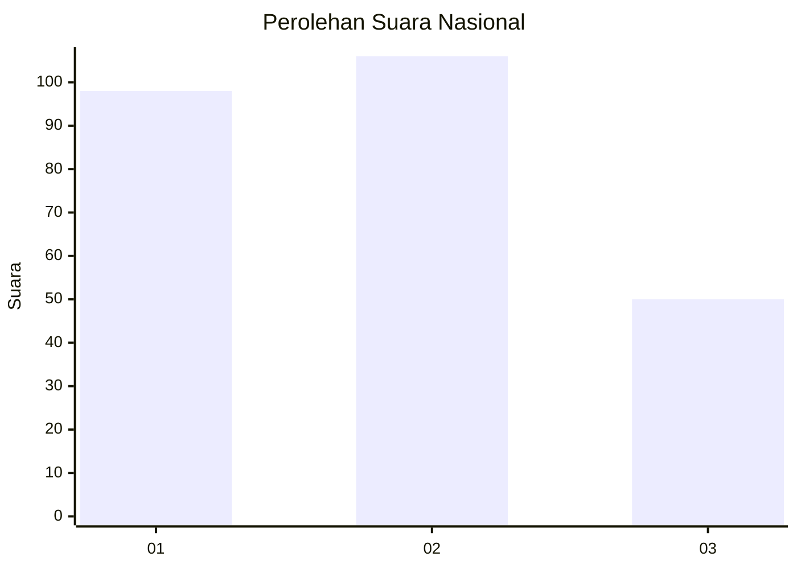
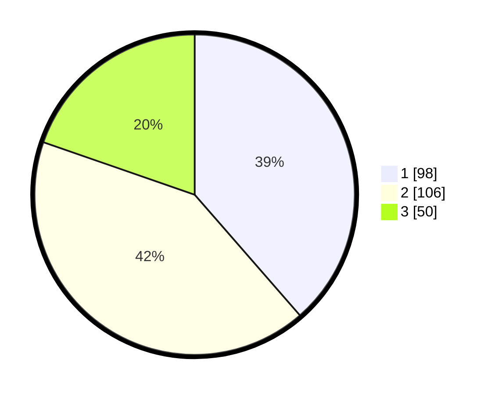

# Hasil

## Grafik

## Tabel

| No.    | Nama Paslon    | Suara | Suara (raw) | Persentase |
|:------ |:-------------- | -----:| -----------:| ----------:|
| 100025 | ANIES MUHAIMIN | 98    | [98][p-1]   | 38,58      |
| 100026 | PRABOWO GIBRAN | 106   | [106][p-2]  | 41,73      |
| 100027 | GANJAR MAHFUD  | 50    | [50][p-3]   | 19,69      |

[p-1]: https://github.com/gigit-pemilu/pemilu-2024/blob/main/pilpres/hitung-suara/sub/31-dki-jakarta/sub/75-jakarta-timur/sub/10-cipayung/sub/1007-lubang-buaya/sub/087-tps/sub/paslon-1.txt
[p-2]: https://github.com/gigit-pemilu/pemilu-2024/blob/main/pilpres/hitung-suara/sub/31-dki-jakarta/sub/75-jakarta-timur/sub/10-cipayung/sub/1007-lubang-buaya/sub/087-tps/sub/paslon-2.txt
[p-3]: https://github.com/gigit-pemilu/pemilu-2024/blob/main/pilpres/hitung-suara/sub/31-dki-jakarta/sub/75-jakarta-timur/sub/10-cipayung/sub/1007-lubang-buaya/sub/087-tps/sub/paslon-3.txt

## Foto C Plano

https://sirekap-obj-formc.kpu.go.id/52ff/pemilu/ppwp/31/75/10/10/07/3175101007087-20240216-134201--a3d199f5-1ec4-4d11-955f-ad42dee281c2.jpg

https://sirekap-obj-formc.kpu.go.id/52ff/pemilu/ppwp/31/75/10/10/07/3175101007087-20240216-134426--315d58c2-04f1-48af-9e4c-f2406f6b4fd5.jpg

https://sirekap-obj-formc.kpu.go.id/52ff/pemilu/ppwp/31/75/10/10/07/3175101007087-20240216-134449--8eddaf9c-63d5-4cea-a003-3f922a332626.jpg

## Metadata

| Key        | Value               |
| ---------- | ------------------- |
| Time Stamp | 2024-02-16 16:25:10 |

