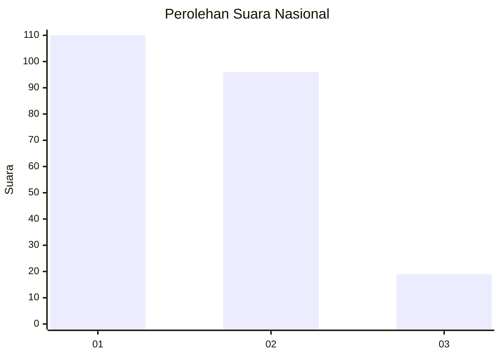
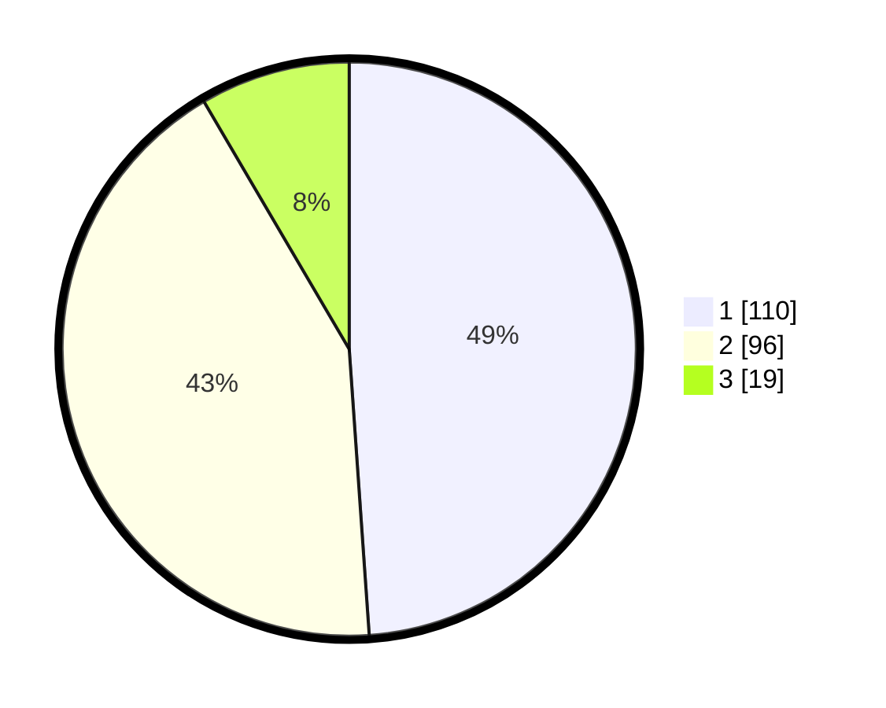

# Hasil

## Grafik

## Tabel

| No.    | Nama Paslon    | Suara | Suara (raw) | Persentase |
|:------ |:-------------- | -----:| -----------:| ----------:|
| 100025 | ANIES MUHAIMIN | 110   | [110][p-1]  | 48,89      |
| 100026 | PRABOWO GIBRAN | 96    | [96][p-2]   | 42,67      |
| 100027 | GANJAR MAHFUD  | 19    | [19][p-3]   | 8,44       |

[p-1]: https://github.com/gigit-pemilu/pemilu-2024/blob/main/pilpres/hitung-suara/sub/31-dki-jakarta/sub/75-jakarta-timur/sub/10-cipayung/sub/1007-lubang-buaya/sub/091-tps/sub/paslon-1.txt
[p-2]: https://github.com/gigit-pemilu/pemilu-2024/blob/main/pilpres/hitung-suara/sub/31-dki-jakarta/sub/75-jakarta-timur/sub/10-cipayung/sub/1007-lubang-buaya/sub/091-tps/sub/paslon-2.txt
[p-3]: https://github.com/gigit-pemilu/pemilu-2024/blob/main/pilpres/hitung-suara/sub/31-dki-jakarta/sub/75-jakarta-timur/sub/10-cipayung/sub/1007-lubang-buaya/sub/091-tps/sub/paslon-3.txt

## Foto C Plano

https://sirekap-obj-formc.kpu.go.id/f393/pemilu/ppwp/31/75/10/10/07/3175101007091-20240215-005839--296e545f-176c-4f63-b63b-34053cebd976.jpg

https://sirekap-obj-formc.kpu.go.id/f393/pemilu/ppwp/31/75/10/10/07/3175101007091-20240215-010438--f6f9fb14-0964-499d-8990-20232d1f55a4.jpg

https://sirekap-obj-formc.kpu.go.id/f393/pemilu/ppwp/31/75/10/10/07/3175101007091-20240215-010513--c45d4cf9-bca2-4368-bbfa-916ef8a96b2d.jpg

## Metadata

| Key        | Value               |
| ---------- | ------------------- |
| Time Stamp | 2024-02-15 12:00:28 |

