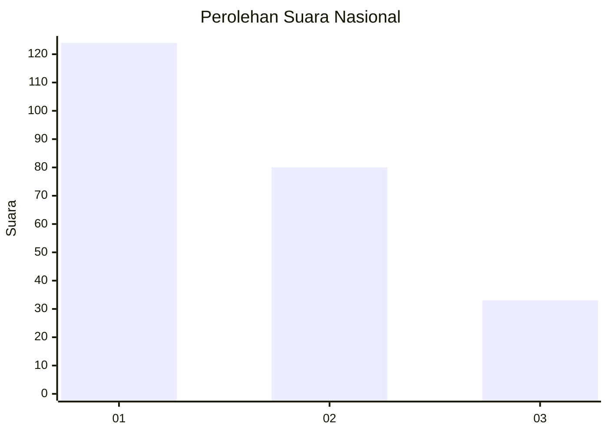
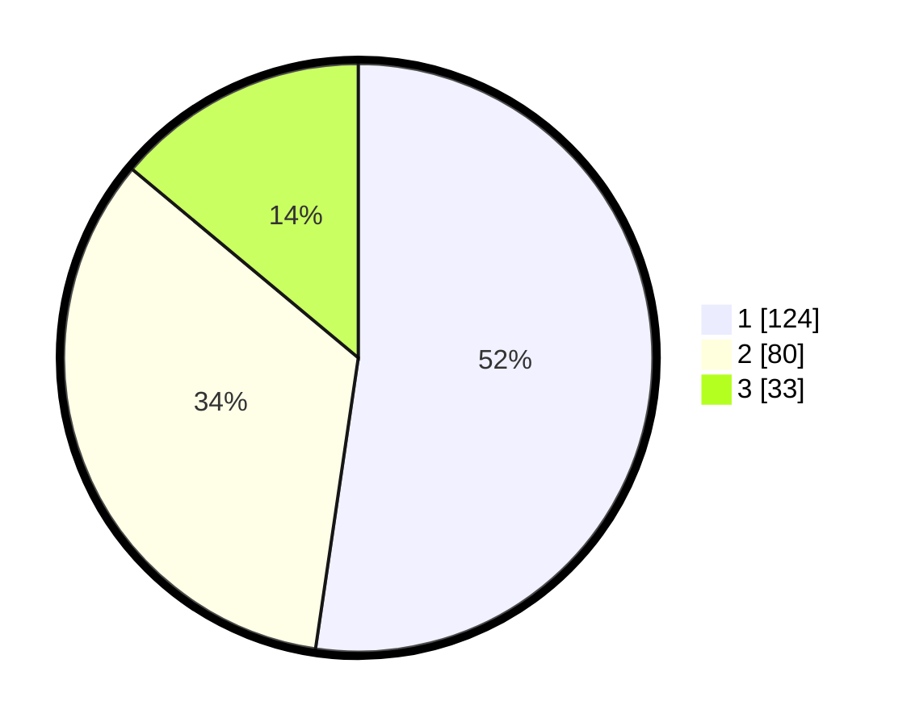

# Hasil

## Grafik

## Tabel

| No.    | Nama Paslon    | Suara | Suara (raw) | Persentase |
|:------ |:-------------- | -----:| -----------:| ----------:|
| 100025 | ANIES MUHAIMIN | 124   | [124][p-1]  | 52,32      |
| 100026 | PRABOWO GIBRAN | 80    | [80][p-2]   | 33,76      |
| 100027 | GANJAR MAHFUD  | 33    | [33][p-3]   | 13,92      |

[p-1]: https://github.com/gigit-pemilu/pemilu-2024/blob/main/pilpres/hitung-suara/sub/31-dki-jakarta/sub/75-jakarta-timur/sub/10-cipayung/sub/1007-lubang-buaya/sub/094-tps/sub/paslon-1.txt
[p-2]: https://github.com/gigit-pemilu/pemilu-2024/blob/main/pilpres/hitung-suara/sub/31-dki-jakarta/sub/75-jakarta-timur/sub/10-cipayung/sub/1007-lubang-buaya/sub/094-tps/sub/paslon-2.txt
[p-3]: https://github.com/gigit-pemilu/pemilu-2024/blob/main/pilpres/hitung-suara/sub/31-dki-jakarta/sub/75-jakarta-timur/sub/10-cipayung/sub/1007-lubang-buaya/sub/094-tps/sub/paslon-3.txt

## Foto C Plano

https://sirekap-obj-formc.kpu.go.id/9fda/pemilu/ppwp/31/75/10/10/07/3175101007094-20240214-223227--aab80445-cd52-428f-85de-41f14eb96164.jpg

https://sirekap-obj-formc.kpu.go.id/9fda/pemilu/ppwp/31/75/10/10/07/3175101007094-20240214-223318--7b37c63b-2f98-4943-bc5b-79d9b3b512fb.jpg

https://sirekap-obj-formc.kpu.go.id/9fda/pemilu/ppwp/31/75/10/10/07/3175101007094-20240214-211019--fded9199-6e0d-4f9a-8d97-27bef624d373.jpg

## Metadata

| Key        | Value               |
| ---------- | ------------------- |
| Time Stamp | 2024-02-15 15:00:29 |

