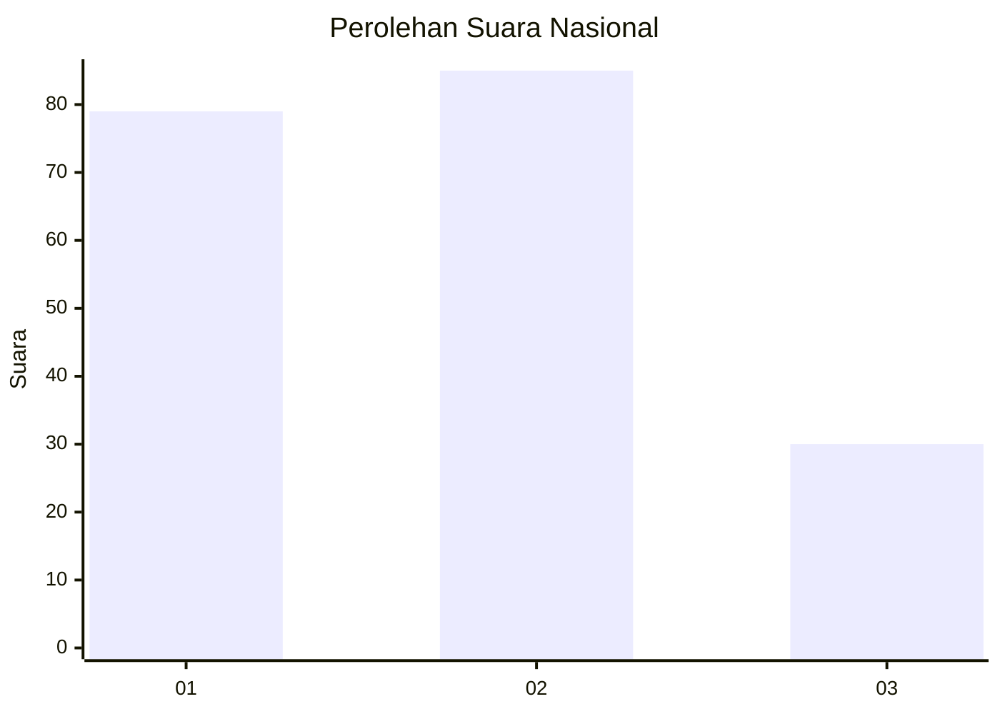
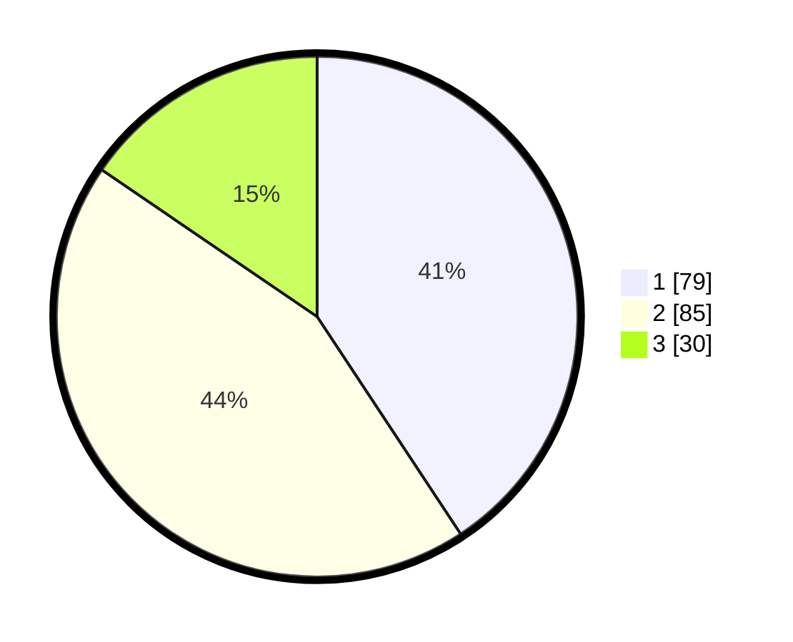

# Hasil

## Grafik

## Tabel

| No.    | Nama Paslon    | Suara | Suara (raw) | Persentase |
|:------ |:-------------- | -----:| -----------:| ----------:|
| 100025 | ANIES MUHAIMIN | 79    | [79][p-1]   | 40,72      |
| 100026 | PRABOWO GIBRAN | 85    | [85][p-2]   | 43,81      |
| 100027 | GANJAR MAHFUD  | 30    | [30][p-3]   | 15,46      |

[p-1]: https://github.com/gigit-pemilu/pemilu-2024/blob/main/pilpres/hitung-suara/sub/31-dki-jakarta/sub/75-jakarta-timur/sub/10-cipayung/sub/1007-lubang-buaya/sub/101-tps/sub/paslon-1.txt
[p-2]: https://github.com/gigit-pemilu/pemilu-2024/blob/main/pilpres/hitung-suara/sub/31-dki-jakarta/sub/75-jakarta-timur/sub/10-cipayung/sub/1007-lubang-buaya/sub/101-tps/sub/paslon-2.txt
[p-3]: https://github.com/gigit-pemilu/pemilu-2024/blob/main/pilpres/hitung-suara/sub/31-dki-jakarta/sub/75-jakarta-timur/sub/10-cipayung/sub/1007-lubang-buaya/sub/101-tps/sub/paslon-3.txt

## Foto C Plano

https://sirekap-obj-formc.kpu.go.id/9968/pemilu/ppwp/31/75/10/10/07/3175101007101-20240215-011837--6e3e813c-60f7-4701-ad03-3c80b6469c16.jpg

https://sirekap-obj-formc.kpu.go.id/9968/pemilu/ppwp/31/75/10/10/07/3175101007101-20240214-194605--cbbc332e-623e-4f32-8fe1-d9b580f34448.jpg

https://sirekap-obj-formc.kpu.go.id/9968/pemilu/ppwp/31/75/10/10/07/3175101007101-20240215-012336--969fbc32-79f4-4a93-bc3b-99663f277e24.jpg

## Metadata

| Key        | Value               |
| ---------- | ------------------- |
| Time Stamp | 2024-02-15 12:00:28 |

