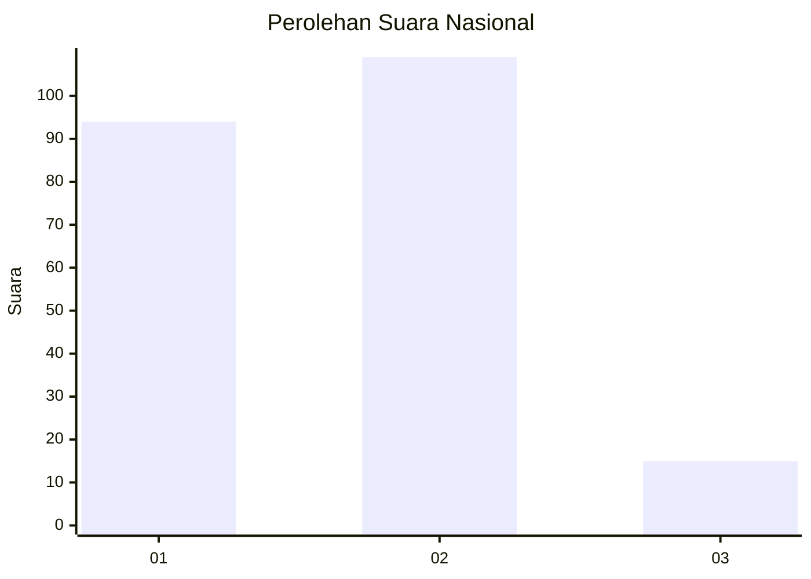
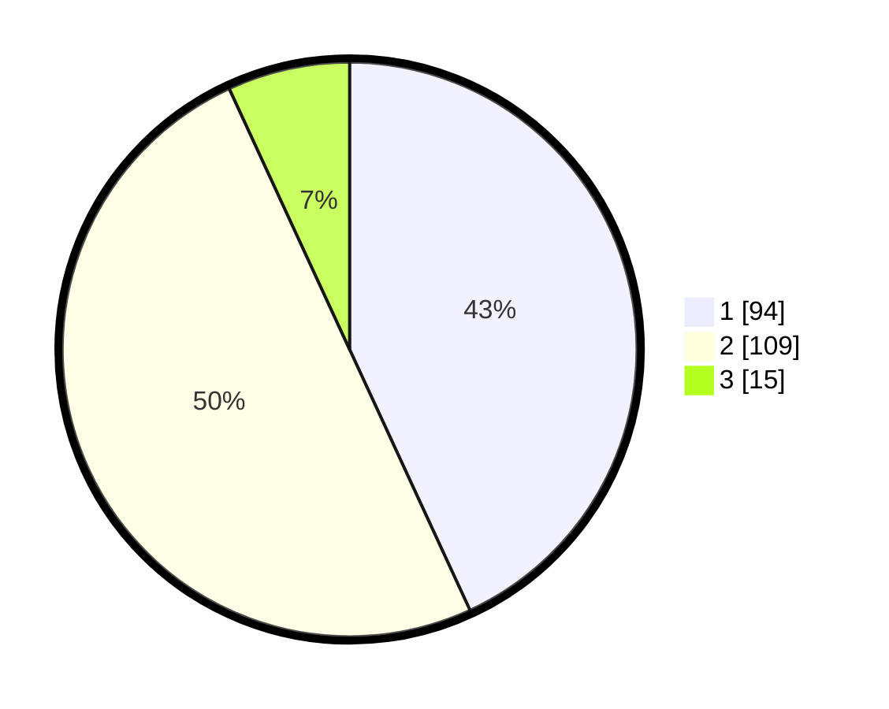

# Hasil

## Grafik

## Tabel

| No.    | Nama Paslon    | Suara | Suara (raw) | Persentase |
|:------ |:-------------- | -----:| -----------:| ----------:|
| 100025 | ANIES MUHAIMIN | 94    | [94][p-1]   | 43,12      |
| 100026 | PRABOWO GIBRAN | 109   | [109][p-2]  | 50,00      |
| 100027 | GANJAR MAHFUD  | 15    | [15][p-3]   | 6,88       |

[p-1]: https://github.com/gigit-pemilu/pemilu-2024/blob/main/pilpres/hitung-suara/sub/31-dki-jakarta/sub/75-jakarta-timur/sub/10-cipayung/sub/1007-lubang-buaya/sub/154-tps/sub/paslon-1.txt
[p-2]: https://github.com/gigit-pemilu/pemilu-2024/blob/main/pilpres/hitung-suara/sub/31-dki-jakarta/sub/75-jakarta-timur/sub/10-cipayung/sub/1007-lubang-buaya/sub/154-tps/sub/paslon-2.txt
[p-3]: https://github.com/gigit-pemilu/pemilu-2024/blob/main/pilpres/hitung-suara/sub/31-dki-jakarta/sub/75-jakarta-timur/sub/10-cipayung/sub/1007-lubang-buaya/sub/154-tps/sub/paslon-3.txt

## Foto C Plano

https://sirekap-obj-formc.kpu.go.id/0aba/pemilu/ppwp/31/75/10/10/07/3175101007154-20240215-032309--6557be51-f254-415b-880d-aa1c8bc2604e.jpg

https://sirekap-obj-formc.kpu.go.id/0aba/pemilu/ppwp/31/75/10/10/07/3175101007154-20240215-012444--93dc4137-abe1-4f59-80e1-2be8bed2ecf8.jpg

https://sirekap-obj-formc.kpu.go.id/0aba/pemilu/ppwp/31/75/10/10/07/3175101007154-20240215-012547--43ff447a-3114-47b7-af2e-5524eb8d1e1e.jpg

## Metadata

| Key        | Value               |
| ---------- | ------------------- |
| Time Stamp | 2024-02-24 22:31:28 |

