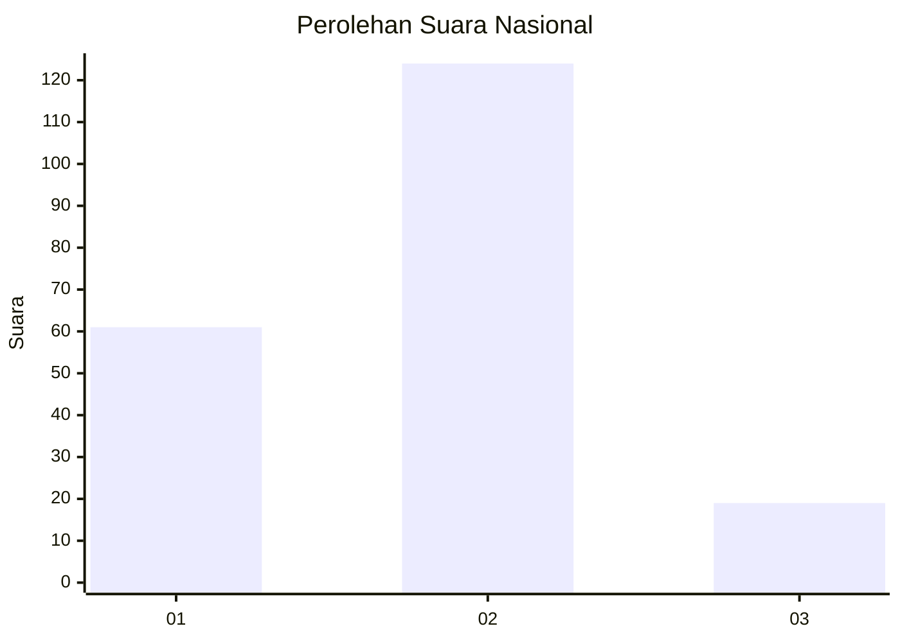
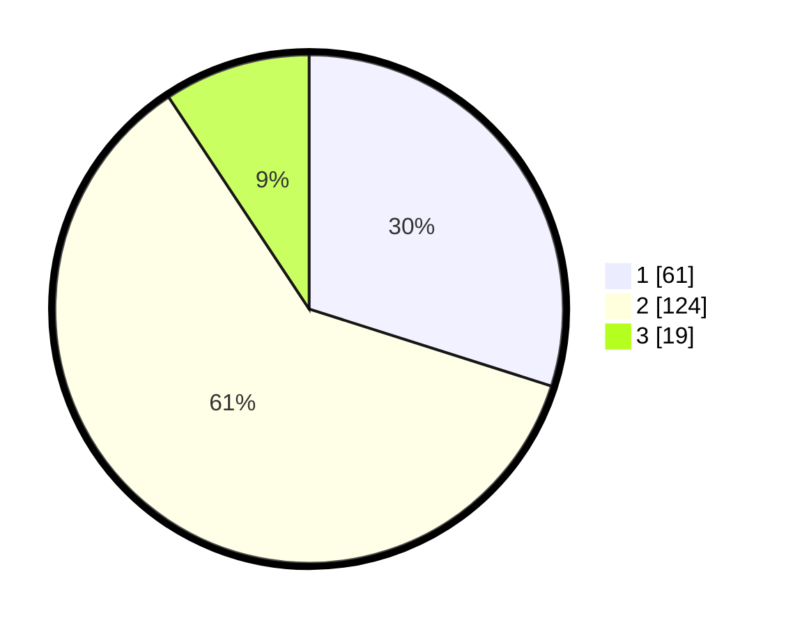

# Hasil

## Grafik

## Tabel

| No.    | Nama Paslon    | Suara | Suara (raw) | Persentase |
|:------ |:-------------- | -----:| -----------:| ----------:|
| 100025 | ANIES MUHAIMIN | 61    | [61][p-1]   | 29,90      |
| 100026 | PRABOWO GIBRAN | 124   | [124][p-2]  | 60,78      |
| 100027 | GANJAR MAHFUD  | 19    | [19][p-3]   | 9,31       |

[p-1]: https://github.com/gigit-pemilu/pemilu-2024/blob/main/pilpres/hitung-suara/sub/31-dki-jakarta/sub/75-jakarta-timur/sub/10-cipayung/sub/1007-lubang-buaya/sub/157-tps/sub/paslon-1.txt
[p-2]: https://github.com/gigit-pemilu/pemilu-2024/blob/main/pilpres/hitung-suara/sub/31-dki-jakarta/sub/75-jakarta-timur/sub/10-cipayung/sub/1007-lubang-buaya/sub/157-tps/sub/paslon-2.txt
[p-3]: https://github.com/gigit-pemilu/pemilu-2024/blob/main/pilpres/hitung-suara/sub/31-dki-jakarta/sub/75-jakarta-timur/sub/10-cipayung/sub/1007-lubang-buaya/sub/157-tps/sub/paslon-3.txt

## Foto C Plano

https://sirekap-obj-formc.kpu.go.id/0047/pemilu/ppwp/31/75/10/10/07/3175101007157-20240214-223105--5395a828-32c9-444e-baf7-2170b9249d2c.jpg

https://sirekap-obj-formc.kpu.go.id/0047/pemilu/ppwp/31/75/10/10/07/3175101007157-20240214-222747--9ec7b945-32fe-4412-9222-1710f77d2cb7.jpg

https://sirekap-obj-formc.kpu.go.id/0047/pemilu/ppwp/31/75/10/10/07/3175101007157-20240214-223305--911363f4-f91c-4447-8963-c79270928066.jpg

## Metadata

| Key        | Value               |
| ---------- | ------------------- |
| Time Stamp | 2024-02-24 22:31:28 |

