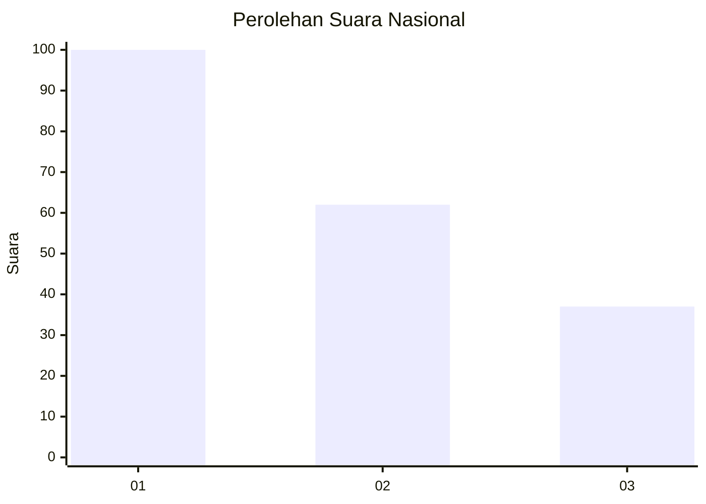
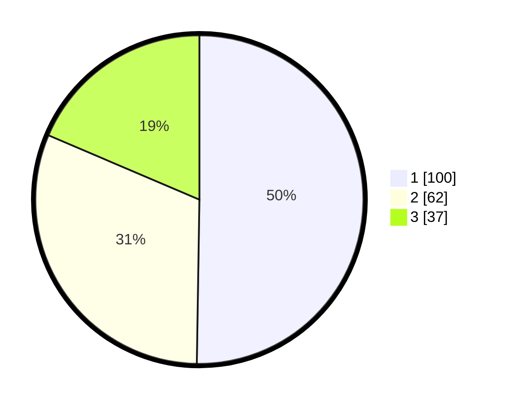

# Hasil

## Grafik

## Tabel

| No.    | Nama Paslon    | Suara | Suara (raw) | Persentase |
|:------ |:-------------- | -----:| -----------:| ----------:|
| 100025 | ANIES MUHAIMIN | 100   | [100][p-1]  | 50,25      |
| 100026 | PRABOWO GIBRAN | 62    | [62][p-2]   | 31,16      |
| 100027 | GANJAR MAHFUD  | 37    | [37][p-3]   | 18,59      |

[p-1]: https://github.com/gigit-pemilu/pemilu-2024/blob/main/pilpres/hitung-suara/sub/31-dki-jakarta/sub/75-jakarta-timur/sub/10-cipayung/sub/1007-lubang-buaya/sub/160-tps/sub/paslon-1.txt
[p-2]: https://github.com/gigit-pemilu/pemilu-2024/blob/main/pilpres/hitung-suara/sub/31-dki-jakarta/sub/75-jakarta-timur/sub/10-cipayung/sub/1007-lubang-buaya/sub/160-tps/sub/paslon-2.txt
[p-3]: https://github.com/gigit-pemilu/pemilu-2024/blob/main/pilpres/hitung-suara/sub/31-dki-jakarta/sub/75-jakarta-timur/sub/10-cipayung/sub/1007-lubang-buaya/sub/160-tps/sub/paslon-3.txt

## Foto C Plano

https://sirekap-obj-formc.kpu.go.id/7377/pemilu/ppwp/31/75/10/10/07/3175101007160-20240214-205045--ad6ddcdc-b138-48dc-869e-429357e3ccab.jpg

https://sirekap-obj-formc.kpu.go.id/7377/pemilu/ppwp/31/75/10/10/07/3175101007160-20240214-211449--f9f4aaf5-1a55-4e69-954e-1e6c48750435.jpg

https://sirekap-obj-formc.kpu.go.id/7377/pemilu/ppwp/31/75/10/10/07/3175101007160-20240214-212045--ce28a4b4-4fff-462c-a30c-928a14fe9f43.jpg

## Metadata

| Key        | Value               |
| ---------- | ------------------- |
| Time Stamp | 2024-02-15 12:00:28 |

