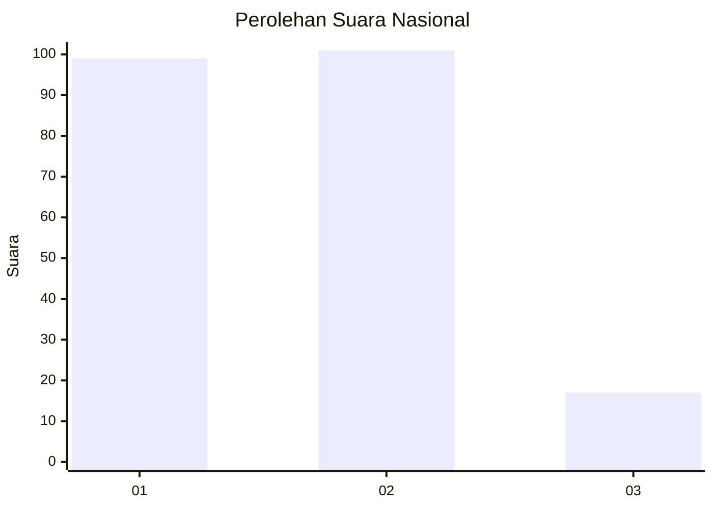
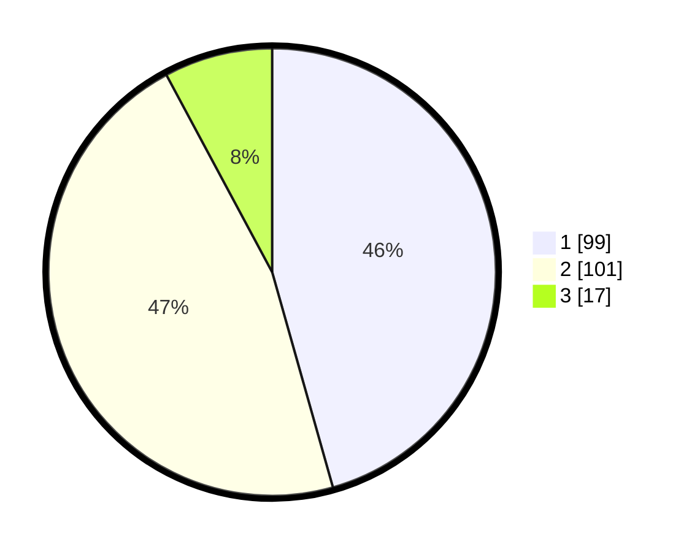

# Hasil

## Grafik

## Tabel

| No.    | Nama Paslon    | Suara | Suara (raw) | Persentase |
|:------ |:-------------- | -----:| -----------:| ----------:|
| 100025 | ANIES MUHAIMIN | 99    | [99][p-1]   | 45,62      |
| 100026 | PRABOWO GIBRAN | 101   | [101][p-2]  | 46,54      |
| 100027 | GANJAR MAHFUD  | 17    | [17][p-3]   | 7,83       |

[p-1]: https://github.com/gigit-pemilu/pemilu-2024/blob/main/pilpres/hitung-suara/sub/31-dki-jakarta/sub/75-jakarta-timur/sub/10-cipayung/sub/1007-lubang-buaya/sub/165-tps/sub/paslon-1.txt
[p-2]: https://github.com/gigit-pemilu/pemilu-2024/blob/main/pilpres/hitung-suara/sub/31-dki-jakarta/sub/75-jakarta-timur/sub/10-cipayung/sub/1007-lubang-buaya/sub/165-tps/sub/paslon-2.txt
[p-3]: https://github.com/gigit-pemilu/pemilu-2024/blob/main/pilpres/hitung-suara/sub/31-dki-jakarta/sub/75-jakarta-timur/sub/10-cipayung/sub/1007-lubang-buaya/sub/165-tps/sub/paslon-3.txt

## Foto C Plano

https://sirekap-obj-formc.kpu.go.id/77f2/pemilu/ppwp/31/75/10/10/07/3175101007165-20240214-221056--9ea0482d-f145-4806-a42c-3e92bb910d08.jpg

https://sirekap-obj-formc.kpu.go.id/77f2/pemilu/ppwp/31/75/10/10/07/3175101007165-20240214-221235--c2fe660d-5da4-441f-b85e-9c94156accd5.jpg

https://sirekap-obj-formc.kpu.go.id/77f2/pemilu/ppwp/31/75/10/10/07/3175101007165-20240214-221344--756887bf-0639-46d7-8223-0bbf28fa7119.jpg

## Metadata

| Key        | Value               |
| ---------- | ------------------- |
| Time Stamp | 2024-02-15 15:00:29 |

