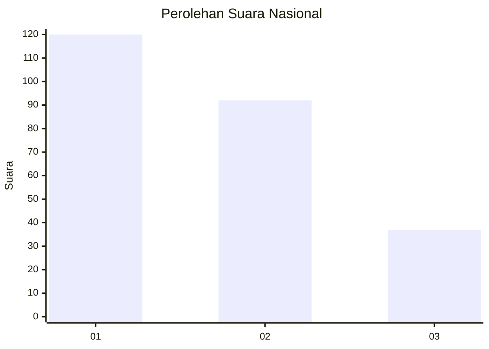
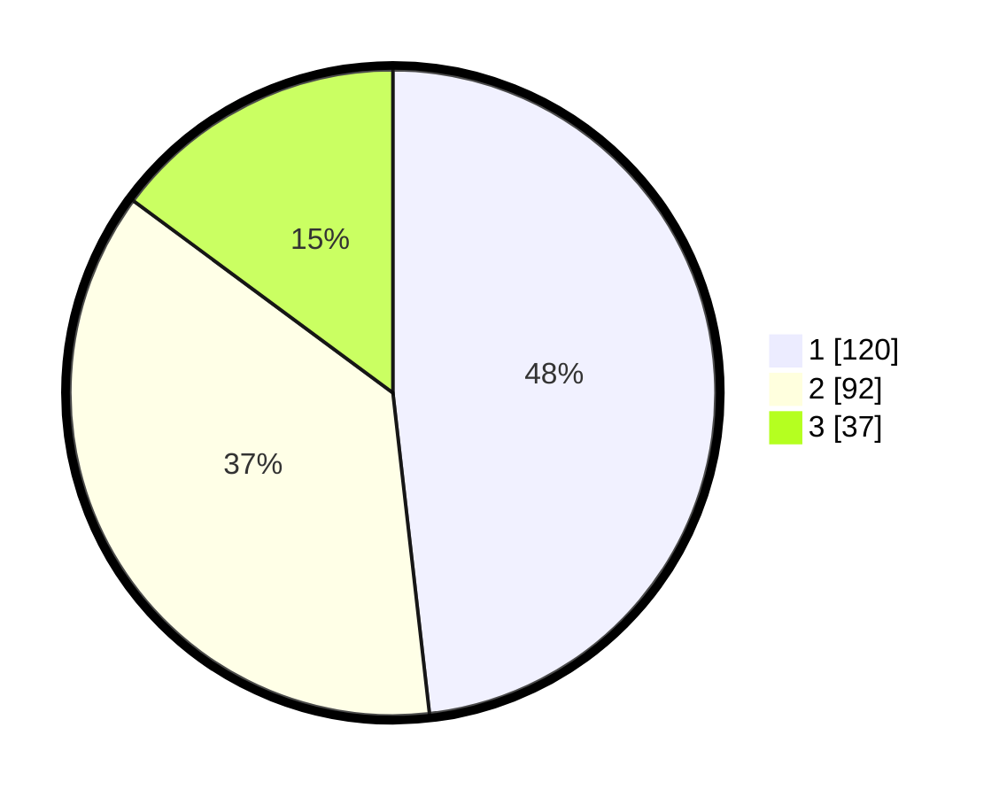

# Hasil

## Grafik

## Tabel

| No.    | Nama Paslon    | Suara | Suara (raw) | Persentase |
|:------ |:-------------- | -----:| -----------:| ----------:|
| 100025 | ANIES MUHAIMIN | 120   | [120][p-1]  | 48,19      |
| 100026 | PRABOWO GIBRAN | 92    | [92][p-2]   | 36,95      |
| 100027 | GANJAR MAHFUD  | 37    | [37][p-3]   | 14,86      |

[p-1]: https://github.com/gigit-pemilu/pemilu-2024/blob/main/pilpres/hitung-suara/sub/31-dki-jakarta/sub/75-jakarta-timur/sub/10-cipayung/sub/1007-lubang-buaya/sub/169-tps/sub/paslon-1.txt
[p-2]: https://github.com/gigit-pemilu/pemilu-2024/blob/main/pilpres/hitung-suara/sub/31-dki-jakarta/sub/75-jakarta-timur/sub/10-cipayung/sub/1007-lubang-buaya/sub/169-tps/sub/paslon-2.txt
[p-3]: https://github.com/gigit-pemilu/pemilu-2024/blob/main/pilpres/hitung-suara/sub/31-dki-jakarta/sub/75-jakarta-timur/sub/10-cipayung/sub/1007-lubang-buaya/sub/169-tps/sub/paslon-3.txt

## Foto C Plano

https://sirekap-obj-formc.kpu.go.id/e143/pemilu/ppwp/31/75/10/10/07/3175101007169-20240215-002239--c3edaea7-6474-40bd-8566-b5ed533529ed.jpg

https://sirekap-obj-formc.kpu.go.id/e143/pemilu/ppwp/31/75/10/10/07/3175101007169-20240215-002540--d554c875-7c26-491e-935c-d47af186a3c0.jpg

https://sirekap-obj-formc.kpu.go.id/e143/pemilu/ppwp/31/75/10/10/07/3175101007169-20240215-002639--7c4c0b7c-60df-40a4-8481-30a5f444ccb7.jpg

## Metadata

| Key        | Value               |
| ---------- | ------------------- |
| Time Stamp | 2024-02-24 22:31:28 |

